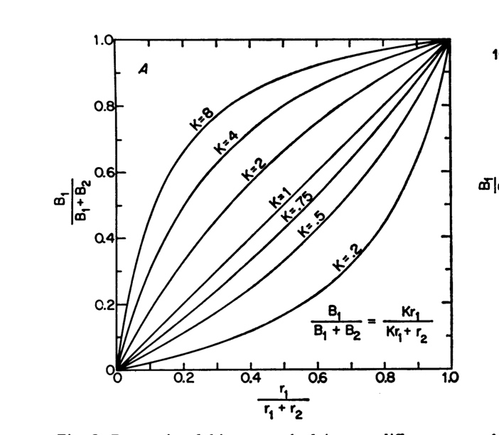
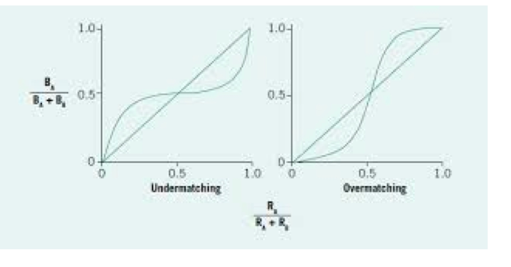
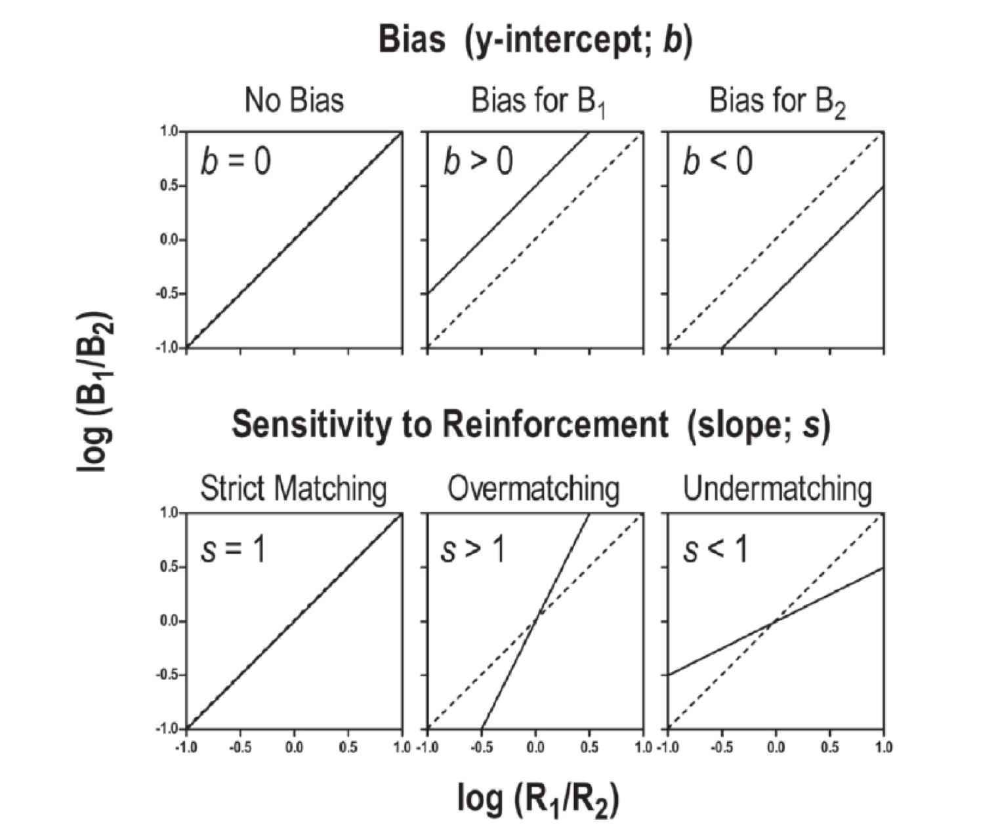
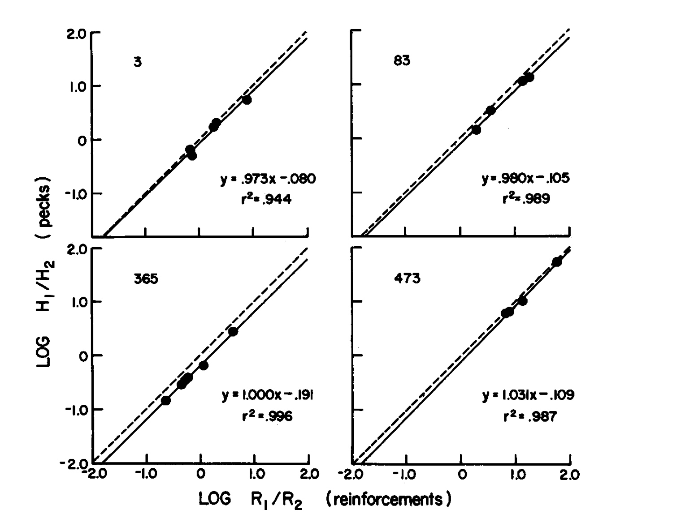

## Borrador

En el capítulo anterior sobre programas de refuerzo, vimos que considerar al comportamiento como emitido, le permitió a Skinner considerar a la tasa de respuesta como el objeto de estudio del comportamiento adaptable. Consideramos al comportamiento como un flujo de acción en constante interacción con su entorno, interacción que define un sistema de retroalimentación. vimos que los programas de refuerzo pueden conceptualizarse como funciones del entorno que transforman acciones a refuerzos.  Estudiamos las regularidades empíricas que se obtienen en equilibrio bajo diferentes programas de refuerzo.  Sin embargo, el refuerzo a una respuesta no ocurre en un vacío conductual, como hemos enfatizado a lo largo de los previos capítulos, los organismos están siempre haciendo algo.  Aunque en un momento dado solo podemos observar una respuesta, siempre hay un sinnúmero de posibles respuestas alternativas. Un organismo en constante acción, en cada momento enfrenta un sinnúmero de decisiones, cual de las *n* posibles respuestas disponibles emitir. Podemos decir, que el estudio de la acción es el estudio de los principios de la  elección y decisión. El resto del libro es una presentación de tales principios

Consideraremos primero un primer grupo de decisiones  que se da entre acciones asociadas con diferentes sucesos biológicamente importantes. Un estudiante al escuchar el reloj despertador, puede levantarse o apagarlo y regresar a dormir, puede bañarse o no, elige entre diferentes tipos de ropa para vestirse, entre diferentes tipos de desayuno, ir a la universidad en diferentes tipos de transporte, puede entrar a una clase o irse a la biblioteca o tomar un cafe con una amistad, estudiar en la tarde, ir al gimnasio o ver una película, dormirse temprano o salir a una fiesta. . a estas decisiones se  les conoce como decisiones *basadas en el valor*, 

Sin embargo, no son estas las únicas decisiones que un agente tiene que tomar. Una primera tarea  es decidir si un objeto esta presente en su entorno (un problema adaptativo de percepción). Al manejar de noche  un conductor tiene que decidir si lo que ve enfrente es el reflejo de la luna o una piedra. Ante la vasta exposición a propiedades simultáneas de su entorno, el agente tiene que decidir a cual de ellas atender. El conductor del auto tiene que decidir si escucha la radio, a la persona que lo acompaña, a las señales de tránsito,  la llamada de su celular o a los autos que ve en su espejo retrovisor. Adicionalmente, el agente tiene que decidir si un objeto pertenece o no a cierta categoría, lo que le permite hacer predicciones y ajustar su comportamiento acorde a su decisión.  Al encontrarse  con un perro callejero el agente tiene que decidir si es agresivo o amigable.  Finalmente, al encontrase con una persona tiene que decidir si ha tenido experiencia previa con ella. Buena parte del estudio de la Psicología, desde sus inicios en la psicofísica, ha estado dedicada a estudiar modelos de las decisiones enunciadas en este párrafo. . Un ejemplo es la teoría de la detección de señales de la que vimos un ejemplo en el capítulo sobre la asignación de crédito a respuestas. A estos modelos se les conoce como de *decisión perceptual*  y los veremos en detalle en capítulos posteriores

## Decisiones Basadas en el Valor

Considere los siguientes dos escenarios. Una persona en el último día de vacaciones debe elegir entre dos restaurantes. Esa elección no tendrá prácticamente consecuencias para decisiones futuras: después de comer, el problema desaparece. En cambio, si esos restaurantes están en el barrio donde vive, la situación cambia. Ya no se trata solo de elegir hoy el restaurante aparentemente mejor, sino de distribuir visitas a lo largo del tiempo, aprender qué ofrece cada uno, detectar cambios y decidir cuándo conviene volver a probar la alternativa menos visitada. Cada uno de los ejemplos representa un diferente problema de adaptación. Al primero, siguiendo a Gallistel, le llamamos problemas de *optar*. Al segundo le llamamos problemas de *asignación*. 

En algunos entornos naturales, abandonar una alternativa permite que su disponibilidad de refuerzos aumente, mientras que permanecer en otra reduce progresivamente su rentabilidad.  Una abeja que forrajea entre dos grupos de flores no enfrenta simplemente una elección entre “el mejor” y “el peor” sitio. Conforme permanece en un grupo de flores, el néctar disponible disminuye y cada nueva visita produce menos alimento por unidad de tiempo. Mientras tanto, el otro grupo puede recuperarse. La decisión adaptativa no consiste en elegir una vez el sitio de mayor valor, sino en distribuir las visitas: permanecer mientras la rentabilidad sea alta, cambiar cuando disminuya, y regresar cuando la alternativa haya vuelto a ser rentable. La elección recurrente es, por tanto, un problema de asignación en un ambiente que el propio comportamiento modifica.

Empezaremos en este y los siguientes tres capítulos estudiando  problemas de  asignación,  en particular una regularidad empírica notablemente replicable que describe cómo se distribuye el comportamiento en equilibrio, una vez que el organismo ha tenido suficiente experiencia con las alternativas disponibles.

## Elección Recurrente

La forma más sencilla de estudiar experimentalmente protocolos de elección recurrente lo desarrolló  Richard Herrnstein en el laboratorio de Skinner y se conoce como *programas de refuerzo concurrentes*. El protocolo consiste en presentarle al organismo dos o más opciones de respuesta simultáneamente disponibles —en el caso de las palomas, dos teclas iluminadas en lados opuestos de la cámara—, cada una reforzada de acuerdo a un programa independiente. El animal puede responder libremente a cualquiera de las dos teclas en cualquier momento, y en cada sesión diaria se registra cuántas respuestas emite a cada tecla y cuántos refuerzos obtiene de cada una. En muchos procedimientos concurrentes se introduce una breve demora de cambio para evitar que el simple alternar entre opciones sea reforzado accidentalmente.

**[FIGURA 14.1: Diagrama esquemático de un programa concurrente de dos teclas para palomas. La tecla izquierda opera bajo un programa IV de 60 segundos; la derecha, bajo un programa IV de 30 segundos. Ambas teclas están disponibles simultáneamente durante toda la sesión.]**

Con un par de programas dado, el animal se expone a sesiones diarias hasta que la distribución de respuestas sea constante de una sesión a la siguiente —típicamente entre 30 y 45 días por condición. Los datos que se analizan son los de los últimos cinco días de cada condición, cuando el comportamiento ha alcanzado el equilibrio y los organismos han aprendido acerca de las consecuencias de cada opción de respuesta.  El procedimiento se repite para todos los pares de programas que se estudian. Lo que se obtiene es una descripción del comportamiento en estado estable, no de su dinámica de adquisición. 

Skinner hizo posible estudiar una variable agregada.  la tasa de una respuesta -número de respuestas dividida entre el tiempo disponible,  Herrnstein  estudió  una nueva variable agregada,  la tasa relativa de respuestas en un periodo de tiempo. 

$$
\frac{R_1} {(R_1 +R_2)}
$$

## La Ley de Igualación

En 1961, Richard Herrnstein reportó los resultados del primer estudio sistemático con programas concurrentes de intervalo variable. Entrenó a palomas bajo varios pares de programas IV y midió la proporción de respuestas a cada tecla en equilibrio. El resultado fue sorprendente por su precisión: la tasa relativa de respuestas —la proporción de respuestas dedicada a cada tecla— igualaba la tasa relativa de refuerzos obtenidos de esa tecla:

$$
\frac {R_1} {(R_1 + R_2)} = \frac {r_1} {(r_1 + r_2)}
$$

donde $R_1$ y $R_2$ son las tasas de respuesta y $r_1$ y $r_2$ son las tasas de refuerzo obtenidas de cada tecla. A esta relación se le conoce como la *ley de igualación*.

**[FIGURA 14.2: Resultados de Herrnstein (1961) con tres palomas en programas concurrentes IV-IV. Eje horizontal: tasa relativa de refuerzo (r₁/(r₁+r₂)). Eje vertical: tasa relativa de respuesta (R₁/(R₁+R₂)). Cada punto representa los datos promediados de los últimos cinco días bajo una condición. Los puntos se alinean cerca de la diagonal de pendiente unitaria que representa la igualación perfecta.]**

La ley de igualación no es un resultado trivial. En los programas de intervalo variable, un reforzador programado no desaparece si el animal no responde inmediatamente: queda disponible hasta que emita una respuesta a esa alternativa. Por eso, una amplia variedad de patrones de visita —desde alternaciones frecuentes hasta largas estancias en una opción con visitas ocasionales a la otra— puede producir tasas totales de reforzamiento muy similares.  Lo sorprendente del resultado de Herrnstein es que, dentro de ese amplísimo rango de distribuciones que producirían el mismo número total de refuerzos, los organismos tiendan a distribuir su comportamiento de acuerdo con la tasa relativa de reforzamiento.l

La robustez del resultado es notable. En las décadas siguientes, la igualación se replicó en docenas de experimentos con ratas, peces, monos, humanos y diversas especies de aves, bajo múltiples pares de programas y con distintos tipos de refuerzos. En la última década del siglo pasado, fue la ley psicológica cuantitativa más citada en la literatura.

### Igualación de tiempos asignados

Herrnstein midió respuestas discretas —picoteos a una tecla. Pero muchos comportamientos naturales no son discretos: el tiempo que una abeja pasa en una parcela, el tiempo que un animal dedica a un área de forrajeo, la duración de una conversación. Rachlin y Baum estudiaron si la igualación se extendía a la distribución del tiempo asignado. Colocaron palomas en una cámara rectangular dividida en dos mitades, con un comedero en cada extremo reforzando de acuerdo a programas IV independientes, y midieron el tiempo que el animal pasaba en cada mitad. El resultado fue igualación de tiempos:

$$
\frac{T_1}{T_1 + T_2} = \frac{r_1}{r_1 + r_2}
$$

La proporción de tiempo asignada a cada alternativa iguala la proporción de refuerzos obtenidos de esa alternativa. Que el resultado se obtuviera tanto con respuestas discretas como con tiempo asignado sugiere que igualación es un principio general sobre la distribución del comportamiento, no un artefacto de la forma de medir.

## Desviaciones de la igualación perfecta

La igualación estricta —que la proporción de respuestas iguale exactamente la proporción de refuerzos— es el resultado típico, pero no el único. Baum identificó dos clases de desviaciones sistemáticas que emergen bajo ciertas condiciones.

### Sesgo

Si en una visita al supermercado les ofrecen probar, sin ningún costo, frijoles negros o bayos, algunos de Uds. preferirán la prueba de los frijoles negros. Dada esa preferencia, si compran frijoles y ambos tienen el mismo precio, comprarán los frijoles negros.  Pero si los negros cuestan el doble, en algún punto la diferencia de precio superaran su preferencia y comprarán los bayos. Aquí hay dos variables separadas: su preferencia por un tipo de frijol (sesgo) y su sensibilidad a la diferencia de precio (sensibilidad). Ambas influyen en la decisión, pero son independientes entre sí.

En los programas concurrentes ocurre algo análogo. Cuando los refuerzos de las dos opciones son de distinto tipo —diferentes alimentos, refuerzos de diferente magnitud— el organismo puede mostrar una preferencia intrínseca por uno de ellos que se suma al efecto de las tasas de refuerzo. Esta preferencia se llama *sesgo*: en la gráfica de tasa relativa de respuesta contra tasa relativa de refuerzo, el sesgo desplaza la función hacia arriba o hacia abajo respecto a la diagonal de igualación perfecta. Cuando la tasa relativa de refuerzo  es 0.5, pero la proporción de respuesta no lo es, la diferencia refleja un sesgo por una de las alternativas, independiente de las tasas de refuerzo.

**[FIGURA 14.3: Efecto del sesgo en la relación entre tasa relativa de respuesta y tasa relativa de refuerzo. Cuando hay sesgo por la opción 1, la función se desplaza hacia arriba: para cada tasa relativa de refuerzo, la proporción de respuestas a la opción 1 es mayor que la predicha por igualación perfecta. El sesgo en favor de la opción 2 produce el efecto opuesto.]**

### Sensibilidad

Una segunda desviación ocurre cuando los organismos no son linealmente sensibles a la diferencia entre las tasas de refuerzo.  Esto puede deberse a como se transforma psicológicamente las diferencias en en el valor de las opciones  o a la dificultad para discriminar entre ellas. Supón que un programa concurrente tiene tasas de refuerzo en razón 2 a 1. La igualación perfecta predice que el organismo responderá dos veces más frecuentemente a la opción más rica. Pero si la diferencia psicológica percibida entre ambas tasas es menor que la diferencia objetiva organismo responderá en una proporción más cercana a la indiferencia que a la igualación. A este patrón se le llama *sub-igualación*: la distribución de respuestas es menos extrema de lo que predice la tasa relativa de refuerzo.

Lo contrario también es posible. Cuando el organismo amplifica las diferencias en tasas de refuerzo —respondiendo de forma más extrema en la opción más rica de lo que la proporción de refuerzos justifica— se observa *sobre-igualación*. Vamos a asumir que el sesgo y la sensibilidad varían independientemente el uno del otro.

**[FIGURA 14.4: Sub-igualación y sobre-igualación. En la sub-igualación (izquierda), la función de tasa relativa de respuesta está por debajo de la diagonal cuando la opción 1 es la más rica, y por encima cuando es la más pobre; el organismo subestimalas diferencias de refuerzo. En la sobre-igualación (derecha), el patrón se invierte: el organismo exagera las diferencias.]**

## La Ley Generalizada de Igualación

Para capturar el sesgo y la sensibilidad en un solo modelo, Baum propuso expresar la ley de igualación en términos de razones de respuesta y refuerzo —en lugar de proporciones— y transformar esa relación como una función de potencia:

$$
\frac{B_1}{B_2} = \alpha \left(\frac{r_1}{r_2}\right)^\beta
$$

donde $\alpha$ es el parámetro de sesgo y $\beta$ es el parámetro de sensibilidad. La igualación perfecta corresponde al caso $\alpha = 1$ y $\beta = 1$.

Aplicando logaritmos a ambos lados, la ecuación se convierte en una familia de líneas rectas:

$$
\log \frac{B_1}{B_2} = \beta \log\frac{r_1}{r_2} + \log \alpha
$$

En esa forma, $\beta$ es la pendiente de la función y $\log \alpha$ es el intercepto. La sub-igualación corresponde a pendientes menores que uno; la sobre-igualación, a pendientes mayores que uno. El sesgo desplaza la línea verticalmente sin cambiar su pendiente.

**[FIGURA 14.5: La ley generalizada de igualación en coordenadas logarítmicas. Las líneas de la familia superior muestran diferentes valores de sesgo (intercepto, $\log\alpha$) con sensibilidad fija ($\beta = 1$). Las líneas de la familia inferior muestran diferentes valores de sensibilidad (pendiente, $\beta$) sin sesgo ($\alpha = 1$). La igualación perfecta es la línea de pendiente 1 que pasa por el origen.]**

La transformación logarítmica no es solo un truco algebraico para hacer lineal la función —también revela su parentesco con un principio psicofísico clásico. S.S. Stevens propuso que muchas dimensiones sensoriales siguen una función de potencia: la magnitud percibida de un estímulo es proporcional a una potencia de su magnitud física. La ley generalizada de igualación dice algo análogo para la elección: la razón de respuestas es proporcional a una potencia de la razón de refuerzos, con el exponente $\beta$ midiendo cuánto amplifica o atenúa el sistema las diferencias en tasas de refuerzo.

Más aún, esta forma no es arbitraria. En el capítulo sobre reglas de respuesta, veremos que la ecuación generalizada de igualación, es una derivación de dos sencillos axiomas que establecen que cuando la elección entre dos opciones refleja diferencias en su valor percibido —como en una regla de respuesta probabilística, donde la probabilidad de elegir una opción crece con la diferencia entre sus valores, el resultado algebraico es exactamente esta familia de líneas rectas en coordenadas logarítmicas. El parámetro $\beta$ corresponde a cuán sensible es la elección a las diferencias de valor, y $\alpha$ refleja una asimetría en el valor percibido de las opciones que es independiente de sus tasas de refuerzo. Por ahora basta notar que la ley generalizada de igualación no es una curva ajustada ad hoc a los datos: tiene una interpretación en el marco más general de la elección basada en valor.

### ¿Optimiza igualación la tasa global de refuerzo?. 

Una respuesta común al principio de igualación es considerarlo, al nivel de explicación computacional,  como una instancia de un mecanismo de adaptación, seleccionado para maximizar el total de refuerzos disponibles. Para atender esta posibilidad, es necesario conocer la función que relaciona, por un lado, a la suma del total de los refuerzos, y por el otro, a las distribuciones relativas de respuesta. Con ello, se puede evaluar si el patrón de respuesta de igualación corresponde al máximo de la función. 

$$
r_{total}= f\left(\frac{R_1}{R_1 + R_2}\right)
$$

Dado que en programas de IV los refuerzos no se cancelan hasta que se obtienen, al animal le conviene seguir visitando ambas opciones y de esa forma obtener todos los reforzadores posibles. Sin embargo, el número de posibles distribuciones de respuestas que garantizarían obtener todos los refuerzos es enorme. El organismo podría hacerlo simplemente alternando constantemente cada respuesta (0.5) o pasando casi todo el tiempo en una de las opciones con una ocasional visita a la opción no atendida. Lo sorprendente es que dentro de ese amplio rango de posibles tasas relativas de respuesta que producen maximización, lo que se observa empíricamente es la proporción de respuesta a cada opción que iguala la tasa de refuerzo relativa. La importancia de la igualación es que representa la solución observada, en equilibrio, a la multiplicidad de formas de maximizar el refuerzo total en programas concurrentes de intervalo variable.

## ¿Qué computa el organismo? Dos interpretaciones de igualación

#### ¿Es Maximización el Mecanismo que Subyace a Igualación?

Una pregunta muy diferente a la de si la igualación es un comportamiento adaptable es la de si, bajo condiciones de equilibrio, la maximización de la tasa de reforzamiento global es el “mecanismo” que guía el comportamiento del organismo y el cual subyace al patrón de respuestas observado en igualación. La pregunta es a nivel de explicación algorítmica. En otras notas veremos modelos en los que se maximizan diferentes variables, pero en estas nos concentramos en la maximización del número de refuerzos totales. Para comprender la pregunta, es necesario considerar que los fenómenos de maximización e igualación implican que los algoritmos que los organismos computan son diferentes para cada modelo. 

Imaginemos un robot de servicio encargado de recoger basura en dos puestos de comida separados por una calle. Un ingeniero puede programarlo con una meta global: recoger la mayor cantidad posible de basura por hora. En la versión más simple, el robot no necesita representar por separado el valor de cada puesto. Puede registrar cuánta basura recoge en total y cómo distribuye su tiempo entre los dos puestos. Si al aumentar el tiempo dedicado a un puesto aumenta la basura total recogida, sigue moviéndose en esa dirección; si disminuye, corrige. El sistema opera como un ascenso de colina sobre una variable global.

Otro ingeniero puede tener una meta distinta: igualar la rentabilidad del tiempo dedicado a cada puesto. En ese caso, el robot sí necesita separar la información por alternativa. Debe registrar cuánta basura recoge en el puesto A y cuánto tiempo pasa ahí, cuánta recoge en el puesto B y cuánto tiempo pasa ahí. Solo con esos cuatro registros puede calcular dos rentabilidades locales: basura por minuto en A y basura por minuto en B. La regla ya no compara únicamente el total global, sino las tasas locales de retorno de cada alternativa.

De acuerdo a esta versión de la maximización como mecanismo subyacente a la igualación, el algoritmo no distingue entre las dos respuestas disponibles y el refuerzo asociado con cada una de ellas: en lugar de ello, este solo computa y actualiza dos variables, la suma de refuerzos y la tasa relativa de respuestas. Noten que, debido a esto último, este modelo de acción no es una instancia de un modelo de elección basado en el valor de las respuestas individuales. En cambio, este modelo asume que los organismos cuentan con solo dos contadores, uno para la tasa relativa de respuestas y otro para la suma de los reforzadores obtenidos por las dos respuestas, sin distinguir entre su origen. Un reloj acumula el tiempo total *T*,  durante el cual las dos respuestas se encuentran disponibles. El resultado del contador del total de refuerzos se divide entre el tiempo T. En estos casos, el organismo busca acceder al mayor número de refuerzos por unidad de tiempo. Este número de {r/T} representa la *ganancia* asociada con cada *distribución* posible de respuestas. Además, dentro de un proceso de ascenso de colina, como el visto en el capítulo 4, la tasa relativa de respuesta se mueve en la dirección de una mayor tasa global de refuerzo hasta alcanzar un máximo, el cual puede ser local. 

#### Igualación y Rentabilidad de las Respuestas

Una explicación alternativa esta implícita en  la regularidad de igualación. Propone que el organismo distribuye su comportamiento de modo que *iguala la rentabilidad* de las distintas opciones disponibles. La rentabilidad de una opción es la tasa de refuerzo que produce por unidad de respuesta o por unidad de tiempo: cuántos refuerzos obtiene el organismo por cada respuesta emitida a esa opción, o por cada segundo que le dedica. La tasa de interés bancaria es la rentabilidad  de cada peso invertido.  La hipótesis de rentabilidad propone que los organismos distribuyen el comportamiento de modo que en equilibrio obtengan la misma tasa de refuerzo local de todas las opciones disponibles. 

Otra explicación que puede dar cuenta del patrón de respuesta de igualación es que los organismos buscan igualar la rentabilidad de sus respuestas o tiempos. La rentabilidad es el número de refuerzos que se obtienen por tiempo o respuestas invertidos en una opción. Cuando ustedes deciden entre planes de ahorro bancario, la primera pregunta que hacen es cuál es la tasa de interés anual, lo que les permite saber cuánto ganarán anualmente por cada $1,000 pesos depositados en su cuenta. Igualación sugiere que esto es exactamente lo que hacen los agentes con la asignación de sus respuestas y tiempos: específicamente, igualación plantea que la regla que siguen los agentes es distribuir sus respuestas y tiempos de tal forma que, en equilibrio, las dos opciones tengan la misma rentabilidad. 

Derivemos rentabilidad del principio de igualación. Igualación para respuestas y tiempos también puede expresarse en forma de razones, esto es, en lugar de hablar de una frecuencia relativa de 6 de 8 (0.75) refuerzos para una respuesta, hablamos de una razón de 6 a 2 (3) refuerzos para esa respuesta:

$$
\frac {R_1} {R_2} = \frac {r_1} {r_2}
$$

$$
\frac {T_1} {T_2} = \frac {r_1} {r_2}
$$

Razones y tasas relativas son dos formas equivalentes:

$$
\frac{R_1}{R_2} = \frac{r_1}{r_2} \qquad \Longrightarrow \qquad \frac{R_1}{R_1 + R_2} = \frac{r_1}{r_1 + r_2}
$$

Trabajando con razones y reacomodando términos, en equilibrio igualación implica  

$$
\frac{r_1}{R_1} = \frac{r_2}{R_2} \qquad \text{o bien} \qquad \frac{r_1}{T_1} = \frac{r_2}{T_2}
$$

Esta nueva forma de expresar la ley de igualación refleja que lo que se iguala es la rentabilidad de las distintas opciones de respuesta y/o tiempo. De este modo, lo que los organismos igualan son lo que podemos llamar  *tasas locales de refuerzo*. Que los organismos igualen las razones de respuesta  a las razones de refuerzo es la misma proposición que decir que igualan las rentabilidades de las distintas opciones.

Un ejemplo numérico hace visible lo que esto significa en la práctica. Supón un programa concurrente con dos opciones: la opción A reforzada con un programa IV de 30 segundos (tasa de refuerzo r₁ = 2 refuerzos por minuto) y la opción B reforzada con un programa IV de 60 segundos (r₂ = 1 refuerzo por minuto). La ley de igualación predice que el organismo dedica a A el doble de  sus respuestas:

$$
\frac{R_1}{ R_2} = \frac{2}{ 1} = 2
$$

Supón ahora que en una sesión de 60 minutos el organismo emite 300 respuestas en total: 200 a la opción A y 100 a la opción B. Si la tasa de respuesta es suficiente para recoger todos los refuerzos disponibles —lo que ocurre típicamente bajo programas IV— el organismo obtiene aproximadamente 120 refuerzos de A y 60 de B. Calculemos la rentabilidad de cada opción:

$$
\frac{r_1}{R_1} = \frac{120}{200} = 0.60 \text{ refuerzos por respuesta} \qquad \frac{r_2}{R_2} = \frac{60}{100} = 0.60 \text{ refuerzos por respuesta}
$$

Las rentabilidades son iguales. Cualquier otra distribución de las 300 respuestas entre las dos opciones produciría rentabilidades distintas. La igualación es la condición de equilibrio que iguala las tasas de refuerzo local.

Computacionalmente, este algoritmo requiere que el organismo mantenga cuatro contadores —respuestas y refuerzos para cada opción— y calcule sus tasas locales. La regla de elección es entonces: asigna más tiempo o respuestas a la opción cuya rentabilidad actual sea mayor. El proceso se detiene —o se vuelve estacionario— cuando ambas rentabilidades son iguales. Computacionalmente, la diferencia entra maximización y rentabilidad es si se actualiza el valor de la razón de respuestas o si se actualiza, por separado el valor de cada una de las respuestas reforzadas. 

#### Maximización vs Rentabilidad

¿Es posible distinguir entre estas dos interpretaciones de la elección en programas concurrentes? Consideren el siguiente escenario. Una estudiante es la única heredera de dos tías de edad avanzada. El monto de la herencia que le deja una de ellas depende del número de visitas que la sobrina le haga; por otra parte, la cantidad que le deja la otra tía tiene un tope máximo y solo depende de que ella la visite ocasionalmente. El escenario de las tías ilustra un programa concurrente, con una de las opciones reforzada con un programa de intervalo variable y la otra con un programa de razón variable. En este escenario, la estrategia óptima de la sobrina es asignar la mayor parte de sus visitas a la tía más demandante, la que ejemplifica un programa de razón, y visitar ocasionalmente a la tía que ejemplifica el programa de intervalo. 

En los programas de razón variable, a diferencia de los de intervalo, la rentabilidad de la respuesta no cambia con el tiempo que el organismo pasa en otra opción: cada respuesta tiene la misma probabilidad de producir un refuerzo, independientemente de cuándo fue la última vez que el organismo respondió a esa tecla. En contraste, en los programas de intervalo, la probabilidad de refuerzo aumenta con el tiempo transcurrido desde la última visita.

Esa diferencia tiene una consecuencia crucial cuando se combinan ambos programas en un programa concurrente RV-IV. De acuerdo a la maximización global, la estrategia óptima es responder casi exclusivamente a la tecla con el programa de razón —que produce refuerzos en proporción directa al número de respuestas emitidas— y visitar ocasionalmente la tecla con el programa de intervalo, solo para recoger el refuerzo que esté esperando. Esta estrategia maximiza el número total de refuerzos por unidad de tiempo. De acuerdo a la hipótesis de rentabilidad, en cambio, el organismo distribuye sus respuestas de modo que las tasas de refuerzo locales de ambas opciones sean iguales. Eso requiere dedicar sustancialmente más respuestas a la opción IV de lo que la maximización global prescribiría.  

Herrnstein y Heyman, llevaron al laboratorio el escenario recién descrito. Expusieron a las palomas a programas concurrentes razón variable - intervalo variable.  La siguiente figura muestra los resultados obtenidos por Heyman y Herrnstein. Puede verse que la distribución de respuestas de las palomas iguala la distribución de refuerzos, con un sesgo en favor del programa de razón. El patrón de igualación obtenido en este programa favorece al algoritmo de rentabilidad por encima del de maximización. Experimentos más recientes confirman este resultado y resaltan la utilidad de separar el sesgo por una opción (en este caso la opción RV) de la sensibilidad de los organismos hacia las diferencias en refuerzo de los dos programas.   

Hasta aquí, la igualación responde principalmente a una pregunta sobre el qué: qué patrón agregado aparece cuando el comportamiento alcanza un equilibrio en programas concurrentes. También hemos visto que una interpretación puramente global de la maximización no basta como explicación del mecanismo. Lo que queda abierto es la pregunta por el cómo: qué proceso, regla o mecanismo lleva al organismo desde sus elecciones sucesivas hasta ese patrón de equilibrio. Los capítulos siguientes responderán esa pregunta desde dos perspectivas complementarias: una dinámica y mecanicista, centrada en reglas locales de cambio, y otra molar o de equilibrio, centrada en las funciones que el comportamiento parece optimizar.

## Conexiones

### Hacia atrás

**Sistemas de retroalimentación (capítulo 5).** Los programas concurrentes son sistemas de retroalimentación de lazo cerrado: lo que el organismo hace determina qué refuerzos recibe, y los refuerzos moldean lo que hace. La novedad del capítulo 14 respecto al 5 es que ahora el sistema tiene dos lazos paralelos —uno por cada alternativa disponible— y la distribución del comportamiento entre ellos es lo que se estudia en equilibrio.

**Programas de refuerzo (capítulo 13).** El capítulo anterior describió la función de retroalimentación del entorno —la regla que transforma la tasa de respuesta en tasa de refuerzo— para cada tipo de programa en solitario. Este capítulo combina dos de esas funciones en un programa concurrente y pregunta cómo se distribuye el comportamiento entre ellas. La igualación es la respuesta en equilibrio para programas de intervalo variable.

**Bush y Mosteller, Rescorla-Wagner (capítulos 8-11).** Los valores Q que esos modelos asignan a cada respuesta son los inputs sobre los que opera la distribución del comportamiento en equilibrio. En programas concurrentes de intervalo variable, el valor Q de cada respuesta en equilibrio es proporcional a la tasa de refuerzo que produce. La ley de igualación describe qué sucede con esos valores Q cuando hay dos respuestas compitiendo.

### Hacia adelante

**Maximización local (capítulo 15).** La ley de igualación describe el estado de equilibrio. El capítulo siguiente pregunta qué proceso dinámico —respuesta a respuesta— lleva al organismo a ese equilibrio. El modelo de mejoramiento (*melioration*) de Herrnstein y Vaughan propone que los organismos eligen en cada momento la opción con mayor tasa local de refuerzo, y muestra que ese proceso converge al patrón de igualación bajo programas IV-IV. 

**La ley relativa del efecto (capítulo 17).** Este capítulo describió la distribución del comportamiento como proporción —tasas relativas. La ley del efecto relativa de Herrnstein da un paso adicional: deriva la relación entre las tasas absolutas de respuesta y las tasas absolutas de refuerzo, y muestra que la igualación emerge como consecuencia de ese marco teórico más general.

**Modelos de optimización global (capítulos sobre Rachlin y Staddon).** La evidencia de Herrnstein y Heyman muestra que los organismos no maximizan el refuerzo global bajo programas RV-IV. Pero eso no descarta que la optimización sea un principio explicativo útil en otros contextos. Los modelos de Rachlin y Staddon proponen que los organismos maximizan funciones de utilidad de carácter diferente, y que igualación emerge como consecuencia bajo ciertas condiciones. El contraste entre la maximización local (capítulo 15) y la maximización global (capítulos de Rachlin y Staddon) organiza el debate teórico sobre los mecanismos de la elección.

---

## Resumen

Los problemas de asignación —situaciones de elección recurrente donde el comportamiento retroalimenta sobre las condiciones futuras de refuerzo— son la norma en la vida de la mayoría de los organismos. Los programas de refuerzo concurrentes reproducen esa estructura en el laboratorio.

Herrnstein (1961) descubrió que en programas concurrentes de intervalo variable, la tasa relativa de respuestas iguala la tasa relativa de refuerzos: $R_1/(R_1+R_2) = r_1/(r_1+r_2)$. El resultado, conocido como la ley de igualación, se replica con tiempo asignado, con distintas especies y con distintos tipos de refuerzo.

Las desviaciones sistemáticas del patrón de igualación perfecta se clasifican en dos tipos: sesgo, que refleja una preferencia intrínseca por una de las alternativas independiente de las tasas de refuerzo; y sensibilidad, que refleja el grado en que el organismo amplifica o atenúa las diferencias entre las tasas. La ley generalizada de igualación, formulada por Baum, captura ambas desviaciones con dos parámetros en una función de potencia que se convierte en una línea recta en coordenadas logarítmicas. Esta forma tiene una interpretación en el marco general de la elección probabilística basada en diferencias de valor, con $\beta$ midiendo la sensibilidad de la elección a las diferencias y $\alpha$ el sesgo intrínseco.

Dos hipótesis computacionales dan cuenta del patrón de igualación: la igualación de la rentabilidad local de las opciones, y la maximización de la tasa global de refuerzo. En programas IV-IV ambas predicen el mismo resultado y no pueden distinguirse. El diseño de programas concurrentes RV-IV permite separar sus predicciones: la evidencia de Herrnstein y Heyman es consistente con la hipótesis de rentabilidad local e inconsistente con la maximización global.

---

## Ejercicios

**1.** Un programa concurrente IV 20 s — IV 60 s está en equilibrio. Calcula la distribución de respuestas que predice la ley de igualación. Si el organismo emite un total de 240 respuestas en una sesión de 60 minutos, ¿cuántas van a cada tecla? Calcula la rentabilidad (refuerzos por respuesta) de cada opción con esa distribución y verifica que sean iguales.

**2.** En un estudio con humanos en una tarea computarizada se observa la siguiente distribución: cuando la tasa de refuerzo de la opción A es el doble que la de la opción B, los participantes asignan a A el 62% de sus respuestas (en lugar del 67% predicho por igualación perfecta). ¿Qué tipo de desviación de igualación es esta? ¿Qué valor de $\beta$ describe mejor este resultado? ¿Qué información adicional necesitarías para estimar también el sesgo?

**3.** La ley generalizada de igualación en escala logarítmica base 10 es: $\log(B_1/B_2) = \beta \log(r_1/r_2) + \log\alpha$. Si en un experimento se obtiene una función con pendiente $\beta = 0.8$ e intercepto $\log\alpha = 0.15$ (es decir, $\alpha \approx 1.41$), describe en palabras qué tipo de desviación de igualación muestra el organismo y qué significa la preferencia capturada por $\alpha$.

**4.** Explica en términos de la función de retroalimentación del entorno por qué los programas concurrentes IV-IV no pueden discriminar entre la hipótesis de maximización global y la de rentabilidad local. ¿Qué característica del programa de intervalo variable hace que ambas predicciones coincidan?

**5.** En el experimento de Herrnstein y Heyman con programas concurrentes RV-IV, ¿qué distribución de respuestas predice la maximización global? ¿Qué distribución predice la igualación de rentabilidades locales? ¿Por qué los datos observados permiten distinguir entre las dos hipótesis en este diseño pero no en los programas IV-IV?

**6.** *(Reflexión)* Este capítulo presenta la igualación como una descripción del comportamiento en equilibrio, después de docenas de sesiones de entrenamiento. ¿Qué supone ese énfasis en el equilibrio sobre el tipo de preguntas que el modelo puede y no puede responder? ¿Qué quedaría fuera de su alcance?

---

## Lecturas Recomendadas

**Herrnstein, R. J. (1961).** Relative and absolute strength of response as a function of frequency of reinforcement. *Journal of the Experimental Analysis of Behavior, 4*, 267–272. — El artículo original. Breve, claro y directamente accesible.

**Baum, W. M. (1974).** On two types of deviation from the matching law: Bias and undermatching. *Journal of the Experimental Analysis of Behavior, 22*, 231–242. — La propuesta de la ley generalizada, con la motivación empírica para los dos parámetros.

**Herrnstein, R. J., & Heyman, G. M. (1979).** Is matching compatible with reinforcement maximization on concurrent variable interval, variable ratio? *Journal of the Experimental Analysis of Behavior, 31*, 209–223. — El experimento decisivo que distingue la hipótesis de rentabilidad de la maximización global.

**Mazur, J. E. (2016).** *Learning and Behavior* (8ª ed.). Routledge. Capítulo 8: *Choice and Preference*. — Presentación clara y bien documentada de la ley de igualación, sus desviaciones y las hipótesis sobre los mecanismos subyacentes. Complementa bien la perspectiva de este capítulo.

Baum WM, Rachlin HC. (1969)  Choice as time allocation.  *Journal of the Experimental Analysis of Behavior, 12*, 861-74 — El experimento de la cámara rectangular que extiende la igualación al tiempo asignado.
~