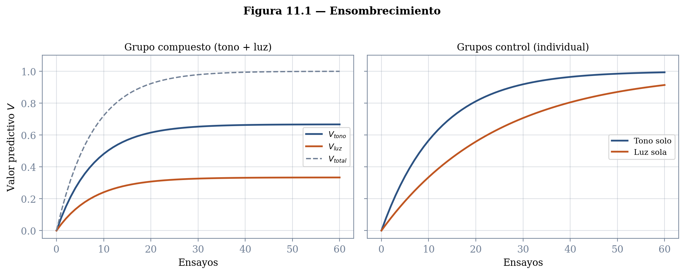
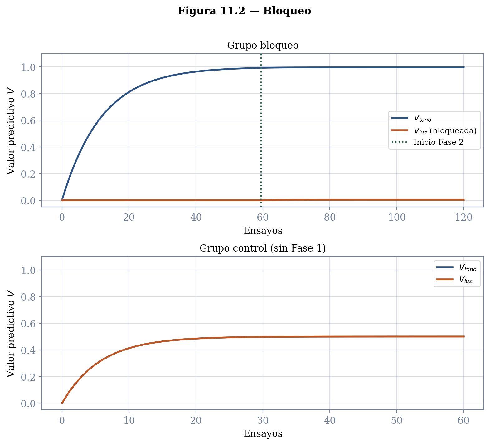
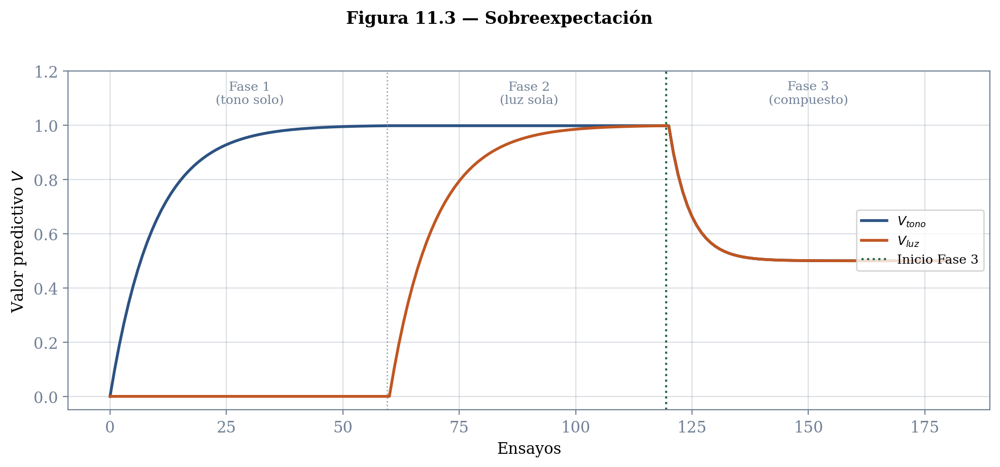
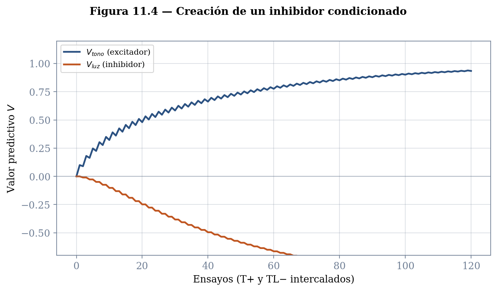
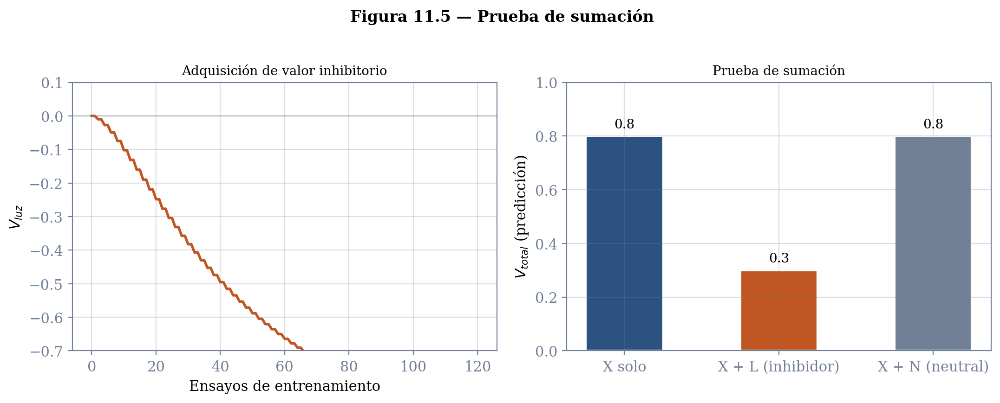
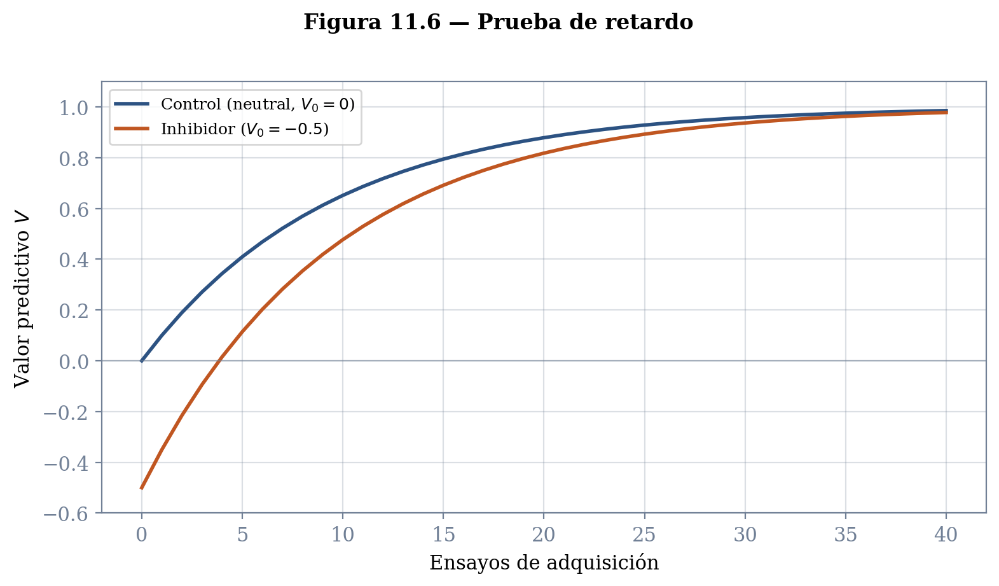
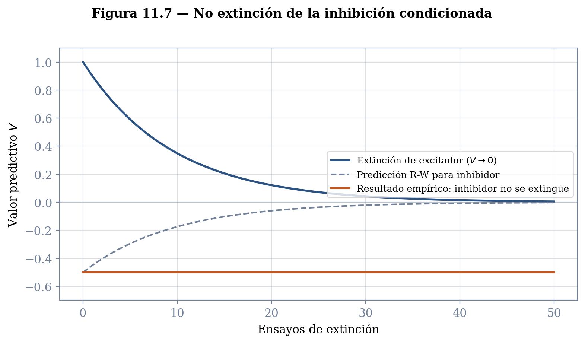
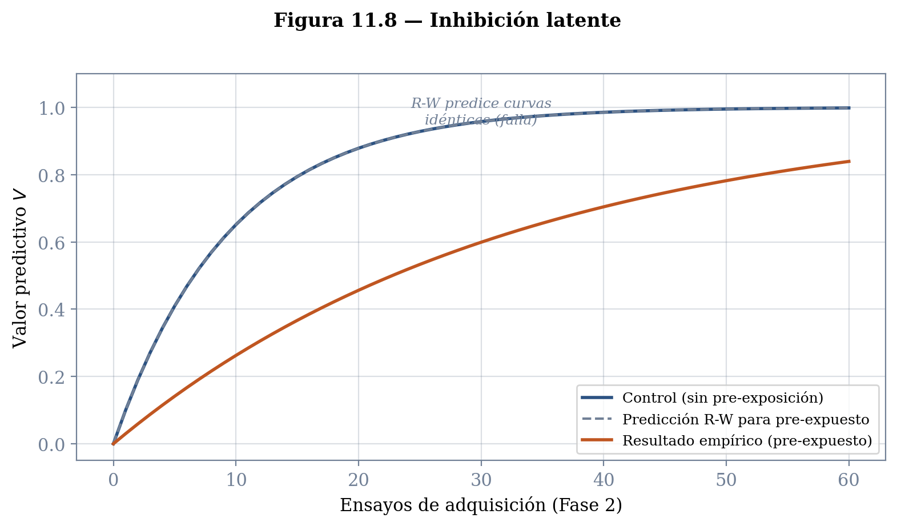

# Capítulo 11: El Modelo de Rescorla y Wagner
## Competencia Entre Estímulos y el Presupuesto del Error

---
# Borrador

En el capítulo anterior vimos que el modelo de Bush y Mosteller captura razonablemente bien la adquisición de valor predictivo cuando un estímulo o respuesta es seguido de un suceso biológicamente importante. La ecuación de actualización —con su error de predicción como motor, su parámetro $\alpha$ como importancia relativa, y sus tres lecturas equivalentes— produce las curvas negativamente aceleradas que la evidencia muestra y formaliza la idea de que el aprendizaje es proporcional al error de predicción —a la discrepancia entre lo que el organismo esperaba y lo que obtuvo. Pero dejamos señalada una limitación seria: el modelo opera sobre eventos individuales. Cuando un solo estímulo precede al SBI, todo funciona. La pregunta es qué ocurre cuando el entorno presenta lo que realmente presenta: múltiples estímulos simultáneos.

Y es que los entornos reales no consisten de elementos que aparecen aisladamente. Los organismos encaran situaciones en las que múltiples estímulos se presentan al mismo tiempo y de manera contigua con sucesos biológicamente importantes. Una comida que nos enferma o que nos produce un gran placer es en sí misma un compuesto de múltiples estímulos: el plato en que se sirve, el mantel bajo el plato, cómo se ve, su aroma, la música que se escucha, la persona que la sirve. Más aún, cada uno de nosotros tiene experiencias diferenciadas con cada uno de estos elementos por separado, correlacionados con otros o con el mismo SBI. Hemos comido en ese mantel otras comidas, con platos y aromas diferentes.

La pregunta que plantea esta realidad es directa: cuando un organismo enfrenta dos o más estímulos presentes simultáneamente y contiguos con un SBI, ¿qué principios describen cuánto aprenderá sobre cada uno de ellos? ¿A cuál le va a atribuir el SBI? ¿Y qué efecto tiene sobre esa decisión la experiencia previa con cada elemento por separado?

Los resultados experimentales que revisamos en el capítulo sobre asignación de crédito a estímulos mostraron que la contigüidad no basta para explicar lo que se observa. Los experimentos de Kamin sobre bloqueo, los de Reynolds sobre ensombrecimiento, y los de García sobre relevancia biológica ilustraron que la asignación de crédito a un estímulo depende de factores que van más allá de la mera co-ocurrencia temporal con el SBI. Las interpretaciones originales de esos resultados enfatizaban que el estímulo debía ser seguido de un SBI que fuera sorpresivo, inesperado, informativo, o que atrajera la atención. En 1972, Rescorla y Wagner presentaron un modelo que captura formalmente esas intuiciones como un modelo matemático basado en el error de predicción, sin hacer referencia a procesos atencionales que se consideraban difíciles de evaluar con sujetos no humanos. Este modelo sigue siendo hasta la fecha el motor de la investigación en aprendizaje.

---

## El problema de Bush y Mosteller con estímulos compuestos

Para entender qué aporta el modelo de Rescorla y Wagner, conviene ver primero por qué el modelo de Bush y Mosteller no puede resolver el problema por sí solo.

Supongamos que un tono y una luz se presentan simultáneamente, seguidos de comida. El modelo de Bush y Mosteller actualizaría el valor de cada estímulo de manera independiente:

$$\Delta V_{\text{tono}} = \alpha\,(R - V_{\text{tono}})$$
$$\Delta V_{\text{luz}} = \alpha\,(R - V_{\text{luz}})$$

Cada estímulo compara su propio valor con el SBI, sin saber nada del otro. El resultado es que ambos convergen hacia $R$ de manera independiente, como si el otro no existiera. Esto tiene una consecuencia empíricamente falsa: el modelo predice que la presencia de un segundo estímulo no debería afectar lo que se aprende sobre el primero. El ensombrecimiento —que un estímulo más saliente reduce el aprendizaje sobre uno menos saliente— queda sin explicación. Y el bloqueo —que el entrenamiento previo de un estímulo impide el aprendizaje sobre un estímulo nuevo añadido al compuesto— es directamente imposible de derivar.

El modelo necesita algo que el esquema individual no tiene: un mecanismo por el cual los estímulos presentes simultáneamente *compitan* entre sí por el crédito disponible.

---

## Dos componentes del modelo de Rescorla y Wagner

El modelo de Rescorla y Wagner incluye dos grandes componentes. El primero es el modelo de Bush y Mosteller que ya conocemos, con su reducción de error de predicción como motor del aprendizaje. El segundo es un modelo de la forma en que un organismo percibe estímulos compuestos. Este segundo componente es la innovación central, y descansa sobre un conjunto de supuestos que conviene examinar.

### Separabilidad

El modelo supone que los organismos perciben a los estímulos compuestos como conjuntos de elementos separables. Un rostro no es un estímulo integrado único, sino un conjunto de elementos —ojos, nariz, boca, orejas— cada uno con su propio valor predictivo. Esto no es trivial. Existen modelos alternativos (como el de Pearce, que veremos en otro capítulo) que suponen que el compuesto es procesado como una configuración única, no descomponible en sus partes. La evidencia empírica favorece, en muchos protocolos, el supuesto elemental de Rescorla y Wagner, aunque hay situaciones donde la configuración importa. Por ahora, aceptamos la separabilidad como punto de partida.

### Valor predictivo de los elementos

Cada elemento tiene un valor $V$ asociado que representa su capacidad predictiva del SBI. $V$ puede ser positivo —prediciendo la presencia del SBI—, negativo —prediciendo su ausencia—, o cero —sin predicción alguna. La relación entre el valor y alguna medida de comportamiento es únicamente ordinal: un elemento con $V = 1$ no produce necesariamente el doble de respuestas que uno con $V = 0.5$; solo indica mayor predicción y probablemente más respuesta, sin especificar la proporción exacta.

### La regla de integración: la suma

El valor predictivo del compuesto es la suma aritmética de los valores de sus elementos. Si el compuesto incluye dos estímulos A y B:

$$V_{\text{total}} = V_A + V_B$$

Esta suma representa la predicción total del organismo sobre si el SBI aparecerá. Es el equivalente a preguntarle al organismo: "dada toda la evidencia que tienes presente en este momento, ¿qué esperas que ocurra?"

### La regla de actualización: el error compartido

Aquí está la contribución formal de Rescorla y Wagner. El cambio en el valor de cada elemento depende de la discrepancia entre el SBI obtenido y la suma de todos los valores presentes:

$$\Delta V_x = \alpha\,\beta_x\,(R - V_{\text{total}})$$

Noten lo que cambió respecto a Bush y Mosteller. No es $(R - V_x)$ sino $(R - V_{\text{total}})$. El error de predicción no se calcula a partir del valor individual de cada estímulo, sino a partir de la suma de los valores de *todos* los estímulos presentes simultáneamente. Esta modificación aparentemente pequeña tiene consecuencias profundas: todos los elementos presentes se actualizan con base en el mismo error, y si ese error es cero para el compuesto, *ningún* elemento cambia su valor.

### Competencia

La consecuencia directa de usar $V_{\text{total}}$ es que los elementos compiten por un valor predictivo limitado. El valor predictivo total está acotado por $R$: cuando $V_{\text{total}}$ alcanza $R$, el error de predicción es cero y el aprendizaje se detiene. Si un elemento ya capturó la mayor parte del valor disponible, queda poco o nada para los demás. Los elementos no lo "saben" —no hay un mecanismo explícito de repartición—, pero la competencia emerge como consecuencia matemática del error compartido.

---

## Los parámetros $\alpha$ y $\beta$

En el capítulo sobre Bush y Mosteller derivamos el parámetro $\alpha$ de supuestos teóricos sobre la importancia relativa del pasado y el presente. Pero empíricamente, hay una segunda variable que afecta la velocidad del aprendizaje: las propiedades del estímulo predictor. Un estímulo más intenso o más sobresaliente produce curvas de aprendizaje más aceleradas. Rescorla y Wagner representan esta segunda fuente de variación con un parámetro adicional, $\beta_x$, que también toma valores entre 0 y 1 y captura la saliencia o asociabilidad del estímulo condicionado $x$.

El producto $\alpha\,\beta_x$ determina la velocidad efectiva de aprendizaje para cada elemento. $\alpha$ captura propiedades del SBI —su intensidad, calidad, relevancia motivacional— y $\beta_x$ captura propiedades del estímulo predictor —su intensidad sensorial, su novedad, su saliencia.

Una nota sobre notación. En el capítulo anterior usamos $\alpha$ como parámetro único de aprendizaje. En la formulación de Rescorla y Wagner, ese papel se distribuye entre $\alpha$ (asociado al SBI) y $\beta$ (asociado al EC). En algunos textos se usa $\alpha$ para el EC y $\beta$ para el SBI; aquí seguimos la convención del artículo original de 1972. Lo importante no es la etiqueta sino la función: el aprendizaje es más rápido cuando tanto el SBI como el EC son intensos o salientes.

---

## Un ejemplo cotidiano

Para anclar la intuición antes de pasar a las aplicaciones formales, consideremos un escenario. Un amigo al que visitas con frecuencia consiguió un nuevo perro. Te gustaría saber si este perro es amigable o agresivo. El perro es un compuesto de múltiples elementos: tamaño, hocico, ojos, orejas, tipo de pelo, entre otros. Tu primera reacción ante ese nuevo perro va a ser el resultado de la suma de los valores predictivos de los distintos elementos que lo componen, adquiridos de tus múltiples experiencias con otros perros.

Imaginemos que en algún momento del pasado te encontraste con un perro pequeño y chato que nunca trató de morderte. Posteriormente, cuando te encuentras con el perro de tu amigo —que comparte el mismo tamaño chico pero tiene un hocico largo—, tu predicción sobre si te morderá será la suma de lo que para ti predicen, por separado, su tamaño y su tipo de hocico. El tamaño (y no el tipo de hocico) del perro tendrá un valor predictivo en el sentido de que el animal no te morderá.

Ahora, si el perro de tu amigo intenta morderte, habrá un error de predicción: la suma de los valores de los elementos predijo que no te mordería, y sí lo hizo. Ese error actualizará el valor de cada uno de los elementos. El tamaño chico perderá valor como predictor de "no mordida", mientras que el hocico largo adquirirá valor como predictor de mordida. Y noten lo esencial: ambos elementos se actualizan en función del mismo error, no de su error individual. Eso es la ecuación de Rescorla y Wagner en acción.

---

## Aplicación al ensombrecimiento

Consideremos un protocolo con tres grupos de 60 ensayos. En el grupo 1, cada ensayo presenta un compuesto de dos estímulos —un tono y una luz— seguido de comida. Los grupos 2 y 3 son controles: al grupo 2 se le presenta solo el tono seguido de comida, al grupo 3 solo la luz seguida de comida. Supongamos que el tono es ligeramente más saliente que la luz ($\beta_{\text{tono}} = 0.4$, $\beta_{\text{luz}} = 0.2$).

Para los grupos de control, el resultado es el que ya conocemos del modelo de Bush y Mosteller: cada estímulo, presentado individualmente, converge hacia $R \approx 1$ sin interferencia de ningún otro elemento.

Para el grupo del compuesto, la historia es diferente. En cada ensayo, el error de predicción es $R - V_{\text{total}}$, donde $V_{\text{total}} = V_{\text{tono}} + V_{\text{luz}}$. Ambos estímulos se actualizan con ese mismo error, pero el tono —con $\beta$ más alta— se actualiza más rápido. A medida que la suma de los dos valores se acerca a $R$, el error disponible disminuye. El tono, por su mayor saliencia, captura una fracción mayor del valor antes de que el error se agote. El resultado es que ni el tono ni la luz alcanzan el valor que alcanzarían si se presentaran solos: el tono termina con un valor cercano a $0.67$ y la luz con uno cercano a $0.33$. El estímulo más saliente *ensombrece* al menos saliente.

*[FIGURA 11.1: Ensombrecimiento. Panel izquierdo: Grupo compuesto — evolución de $V_{\text{tono}}$ (azul, #2C5282, asíntota ≈ 0.67), $V_{\text{luz}}$ (naranja, #C05621, asíntota ≈ 0.33) y $V_{\text{total}}$ (gris punteado, #718096, asíntota ≈ 1.0) a lo largo de 60 ensayos. Panel derecho: Grupos control — $V_{\text{tono}}$ solo (azul) y $V_{\text{luz}}$ sola (naranja), ambos convergiendo a ≈ 1.0. Ejes: horizontal = ensayos, vertical = valor predictivo V (0 a 1.0). Referencia visual: diapositiva 22 de rescorla_y_Wagner_2023.pptx.]*

*[SIMULADOR 11.1: Explorador de ensombrecimiento. Parámetros manipulables: $\alpha$ (0.05–0.5), $\beta_A$ (0.1–0.9), $\beta_B$ (0.1–0.9), número de ensayos (10–100). Visualización: curvas de $V_A$, $V_B$ y $V_{\text{total}}$ en función de ensayos. Objetivo pedagógico: que el estudiante descubra cómo la proporción de saliencias determina la distribución asintótica del valor.]*

---

## Aplicación al bloqueo

El bloqueo es quizás el resultado más importante que el modelo de Rescorla y Wagner explica, y el que mejor ilustra la distancia entre este modelo y cualquier versión que descanse en la mera contigüidad.

El protocolo tiene dos grupos, cuyo diseño conviene tener a la vista antes de seguir el análisis:

| Grupo | Fase 1 | Fase 2 |
|-------|--------|--------|
| Bloqueo | Tono → Comida (60 ensayos) | Tono + Luz → Comida (60 ensayos) |
| Control | — | Tono + Luz → Comida (60 ensayos) |

Para el grupo de bloqueo, al final de la Fase 1 el tono ya predice perfectamente la comida: $V_{\text{tono}} \approx R$. En el primer ensayo de la Fase 2, cuando aparecen el tono y la luz juntos seguidos de comida, la predicción total es $V_{\text{total}} = V_{\text{tono}} + V_{\text{luz}} = R + 0 = R$. El error de predicción es $R - R = 0$. Sin error, no hay actualización. La luz, a pesar de ser perfectamente contigua con el SBI, no adquiere valor alguno.

La lógica es transparente una vez que se entiende la ecuación: cuando un elemento ya predice el SBI, no queda error de predicción que pueda asignarse a elementos nuevos. Computando explícitamente:

$$\Delta V_{\text{luz}} = \alpha\,\beta_{\text{luz}}\,(R - V_{\text{total}}) = \alpha\,\beta_{\text{luz}}\,(1 - 1) = 0$$

Para el grupo control, ambos estímulos parten de cero y compiten por el valor disponible, produciendo un patrón similar al ensombrecimiento.

Noten que en la simulación del bloqueo, $V_{\text{luz}}$ para el grupo control no llega a 1 —se detiene cerca de 0.4. La razón es la misma que en el ensombrecimiento: el tono, al estar presente también, captura parte del valor disponible.

*[FIGURA 11.2: Bloqueo. Panel superior: adquisición de $V_{\text{tono}}$ (azul, #2C5282) durante la Fase 1, convergiendo a ≈ 1.0. Panel inferior: Fase 2 — $V_{\text{luz}}$ del grupo bloqueo (naranja, #C05621, plana en ≈ 0) versus $V_{\text{luz}}$ del grupo control (verde, #276749, creciente a ≈ 0.4). Línea divisoria vertical entre fases. Ejes: horizontal = ensayos, vertical = valor predictivo V. Referencia visual: diapositiva 24 de rescorla_y_Wagner_2023.pptx.]*

---

## Predicción contraintuitiva: la sobreexpectación

Cualquier versión del modelo de Bush y Mosteller predice que un SBI adicional debe incrementar —aunque sea por un monto pequeño— el valor predictivo de un estímulo. El modelo de Rescorla y Wagner predice que en ciertas circunstancias ocurre exactamente lo contrario.

Consideremos el siguiente protocolo:

| Fase | Protocolo | Ensayos |
|------|-----------|---------|
| 1 | Tono → Comida | 60 |
| 2 | Luz → Comida | 60 |
| 3 | Tono + Luz → Comida | 60 |

Al final de las dos primeras fases, ambos estímulos han alcanzado la asíntota: $V_{\text{tono}} \approx 1$ y $V_{\text{luz}} \approx 1$. En la tercera fase, se presenta el compuesto tono + luz seguido de comida.

Al inicio de la tercera fase, $V_{\text{total}} = V_{\text{tono}} + V_{\text{luz}} = 1 + 1 = 2$. Pero el SBI vale $R = 1$, porque solo aparece una porción de comida. El error de predicción es $R - V_{\text{total}} = 1 - 2 = -1$. El error es *negativo*: el organismo espera más de lo que obtiene. La consecuencia es que ambos valores *disminuyen* a pesar de que el SBI está presente:

$$\Delta V_{\text{tono}} = \alpha\,\beta_{\text{tono}}\,(-1) < 0$$
$$\Delta V_{\text{luz}} = \alpha\,\beta_{\text{luz}}\,(-1) < 0$$

Los valores siguen disminuyendo hasta que su suma iguala al SBI: $V_{\text{tono}} + V_{\text{luz}} = 1$, en cuyo punto el error se hace cero y el aprendizaje se detiene. Cada uno termina con un valor aproximado de 0.5.

Esta predicción —que reforzar un compuesto puede *reducir* el valor de sus elementos— es imposible de generar sin el $V_{\text{total}}$. Un modelo con error individual siempre incrementaría $V$ cuando el SBI está presente. Interesantemente, la predicción ha sido confirmada experimentalmente (Kremer, 1978; Rescorla, 2006), proporcionando fuerte evidencia a favor del modelo.

*[FIGURA 11.3: Sobreexpectación. Panel izquierdo: curvas separadas de $V_{\text{tono}}$ y $V_{\text{luz}}$ durante Fases 1 y 2 (adquisición individual, ambas convergen a 1.0). Panel derecho: Fase 3 — ambos valores descienden desde 1.0 hasta ≈ 0.5 cuando se presentan en compuesto. Colores: tono en azul (#2C5282), luz en naranja (#C05621). Líneas verticales separando fases. Referencia visual: diapositiva 26 de rescorla_y_Wagner_2023.pptx.]*

*[SIMULADOR 11.2: Explorador de protocolos R-W. Permite seleccionar protocolo: adquisición simple, ensombrecimiento, bloqueo, sobreexpectación. Parámetros manipulables: $\alpha$, $\beta_A$, $\beta_B$, número de ensayos por fase. Visualización: curvas de $V_A$, $V_B$ y $V_{\text{total}}$ con separadores de fase. Objetivo pedagógico: que el estudiante explore los fenómenos como consecuencias de una misma ecuación, no como fenómenos separados.]*

---

## Inhibición condicionada

Hasta este punto, hemos discutido estímulos que adquieren valor positivo y predicen la presencia de un SBI. Pero ¿pueden los estímulos predecir la *ausencia* de un SBI? Poder hacer esa predicción tiene importantes ventajas adaptativas. La señal de que un depredador no aparecerá le permite a una presa buscar alimento sin interrupciones. La señal de que no habrá comida le permite al organismo reorientar su búsqueda hacia otros recursos. Al estudio de este fenómeno se le conoce como *inhibición condicionada*.

### Por qué un estímulo neutral no se convierte en inhibidor

El estudio de la inhibición tardó décadas en despegar, y la estructura del modelo original ayuda a entender por qué. Imaginen que se encuentran con una persona paseando a un perro que los ignora completamente. El perro no fue un SBI: ni les gruñó ni les movió la cola. Consecuentemente, $R = 0$. La persona era un desconocido que no predice nada: su $V$ es cero. El error de predicción es $R - V = 0 - 0 = 0$. No hay cambio. Si nada se espera y nada se obtiene, nada se aprende. La persona sigue siendo un estímulo neutral, no un inhibidor.

Esto establece una condición necesaria para la inhibición. Para que un estímulo adquiera valor *negativo*, el error de predicción debe ser negativo. Para que eso ocurra cuando $R = 0$, el estímulo debe aparecer en compuesto con un estímulo que ya tiene valor positivo, de tal forma que $V_{\text{total}} > 0$ y el error $(R - V_{\text{total}}) < 0$.

### Cómo se crea un inhibidor

Regresemos al ejemplo del perro, pero esta vez imaginemos que el perro les gruñe de forma amenazante cada vez que ven a su paseador. Después de muchos encuentros, la persona paseando al perro se convierte en un predictor del gruñido: $V_{\text{persona}} \approx 1$. En un siguiente encuentro, la persona va acompañada de su pareja y el perro esta vez *no* gruñe. El error de predicción es $R - V_{\text{total}} = 0 - (V_{\text{persona}} + V_{\text{pareja}}) = 0 - (1 + 0) = -1$. El error es negativo, y la pareja adquiere valor negativo:

$$\Delta V_{\text{pareja}} = \alpha\,\beta\,(-1) < 0$$

Después de muchos encuentros de este tipo —la persona sola con perro agresivo, la persona con pareja y perro tranquilo—, la pareja se convierte en un inhibidor condicionado que predice la no ocurrencia del gruñido. El proceso continúa hasta que la suma de valores en el compuesto se aproxima a cero: $V_{\text{persona}} + V_{\text{pareja}} \approx 1 + (-1) = 0$, momento en que el error desaparece.

*[FIGURA 11.4: Creación de un inhibidor condicionado. Protocolo: Fase 1 — Tono+ (60 ensayos reforzados). Fase 2 — Tono+ intercalados con TL− (tono + luz sin SBI, 60 ensayos). Curvas: $V_{\text{tono}}$ (azul, #2C5282, manteniéndose cerca de 1.0), $V_{\text{luz}}$ (naranja, #C05621, descendiendo de 0 a ≈ −0.5). Eje vertical: valor predictivo (−1.0 a 1.0). Referencia visual: figura superior de diapositiva 11 de Inhibición_Rescorla.pptx.]*

### El problema empírico: ¿inhibidor o neutral?

La segunda razón por la que la inhibición condicionada tardó en estudiarse es la dificultad para distinguir empíricamente entre un estímulo neutral —que no predice nada— y un estímulo que predice *la ausencia* de algo. Rescorla, en un artículo de 1969, propuso que para concluir que un estímulo es un inhibidor condicionado, este debe pasar dos pruebas complementarias.

En la primera, la **prueba de sumación**, se compara la respuesta ante un estímulo excitador $A$ presentado solo con la respuesta ante el compuesto de $A$ junto con el supuesto inhibidor $X$. El protocolo típico tiene tres fases:

| Grupo | Fase 1 | Fase 2 | Fase 3 (prueba) |
|-------|--------|--------|-----------------|
| Inhibición | T+ / X+ | LT− | LX− |
| Control | T− / X+ | LT− | LX− |

Si $X$ es verdaderamente inhibitorio ($V_X < 0$), entonces $V_{\text{total}} = V_A + V_X < V_A$, y la respuesta al compuesto debe ser menor que la respuesta a $A$ solo. Regresando a nuestro ejemplo: si la pareja del paseador es un inhibidor, el perro debería gruñir menos cuando la pareja está presente que cuando el paseador va solo. Sin embargo, Rescorla señala que estos resultados tienen una interpretación alternativa: quizás la atención dirigida a $X$ simplemente reduce la atención dirigida a $A$, produciendo una menor respuesta sin que $X$ sea genuinamente inhibitorio.

En la segunda, la **prueba de retardo**, se compara la velocidad de adquisición de valor excitatorio entre el supuesto inhibidor $X$ y un estímulo neutral:

| Grupo | Fase 1 | Fase 2 | Fase 3 (prueba) |
|-------|--------|--------|-----------------|
| Retardo | T+ | LT− | L+ |
| Control | T− | LT− | L+ |

Si $X$ tiene valor negativo, debe tardar más en alcanzar valores positivos que un estímulo que parte de cero —porque tiene que recorrer mayor distancia. Pero también aquí hay una explicación alternativa: quizás la familiaridad con $X$ reduce la atención que recibe (habituación), retardando el aprendizaje sin que el estímulo sea inhibitorio.

La genialidad del argumento de Rescorla es que las dos explicaciones alternativas se contradicen entre sí. La alternativa para la sumación requiere que $X$ reciba *más* atención (distrayendo de $A$); la alternativa para el retardo requiere que $X$ reciba *menos* atención (por habituación). No resulta plausible que un mismo estímulo reciba más atención en una circunstancia y menos en otra. Si el estímulo pasa ambas pruebas, las explicaciones atencionales se eliminan mutuamente, y la conclusión de que $X$ es genuinamente inhibitorio queda como la más parsimoniosa.

*[FIGURA 11.5: Prueba de sumación. Panel superior: protocolo experimental en tabla (Grupo Inhibición: Fase 1 = T+/X+, Fase 2 = LT−, Fase 3 = LX−; Grupo Control: Fase 1 = T−/X+, Fase 2 = LT−, Fase 3 = LX−). Panel inferior izquierdo: adquisición de $V_{\text{luz}}$ (valor negativo, convergiendo a ≈ −0.5 durante Fase 2). Panel inferior derecho: respuesta al compuesto LX en Fase 3 — grupo inhibición (naranja, menor respuesta) vs. grupo control (verde, mayor respuesta). Referencia visual: diapositiva 11 de Inhibición_Rescorla.pptx.]*

*[FIGURA 11.6: Prueba de retardo. Panel superior: protocolo (Grupo Retardo: Fase 1 = T+, Fase 2 = LT−, Fase 3 = L+; Grupo Control: Fase 1 = T−, Fase 2 = LT−, Fase 3 = L+). Panel inferior: curvas de adquisición en Fase 3 — $V_{\text{luz}}$ del grupo retardo (naranja, #C05621, partiendo de ≈ −0.5, adquisición lenta) vs. $V_{\text{luz}}$ del grupo control (azul, #2C5282, partiendo de 0, adquisición rápida). Referencia visual: diapositiva 13 de Inhibición_Rescorla.pptx.]*

---

## Limitaciones del modelo

Dentro de la psicología, pocos modelos han sido tan exitosos como el de Rescorla y Wagner en dar cuenta de una amplia gama de resultados, abrir nuevas rutas de investigación y capturar formalmente el papel del error de predicción en el aprendizaje. Sin embargo, como ocurre con cualquier modelo, hay predicciones que no se sostienen empíricamente. Estas fallas no son fracasos sino pistas: cada una ha señalado hacia direcciones que enriquecieron la comprensión del aprendizaje. Presentamos tres que, por su claridad conceptual y por las alternativas que motivaron, merecen atención.

### La extinción no reduce el valor a cero

En extinción, el SBI que previamente seguía al estímulo deja de presentarse. En este caso $R = 0$, y el modelo predice que $V$ disminuirá hasta igualarse a $R$, es decir, hasta llegar a cero. Cuando eso ocurre, el error de predicción desaparece ($0 - 0 = 0$) y no hay más cambios. Para el modelo, un estímulo extinguido y un estímulo que nunca fue condicionado son funcionalmente idénticos: ambos tienen $V = 0$.

La evidencia dice otra cosa. Hay una multitud de reportes que muestran que el mero paso del tiempo produce una *recuperación espontánea* de la respuesta condicionada extinguida. Adicionalmente, estímulos previamente extinguidos adquieren valor excitatorio más rápido que estímulos genuinamente neutrales, a pesar de que se supone que ambos parten de $V = 0$. Estos hallazgos sugieren que la extinción no borra la asociación original sino que la suprime, posiblemente mediante un mecanismo inhibitorio separado que es sensible al contexto. Esta literatura y los modelos para dar cuenta de ella los presentaremos en un capítulo posterior sobre extinción y contexto.

### La inhibición condicionada no se extingue

Si la excitación y la inhibición son simétricas —si $V$ puede subir y bajar por la misma escala continua—, entonces un inhibidor condicionado ($V < 0$) debería poder extinguirse de la misma manera que un excitador: presentándolo sin SBI hasta que $V$ regrese a cero. El modelo predice exactamente eso: cuando un inhibidor con $V = -0.5$ se presenta solo sin SBI, el error de predicción es $0 - (-0.5) = 0.5 > 0$, y el valor debería subir hacia cero.

Sin embargo, la evidencia empírica muestra que presentar un inhibidor condicionado sin consecuencias *no reduce* su valor inhibitorio. El inhibidor mantiene su efecto en pruebas de sumación y retardo posteriores, como si la fase de extinción no hubiera ocurrido. Este resultado sugiere que la inhibición puede ser cualitativamente diferente de la excitación, no simplemente el extremo negativo de una misma dimensión.

*[FIGURA 11.7: No extinción de inhibición. Protocolo: Fase 1 = creación del inhibidor (T+/LT−); Fase 2 = presentación de L solo (intento de extinción); Fase 3 = prueba de sumación. Dos curvas superpuestas: extinción de un excitador (azul, #2C5282, $V$ desciende de ≈ 1.0 a ≈ 0) y "extinción" de un inhibidor (naranja, #C05621, $V$ se mantiene cerca de −0.5). El modelo predice que ambas converjan a cero; empíricamente, solo la primera lo hace. Referencia visual: diapositiva 4 de Problemas_con_el_modelo.pptx.]*

### Inhibición latente

Consideremos un protocolo simple. A un grupo se le presenta, durante 60 ensayos, un estímulo neutral sin SBI; en una segunda fase, ese mismo estímulo es seguido de un SBI. A un grupo control solo se le presenta la segunda fase. Para el modelo de Rescorla y Wagner, la primera fase no debería tener efecto: si $V = 0$ y $R = 0$, entonces el error es cero y $V$ permanece en cero. Ambos grupos deberían aprender a la misma velocidad en la segunda fase.

Sin embargo, una enorme literatura reporta que la pre-exposición a un estímulo sin consecuencias *retarda* la adquisición posterior de valor predictivo. A este fenómeno se le conoce como *inhibición latente*, y el modelo de Rescorla y Wagner no puede explicarlo porque asume que $\beta$ —la asociabilidad del estímulo— es fija. El hallazgo sugiere que la pre-exposición reduce $\beta$: el estímulo "pierde la atención" del organismo porque ha aprendido que no predice nada importante. Cuando en la segunda fase el estímulo sí va seguido de un SBI, el sistema tarda en "prestarle atención" de nuevo.

Este fenómeno fue la motivación principal para modelos alternativos que enfatizan cambios dinámicos en la atención, y no solo en el valor asociativo. El más influyente de estos modelos es el de Pearce y Hall (1980), cuya idea central es que la atención a un estímulo ($\beta$) no es fija sino que depende de si ese estímulo ha sido seguido de eventos sorpresivos. Cuando un estímulo predice bien lo que ocurre (error bajo), la atención que recibe disminuye; cuando lo que ocurre es inesperado (error alto), la atención aumenta. En un capítulo posterior, cuando examinemos modelos bayesianos del aprendizaje, veremos cómo esta idea se formaliza de manera más general: el organismo no solo actualiza lo que cree ($V$), sino también cuánta confianza tiene en lo que cree, y cuánta atención dedica a recoger nueva evidencia.

*[FIGURA 11.8: Inhibición latente. Dos curvas de adquisición en Fase 2: grupo pre-expuesto (naranja, #C05621, adquisición lenta) vs. grupo control sin pre-exposición (azul, #2C5282, adquisición rápida). Ambos empiezan con $V = 0$; la diferencia no se explica por el modelo de R&W. Línea vertical separando fases. Eje horizontal = ensayos, vertical = valor predictivo V (0 a 1.0).]*

---

## Conexiones

### El comparador universal: de la selección natural a Rescorla-Wagner

A lo largo de los bloques anteriores hemos encontrado, una y otra vez, la misma arquitectura formal: un sistema que compara dos cantidades, detecta una diferencia, y usa esa diferencia para ajustar su estado. En la selección natural, la ecuación de Price formaliza la covarianza entre un rasgo y el éxito reproductivo — la diferencia entre el individuo y el promedio poblacional, ponderada por el fitness, impulsa el cambio evolutivo. En la kinesis, el organismo compara su estado presente con su estado inmediatamente anterior y ajusta la velocidad o la frecuencia de giro. En las taxias, la comparación es simultánea — entre dos puntos del espacio — y el ajuste es una orientación. En los sistemas de retroalimentación, un comparador contrasta el valor actual de una variable con un punto de referencia y genera una señal de error que corrige la desviación.

El modelo de Bush y Mosteller llevó esta misma operación al aprendizaje: el organismo compara lo que obtuvo ($R$) con lo que esperaba obtener ($V$), y esa diferencia — el error de predicción — impulsa la actualización. Lo que cambia respecto a los mecanismos anteriores es la fuente de la referencia: ya no es el estado inmediato ni un punto fijo genético, sino una memoria de largo plazo que integra la experiencia acumulada.

El modelo de Rescorla y Wagner extiende esa misma operación a un escenario más complejo: la referencia ya no es el valor de un solo evento sino la suma de los valores de todos los eventos presentes simultáneamente. El error sigue siendo una diferencia entre lo obtenido y lo esperado, pero ahora lo esperado refleja la contribución conjunta de múltiples predictores. La competencia entre estímulos no es un mecanismo nuevo — es la consecuencia de aplicar el mismo principio de reducción de diferencia a un mundo con múltiples fuentes de información. En todos los casos — selección natural, kinesis, retroalimentación, Bush y Mosteller, Rescorla y Wagner — el motor del cambio es la discrepancia, y el equilibrio se alcanza cuando esa discrepancia desaparece.

### Hacia atrás: Bush y Mosteller y la asignación de crédito

El modelo de Rescorla y Wagner resuelve el problema que el capítulo anterior dejó explícitamente abierto. Bush y Mosteller formalizaron el error de predicción como motor del aprendizaje, pero su ecuación opera sobre eventos individuales. Cuando hay varios estímulos presentes, cada uno actualizaría su valor de manera independiente y fenómenos como el bloqueo no se derivan. Rescorla y Wagner resolvieron esto con una extensión que, en retrospectiva, es la más natural posible: computar el error sobre la suma de todos los valores presentes. Esa suma ($V_{\text{total}}$) convierte la competencia entre estímulos en consecuencia matemática de la misma ecuación de error de predicción.

El bloqueo de Kamin, que en el capítulo sobre asignación de crédito a estímulos establecimos como la evidencia central, encuentra aquí su explicación formal: si un elemento ya predice perfectamente el SBI, la suma de valores iguala a $R$, el error es cero, y ningún estímulo nuevo puede adquirir valor. El ensombrecimiento y la sobreexpectación emergen por la misma lógica. No son fenómenos independientes que requieran explicaciones separadas sino manifestaciones distintas de un mismo principio.

### Hacia adelante: Correlaciones, tiempo y modelos bayesianos

El modelo de Rescorla y Wagner asume que el aprendizaje ocurre ensayo a ensayo, en tiempo discreto. Pero los organismos experimentan el tiempo como un flujo continuo, no como una secuencia de ensayos empaquetados. En un capítulo posterior examinaremos los experimentos de Rescorla sobre correlaciones y contingencias — P(SBI|EC) versus P(SBI|¬EC) — y veremos cómo el modelo de Gallistel reformula el problema del aprendizaje en términos de tasas de eventos en el tiempo, no de asociaciones ensayo a ensayo. Esa reformulación cambiará profundamente la pregunta: de "¿cuánta fuerza tiene la asociación?" a "¿ha cambiado la tasa de refuerzo?".

Las limitaciones que identificamos — la incapacidad de explicar la extinción como proceso reversible, la asimetría entre excitación e inhibición, y la insensibilidad a la pre-exposición — apuntan todas hacia una misma dirección: el organismo no solo actualiza lo que cree, sino que también ajusta la confianza de sus creencias y la atención que dedica a recoger evidencia. Esa idea, esbozada por Pearce y Hall y formalizada con mayor rigor en modelos bayesianos, será tema de capítulos posteriores.

Hay una segunda línea de extensión que también examinaremos más adelante. La ecuación de Rescorla y Wagner opera ensayo a ensayo, comparando lo obtenido con lo esperado en el momento presente. Pero en muchas situaciones el SBI aparece al final de una secuencia de acciones, no inmediatamente después del estímulo. Las extensiones de la ecuación al caso temporal — en particular, el aprendizaje por diferencias temporales (TD-learning) de Sutton y Barto — resuelven ese problema permitiendo que la señal de error se propague hacia atrás en el tiempo, y resultan ser formalmente equivalentes a la señal de las neuronas dopaminérgicas descubierta por Schultz y colaboradores. Esa conexión entre la psicología del aprendizaje, la neurociencia y el aprendizaje automático la desarrollaremos cuando abordemos el aprendizaje secuencial.

---

## Resumen

El modelo de Rescorla y Wagner extiende el modelo de Bush y Mosteller a estímulos compuestos mediante un supuesto que es a la vez simple y poderoso: los estímulos son separables en elementos, y el error de predicción se computa sobre la suma de los valores de todos los elementos presentes. Esa modificación genera competencia entre estímulos como consecuencia matemática y da cuenta del ensombrecimiento, el bloqueo, la sobreexpectación y la inhibición condicionada sin invocar mecanismos adicionales.

El modelo tiene limitaciones. No explica la recuperación espontánea tras la extinción, la resistencia de la inhibición condicionada a la extinción, ni el efecto de retardo por pre-exposición (inhibición latente). Cada una de estas fallas señala hacia mecanismos que el modelo no contempla: la sensibilidad al contexto, la posible asimetría entre excitación e inhibición, y los cambios dinámicos en la atención al estímulo. El modelo de Pearce y Hall propone que la atención ($\beta$) no es fija sino que varía con la historia de sorpresas; modelos bayesianos posteriores formalizan esa idea de manera más general.

A pesar de estas limitaciones, la ecuación de Rescorla y Wagner sigue siendo, después de más de cincuenta años, el punto de partida obligado para cualquier discusión formal sobre el aprendizaje asociativo. Su legado no está solo en lo que explica sino en lo que sus fallas revelaron: que el aprendizaje es más rico de lo que cualquier ecuación de una sola línea puede capturar.

---

## Ejercicios

**1.** Para cada uno de los siguientes escenarios, indica si los modelos de Bush y Mosteller y Rescorla y Wagner hacen predicciones idénticas o diferentes, y explica por qué: (a) un tono se presenta 60 veces seguido de comida; (b) un tono se presenta 60 veces junto con una luz, ambos seguidos de comida; (c) primero un tono solo se presenta 60 veces con comida, luego el tono junto con una luz se presentan 60 veces con comida.

**2.** Con $\alpha = 0.2$, $\beta_{\text{tono}} = 0.4$, $\beta_{\text{luz}} = 0.3$, y $R = 1$, calcula los primeros tres ensayos de un protocolo de ensombrecimiento (tono + luz → comida). Para cada ensayo reporta: $V_{\text{total}}$, error de predicción, $\Delta V_{\text{tono}}$, $\Delta V_{\text{luz}}$, y los nuevos valores. ¿Qué patrón se empieza a observar?

**3.** Usa el Simulador 11.2 para comparar el resultado del bloqueo cuando la intensidad del SBI cambia entre fases. Configura el protocolo de bloqueo estándar (Fase 1: tono → comida con $R = 1$; Fase 2: tono + luz → comida con $R = 1$). Ahora repite con $R = 1.5$ en la Fase 2, manteniendo $R = 1$ en la Fase 1. ¿Qué ocurre con $V_{\text{luz}}$? Este fenómeno, llamado *desbloqueo*, fue una de las primeras confirmaciones experimentales del modelo. Explica en términos del error de predicción por qué el cambio en la intensidad del SBI "desbloquea" el aprendizaje.

**4.** Explica en tus propias palabras por qué un inhibidor condicionado solo puede formarse en presencia de un excitador. Luego, usando la lógica de Rescorla sobre las pruebas de sumación y retardo, explica por qué se necesitan *ambas* pruebas para concluir que un estímulo es genuinamente inhibitorio.

**5.** El modelo de Rescorla y Wagner predice que un estímulo extinguido y un estímulo genuinamente neutral son funcionalmente idénticos. Sin embargo, la evidencia muestra recuperación espontánea y readquisición rápida del estímulo extinguido. ¿Qué implica esto sobre lo que "sabe" el organismo al final de la extinción? ¿La extinción es "desaprendizaje" o algo diferente?

**6.** *(Reflexión)* El modelo de Rescorla y Wagner supone que $\beta$ —la saliencia del estímulo— es fija dentro de un experimento. La inhibición latente demuestra que eso no se sostiene. Describe un escenario de la vida cotidiana donde la pre-exposición a una señal sin consecuencias retarde tu aprendizaje posterior sobre esa señal. Luego describe un escenario donde un cambio repentino en las consecuencias *aumente* tu atención a una señal que habías ignorado. ¿Qué tendría que ser cierto sobre el mecanismo de aprendizaje para que ambos escenarios sean posibles?

---

## Lecturas Recomendadas

**Rescorla, R. A. (1988).** Pavlovian conditioning: It's not what you think it is. *American Psychologist, 43*(3), 151–160. — Rescorla argumenta que la visión tradicional del condicionamiento como formación ciega de asociaciones por contigüidad es inadecuada. El organismo es mejor descrito como un buscador de información que usa relaciones lógicas y perceptuales entre eventos para construir una representación sofisticada de su entorno. Accesible, breve, y la mejor puerta de entrada conceptual al tema de este capítulo.

**Rescorla, R. A., & Wagner, A. R. (1972).** A theory of Pavlovian conditioning: Variations in the effectiveness of reinforcement and nonreinforcement. En A. H. Black & W. F. Prokasy (Eds.), *Classical Conditioning II*. Appleton-Century-Crofts. — El artículo fundacional. La escritura es densa pero la lógica es transparente; las primeras secciones donde presentan los supuestos y derivan el bloqueo son un ejemplo de claridad formal.

**Miller, R. R., Barnet, R. C., & Grahame, N. J. (1995).** Assessment of the Rescorla-Wagner model. *Psychological Bulletin, 117*, 363–386. — Evaluación comprehensiva de los éxitos y limitaciones del modelo después de dos décadas. Útil para entender qué explicó, qué no explicó, y qué motivó los modelos alternativos.

**Pearce, J. M., & Hall, G. (1980).** A model for Pavlovian learning: Variations in the effectiveness of conditioned but not of unconditioned stimuli. *Psychological Review, 87*, 532–552. — La alternativa centrada en atención. Presenta el argumento formal de que el error de predicción modula no solo el valor asociativo sino también la asociabilidad del estímulo. Lectura obligada para entender la inhibición latente y el camino hacia los modelos bayesianos.

**Schultz, W., Dayan, P., & Montague, P. R. (1997).** A neural substrate of prediction and reward. *Science, 275*, 1593–1599. — Las neuronas dopaminérgicas codifican errores de predicción al estilo de Rescorla-Wagner. Tres páginas que conectaron un modelo de los años 70 con la neurociencia de los años 90.

**Sutton, R. S., & Barto, A. G. (2018).** *Reinforcement Learning: An Introduction* (2ª ed.). MIT Press. Disponible gratuitamente en línea. — Los capítulos 6 y 7 desarrollan extensiones temporales del modelo. El puente entre la psicología del aprendizaje y el aprendizaje automático más directo que existe.
