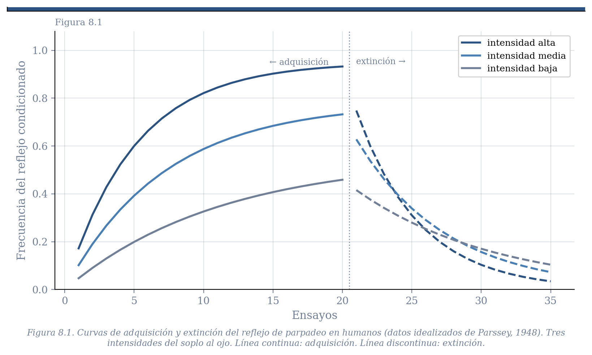
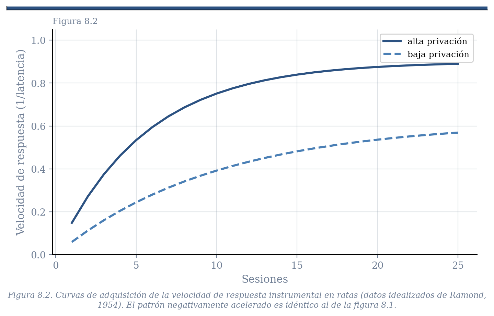
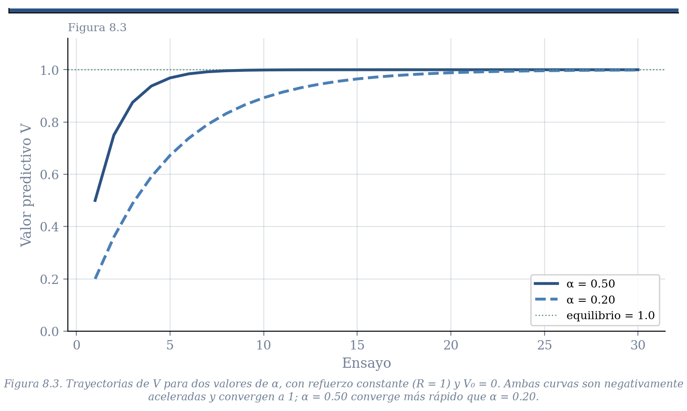
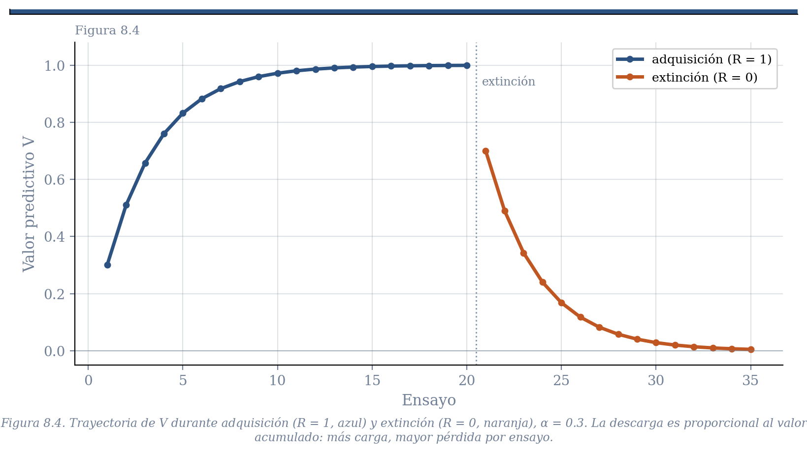
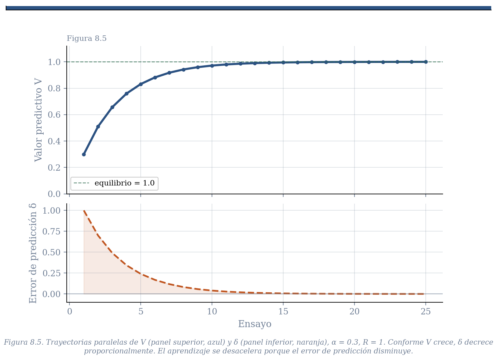
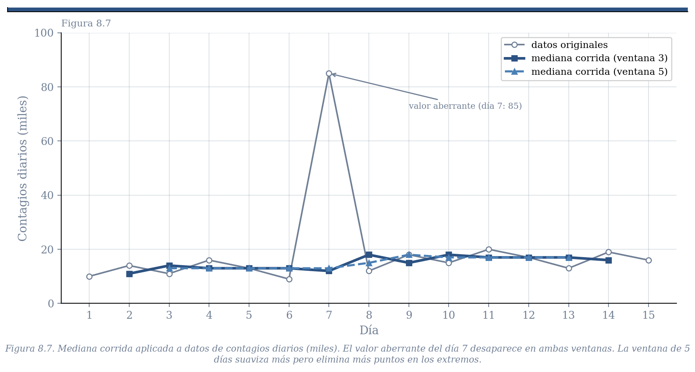
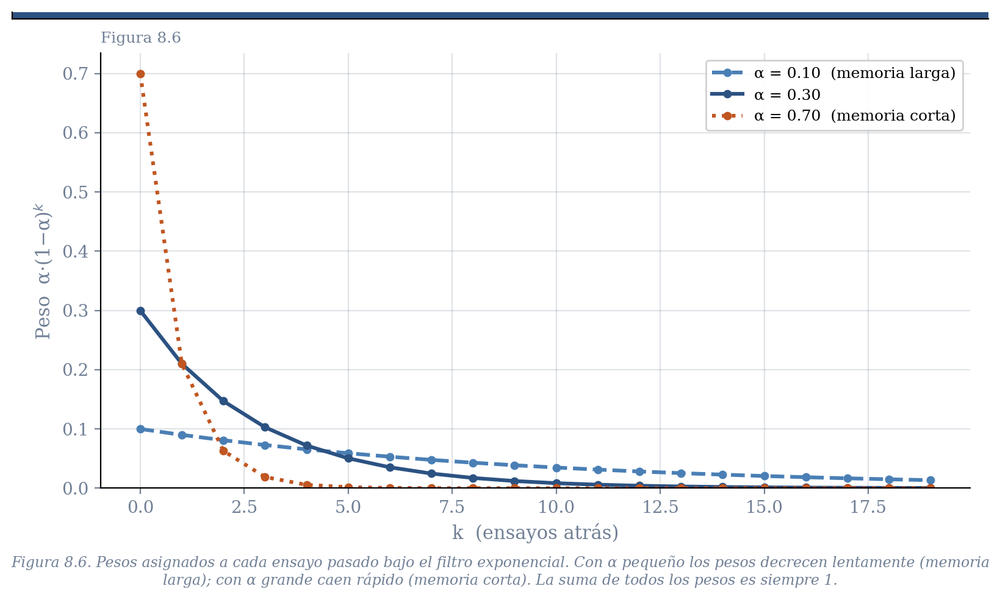

# Capítulo 8: El Modelo de Bush y Mosteller
## Tres Lecturas de una Ecuación

BORRADOR

Los capítulos anteriores dejaron pendiente una promesa. En los capítulos de kinesis y retroalimentación vimos mecanismos que permiten a los organismos orientarse, navegar y regular variables internas con notable eficiencia. Pero tienen una limitación que señalamos entonces: responden a lo que ocurre *ahora*, sin ninguna capacidad de anticipar lo que está por ocurrir. El conductor que carga gasolina solo cuando el tanque está vacío llegará varado tarde o temprano. Lo que le falta es la capacidad de aprender que ciertas señales *predicen* la necesidad futura.

Los capítulos 6 y 7 establecieron las condiciones empíricas bajo las cuales esa capacidad predictiva se desarrolla —y las condiciones bajo las cuales no se desarrolla. Mostraron que los organismos son detectores de covariación estadística: aprenden que ciertos estímulos predicen SBIs, y que ciertas respuestas los producen. Pero no describieron el mecanismo formal que hace posible esa detección.

Este capítulo presenta ese mecanismo. En 1951, Robert Bush y Frederick Mosteller propusieron una ecuación de actualización que ha demostrado ser, pese a su simplicidad, una de las más productivas de la psicología del siglo XX. La ecuación puede leerse de tres maneras distintas. Las tres son algebraicamente idénticas, pero cada una ilumina un aspecto diferente de lo que el mecanismo hace y por qué tiene la forma que tiene.

Antes de la ecuación, sin embargo, conviene observar los datos que debe explicar.

---

## Las curvas de aprendizaje

Desde finales del siglo XIX, el estudio del aprendizaje ha producido una regularidad empírica notable: cuando un organismo experimenta repetidamente la relación entre un evento y un SBI, alguna medida de su comportamiento cambia de forma característica. Aumenta rápidamente al principio y se va estabilizando conforme el aprendizaje madura. La curva resultante es negativamente acelerada —ganancias grandes al inicio, decrecientes con la práctica.

La figura 8.1 muestra un ejemplo con condicionamiento clásico: la frecuencia del reflejo de parpadeo en humanos expuestos a un tono seguido de un soplo al ojo, con diferentes intensidades del soplo (Parssey, 1948). La figura 8.2 muestra un ejemplo instrumental: la velocidad con que ratas tocan una palanca que produce comida, con diferentes niveles de privación (Ramond, 1954). La forma de la curva es la misma en ambos casos —estímulo o respuesta, condicionamiento clásico o instrumental, rata o humano. El modelo que presentamos en este capítulo debe poder explicar ese patrón. Al final del capítulo veremos por qué lo logra.

**[FIGURA 8.1: Curvas de adquisición y extinción del reflejo de parpadeo en humanos. Eje horizontal: ensayos. Eje vertical: frecuencia del reflejo condicionado. Tres curvas para distintas intensidades del soplo al ojo. Todas muestran el patrón negativamente acelerado durante la adquisición y el declive durante la extinción. Datos de Parssey (1948).]**

**[FIGURA 8.2: Curva de adquisición de la velocidad de respuesta en condicionamiento instrumental con ratas. Eje horizontal: sesiones. Eje vertical: velocidad de respuesta. Dos curvas para dos niveles de privación alimentaria. El patrón es cualitativamente idéntico al de la figura 8.1. Datos de Ramond (1954).]**

> **Nota.** La curva negativamente acelerada es el patrón *promedio*, pero existe un debate sobre si refleja el aprendizaje de organismos individuales o es un artefacto estadístico. Si distintos organismos aprenden de manera abrupta —un cambio discreto de no responder a responder— pero en ensayos distintos, el promedio grupal producirá una curva continua aunque ningún individuo la siga. Skinner, Estes y más recientemente Gallistel han insistido en analizar datos de sujetos individuales por esta razón. En un capítulo posterior, cuando examinemos los modelos de Gallistel sobre tiempo y correlaciones, veremos que esa discusión tiene consecuencias formales sobre cómo debe concebirse el mecanismo de aprendizaje.

---

## El modelo: elementos comunes

Todos los modelos de aprendizaje por refuerzo comparten una arquitectura básica. A cada evento que puede predecir un SBI —sea un estímulo condicionado o una respuesta— se le asigna un número que representa su *valor predictivo* actual. A lo largo del siglo XX ese número recibió distintos nombres: fuerza del reflejo, fuerza del hábito, fuerza asociativa. Nosotros lo llamaremos valor predictivo —$V$ cuando hablemos de estímulos, $Q$ cuando hablemos de respuestas— aunque en lo que sigue usaremos $V$ para los dos salvo donde la distinción importe.

Una aclaración terminológica que conviene hacer desde el inicio: en la literatura matemática del aprendizaje, al SBI se le llama *refuerzo* y se representa con $R$ o con $\lambda$. Usaremos ese término en las ecuaciones y derivaciones que siguen, recordando que es exactamente el mismo concepto que en los capítulos anteriores llamamos suceso biológicamente importante. Refuerzo = SBI.

El modelo propone que $V$ se actualiza en cada *ensayo* —cada vez que el evento se presenta— como función de lo que ocurre en ese ensayo. Si el evento va seguido del refuerzo, $V$ sube. Si ocurre sin refuerzo, $V$ baja. El mero paso del tiempo entre ensayos no cambia $V$; solo la experiencia directa con el evento lo modifica. Por eso se dice que son modelos basados en ensayos.

El modelo es una instancia de un sistema de retroalimentación, como los que vimos en el capítulo 5. La función del organismo transforma refuerzos en valor predictivo. La función del entorno —los programas de refuerzo que estudiaremos en bloques posteriores— transforma el comportamiento en consecuencias. Las dos funciones están acopladas en un lazo cerrado.

---

## Ecuaciones en diferencia: un lenguaje ya conocido

Antes de escribir la ecuación, conviene reconocer su forma. En capítulos anteriores encontramos ecuaciones que describen cómo una variable cambia de un momento al siguiente como función de su valor previo y de alguna influencia externa. En el ejemplo de los contagios de covid, el número de casos hoy dependía del número de casos ayer y de la tasa de transmisión. En el modelo de ascenso de colina, el valor de la variable de decisión en el siguiente instante dependía de su valor actual y del cambio detectado en el entorno.

Esas ecuaciones se llaman *ecuaciones en diferencia*: expresan el estado del sistema en el tiempo $t+1$ como función del estado en el tiempo $t$. Son ecuaciones recursivas que se aplican en cada paso al resultado del paso anterior, y siempre requieren especificar un valor inicial.

El modelo de Bush y Mosteller es exactamente una ecuación de esa naturaleza. $V_{t+1}$ —el valor predictivo en el siguiente ensayo— depende de $V_t$ —el valor acumulado hasta ahora— y de $R_t$ —si hubo o no refuerzo en el ensayo actual. La dinámica que produce es la misma clase de trayectoria que ya conocen: un sistema que evoluciona ensayo a ensayo, que puede tener un equilibrio, y cuya trayectoria depende de los parámetros y del valor inicial.

---

## Primera lectura: el integrador con fuga

La forma más directa de pensar en el modelo es como un proceso de carga y descarga. Cada refuerzo *carga* —fortalece— el valor del evento, y cada presentación sin refuerzo lo *descarga* —lo debilita. En este marco, $V$ (o $Q$) es la cantidad de carga del sistema en cada momento. La batería del teléfono es el análogo cotidiano: se carga mientras está conectada, se descarga mientras se usa, y en ningún momento llega a cero de golpe ni alcanza el máximo instantáneamente.

Asumimos que $V_{t+1}$ depende de solo dos factores: el valor acumulado hasta ahora, $V_t$, y lo que ocurrió en el ensayo actual, $R_t$ —que vale 1 si hubo refuerzo y 0 si no lo hubo.

El punto clave es que estos dos factores no siempre deben tener el mismo peso. En un entorno muy estable, donde la historia acumulada es un buen predictor del futuro, tiene sentido darle más peso a la experiencia pasada que al ensayo actual. En un entorno cambiante, donde el pasado distante es poco relevante, tiene sentido darle más peso a la experiencia reciente. El parámetro $\alpha$ —entre 0 y 1— captura exactamente esa importancia relativa: cuánto pesa la experiencia acumulada frente al nuevo refuerzo. Si los dos factores deben sumar 1, la ecuación queda:

$$V_{t+1} = (1-\alpha)\,V_t + \alpha\,R_t \qquad \text{donde } 0 < \alpha < 1$$

Esta es la ecuación del *integrador con fuga*. El parámetro $(1-\alpha)$ es el peso de la historia acumulada; $\alpha$ es el peso del refuerzo actual.

Para ver los dos procesos por separado, conviene examinar cada caso. Cuando hay refuerzo ($R_t = 1$), la ecuación carga el sistema: $V_{t+1} = (1-\alpha)V_t + \alpha$, y el incremento es proporcional a qué tan lejos está $V$ de su máximo. Cuando no hay refuerzo ($R_t = 0$), la ecuación se reduce a:

$$V_{t+1} = (1-\alpha)\,V_t$$

En este caso la descarga es pura: cada presentación del evento sin refuerzo multiplica la carga actual por $(1-\alpha)$, reduciéndola en una fracción $\alpha$. Un sistema con mucha carga acumulada pierde más en términos absolutos que uno con poca carga —exactamente como una batería que se descarga más rápido cuando está llena que cuando está casi vacía.

Cuando $\alpha$ es cercano a 0, la historia acumulada domina: cada nuevo ensayo apenas mueve la cantidad de carga, y el sistema es resistente a fluctuaciones pero lento para detectar cambios reales. Cuando $\alpha$ es cercano a 1, el refuerzo actual domina: el sistema responde rápido a cambios pero es volátil ante fluctuaciones accidentales. Pensemos en una amistad de muchos años que siempre ha sido positiva. Una mañana esa persona no te saluda. Con $\alpha$ cercano a 0, ese evento apenas altera tu valoración de la relación —la historia pesa más. Con $\alpha$ cercano a 1, ese único evento tiene un peso desproporcionado sobre años de experiencia acumulada. Ninguno de los dos extremos es adaptativo en general; el valor óptimo de $\alpha$ depende de qué tan estable y predecible sea el entorno.

La ecuación puede expresarse de dos formas equivalentes que la literatura usa indistintamente. La primera enfatiza el *nivel* del valor predictivo ensayo a ensayo:

$$V_{t+1} = (1-\alpha)\,V_t + \alpha\,R_t$$

La segunda enfatiza el *cambio* de ensayo a ensayo. Si definimos $\Delta V = V_{t+1} - V_t$, restando $V_t$ de ambos lados:

$$\Delta V = \alpha\,(R_t - V_t)$$

Ambas formas son idénticas. La primera es útil para simular la trayectoria de $V$; la segunda hace visible de inmediato que el cambio es proporcional a la discrepancia entre lo que ocurrió y lo que se esperaba —anticipando la segunda lectura.

Para ver cómo funciona la primera forma, sigamos el ejemplo numérico de las diapositivas. Con $\alpha = 0.5$, $V_0 = 0$, y cuatro ensayos de adquisición seguidos de tres de extinción:

| Ensayo | $R_t$ | $V_t$ | $V_{t+1} = 0.5\,V_t + 0.5\,R_t$ | Fase |
|--------|--------|--------|----------------------------------|------|
| 1      | 1      | 0.000  | 0.500                            | Adquisición |
| 2      | 1      | 0.500  | 0.750                            | Adquisición |
| 3      | 1      | 0.750  | 0.875                            | Adquisición |
| 4      | 1      | 0.875  | 0.938                            | Adquisición |
| 5      | 0      | 0.938  | 0.469                            | Extinción |
| 6      | 0      | 0.469  | 0.234                            | Extinción |
| 7      | 0      | 0.234  | 0.117                            | Extinción |

Noten el patrón en ambas fases. Durante la adquisición, el $V$ obtenido en cada ensayo se convierte en el nuevo $V_t$ del ensayo siguiente; el valor crece rápidamente al principio y se desacelera conforme se aproxima a 1. Durante la extinción —cuando $R_t = 0$ y la ecuación se reduce a $V_{t+1} = (1-\alpha)V_t$— el proceso se invierte: la carga disminuye en cada ensayo en una fracción $\alpha$ de su valor actual. Desde 0.938, la descarga es más rápida que desde 0.234, porque hay más carga que perder. Con $\alpha = 0.2$ el proceso de adquisición es más lento: $V_1 = 0.2$, $V_2 = 0.36$, $V_3 = 0.488$, $V_4 = 0.590$; y la extinción también es más lenta. La forma de las trayectorias es la misma; cambia la velocidad.

**[FIGURA 8.3: Trayectorias de V para α = 0.2 y α = 0.5, con refuerzo constante (R = 1) y V₀ = 0. Eje horizontal: ensayos. Eje vertical: valor V. Ambas curvas son negativamente aceleradas y convergen a 1, pero con velocidades distintas. Con α = 0.5 la convergencia es más rápida; con α = 0.2 es más lenta y suave. Datos de las diapositivas del curso.]**

**[FIGURA 8.4: Trayectoria de V durante adquisición (R = 1) y extinción (R = 0), α = 0.3. Eje horizontal: ensayos. Eje vertical: valor V. V crece durante la adquisición siguiendo la curva negativamente acelerada; decrece durante la extinción siguiendo una curva especular. La tasa de cambio en ambas fases es proporcional al valor actual de V.]**

**[SIMULADOR 8.1 — Disponible en línea. El simulador implementa el integrador con fuga. Parámetros ajustables: valor inicial de V, α, secuencia de refuerzos (constante o probabilística), número de ensayos. Muestra la trayectoria de V ensayo a ensayo.]**

---

## Segunda lectura: la reducción del error de predicción

La misma ecuación puede leerse de otra manera. Basta reordenar los términos algebraicamente:

$$V_{t+1} = (1-\alpha)\,V_t + \alpha\,R_t$$

$$V_{t+1} = V_t - \alpha\,V_t + \alpha\,R_t$$

$$V_{t+1} = V_t + \alpha\,(R_t - V_t)$$

La expresión $(R_t - V_t)$ es la clave. Es la diferencia entre lo que ocurrió ($R_t$) y lo que el organismo esperaba ($V_t$): el *error de predicción*. En la literatura contemporánea se representa con $\delta$:

$$\delta_t = R_t - V_t$$

Con esa notación, la ecuación del nivel queda:

$$V_{t+1} = V_t + \alpha\,\delta_t$$

Y la ecuación del cambio queda:

$$\Delta V = \alpha\,\delta_t$$

Si el refuerzo fue mayor de lo anticipado, $\delta$ es positivo y $V$ sube. Si fue menor, $\delta$ es negativo y $V$ baja. Si el refuerzo ocurrió exactamente como se esperaba —$R_t = V_t$— entonces $\delta = 0$ y $V$ no cambia. En la literatura contemporánea, esta forma se conoce como la *regla delta*, y es la versión dominante en la psicología del aprendizaje y las neurociencias.

Esta lectura sugiere una intuición sobre el bloqueo de Kamin que vimos en el capítulo 6. Si un estímulo ya predice perfectamente el refuerzo —$V_t = R_t$— entonces $\delta_t = 0$: no hay sorpresa y no hay nada que aprender. Cuando se presenta el compuesto AB, si A ya predice el refuerzo perfectamente, el error de predicción debería ser cero y B no debería aprender nada. La intuición es correcta, pero la ecuación de Bush y Mosteller no puede derivarla formalmente: opera sobre eventos individuales y no tiene mecanismo para distribuir el error de predicción entre estímulos simultáneos. Esa extensión es precisamente lo que Rescorla y Wagner añadieron en 1972, y es el tema del capítulo siguiente.

La figura 8.5 muestra la evolución paralela de $V$ y $\delta$ a lo largo del aprendizaje. Al inicio, cuando $V$ es bajo y el refuerzo ocurre, $\delta$ es grande y positivo —mucha sorpresa, mucho aprendizaje. Conforme $V$ crece y se aproxima al valor de equilibrio, $\delta$ se hace cada vez más pequeño. El aprendizaje se desacelera no porque el mecanismo cambie, sino porque hay menos error que corregir. La curva negativamente acelerada es, desde esta perspectiva, la consecuencia directa de un sistema que aprende proporcionalmente a su propia ignorancia.

**[FIGURA 8.5: Trayectorias paralelas de V y δ. Panel superior: V crece de 0 hacia 1 siguiendo la curva negativamente acelerada. Panel inferior: δ decrece desde su valor máximo inicial hacia cero. La relación entre las dos curvas ilustra que el aprendizaje se desacelera porque el error de predicción disminuye. α = 0.3, R = 1.]**

Esta lectura también conecta con la neurociencia. A finales de los años noventa, Wolfram Schultz encontró que las neuronas dopaminérgicas del mesencéfalo de primates se comportan exactamente como predice la señal $\delta$. Al inicio del entrenamiento disparan cuando ocurre el refuerzo inesperado. Conforme el animal aprende, la respuesta dopaminérgica se desplaza hacia el estímulo predictor —el momento donde se produce el error de predicción— y desaparece en el momento del refuerzo, porque este ya no es sorprendente. Cuando el refuerzo esperado no ocurre, las neuronas muestran una supresión de actividad: un error de predicción negativo. La dopamina no es simplemente una señal de placer; es una señal de error de predicción.

---

## Tercera lectura: el filtro de media exponencial corrida

Hay una tercera forma de llegar a la misma ecuación. Es la que más claramente revela qué está haciendo el organismo desde el punto de vista estadístico, y es la que favoreceremos en capítulos posteriores cuando examinemos entornos cambiantes.

El problema que enfrenta el organismo es, en el fondo, un problema de estimación: dado todo lo que he observado hasta ahora, ¿cuál es la tasa de refuerzo asociada a este evento? Para entender cómo el modelo resuelve ese problema, conviene empezar con una estrategia más simple y mostrar por qué no es suficiente.

### Medianas corridas y el problema del alisamiento

El problema que enfrenta el organismo es un problema de estimación: dado todo lo que he observado, ¿cuál es la tasa de refuerzo asociada a este evento? La estrategia más directa es calcular el promedio de todos los refuerzos desde el primer ensayo:

$$V_t = \frac{1}{t}\sum_{i=1}^{t} R_i$$

Pero este promedio simple tiene dos limitaciones. Asigna el mismo peso a todos los ensayos —una observación de hace cien ensayos pesa igual que la de ayer— y no filtra el ruido de las fluctuaciones accidentales.

Para entender el problema del ruido y cómo resolverlo, consideremos el ejemplo de los contagios diarios de covid, que ya conocen. Usamos la *mediana corrida* porque es fácil de calcular a mano y robusta ante valores aberrantes; el argumento sobre alisamiento aplica igualmente a la media. Se selecciona una ventana de cierto número de observaciones, se calcula su mediana —el valor central al ordenarlos— y se desplaza la ventana un paso a la derecha, repitiendo la operación.

Con los siguientes contagios diarios (en miles): 10, 14, 11, 16, 13, 9, **85**, 12, 18, 15, 20, 17, 13, 19, 16, una mediana corrida de 3 produce: 11, 13, 13, 13, 11, 12, 15, 15, 18, 17, 17, 16, 16. El valor aberrante de 85 desaparece, absorbido por sus vecinos, y la tendencia ascendente queda visible. Una ventana de 5 suaviza más aún: 13, 13, 12, 13, 13, 15, 17, 17, 17, 17, 16.

**[FIGURA 8.7: Ejemplo de mediana corrida. Eje horizontal: días (1–15). Eje vertical: contagios diarios (miles). Línea negra irregular: datos originales, con el valor aberrante de 85 visible en el día 7. Línea azul oscura: mediana corrida de ventana 3. Línea azul clara: mediana corrida de ventana 5. Las dos ventanas eliminan el valor aberrante y hacen visible la tendencia ascendente.]**

La mediana corrida resuelve el ruido pero no el problema de los pesos iguales: los datos de la primera semana pesan igual que los de ayer. Y además es costosa: requiere almacenar toda la ventana en cada paso. En la mayoría de los contextos adaptativos, tiene más sentido dar mayor peso a las experiencias recientes.

### De la media simple a la regla delta

Para ver cómo la media simple se convierte en filtro exponencial, conviene partir de un caso concreto. Consideremos una secuencia de resultados de una máquina tragamonedas —cada respuesta produce refuerzo (1) o no (0) con cierta probabilidad constante:

$$1\;1\;0\;0\;0\;1\;0\;0\;1\;1\;1\;0\;0\;0\;1\;1\;0\;0\;1\;1\;0\;1\;0\;0\;1\;1\;1\;1$$

Para predecir el siguiente resultado, la estrategia más directa es calcular la media de todos los resultados obtenidos hasta el ensayo $t$:

$$V_t = \frac{1}{t}\sum_{i=1}^{t} R_i$$

Pero esta fórmula exige recordar cada resultado desde el inicio y sumarlos de nuevo en cada ensayo. Existe una forma equivalente que evita ese costo. Partimos de la media en $t$ y la media en $t-1$:

$$V_t = \frac{1}{t}\sum_{i=1}^{t} R_i \qquad \qquad V_{t-1} = \frac{1}{t-1}\sum_{i=1}^{t-1} R_i$$

Expandemos  las dos ecuaciones:

$$V_t = \frac{1}{t}\bigl(R_1 + R_2 + \cdots + R_{t-1} + R_t\bigr)$$

$$V_{t -1}= \frac{1}{t-1|}\bigl(R_1 + R_2 + \cdots + R_{t-1} )$$

Las dos ecuaciones comparten los términos $R_1$ hasta $R_{t-1}$. Multiplicando la segunda por $(t-1)$ obtenemos justo esa suma compartida:

$$(t-1)\,V_{t-1} = R_1 + R_2 + \cdots + R_{t-1}$$

Sustituyendo en la primera:

$$V_t = \frac{1}{t}\bigl((t-1)\,V_{t-1} + R_t\bigr)$$

Expandiendo y reordenando:

$$V_t = V_{t-1} + \frac{1}{t}\,(R_t - V_{t-1})$$

Esta es la media simple escrita como regla de actualización: para calcular el nuevo promedio solo necesito el promedio anterior $V_{t-1}$ y el refuerzo actual $R_t$. No hace falta almacenar ningún resultado individual.

La forma de la ecuación debería resultar familiar: es la regla delta, con el peso $\frac{1}{t}$ en lugar de $\alpha$. Pero ese peso tiene un problema: decrece con cada ensayo nuevo. En el ensayo 10, cada resultado pesa $\frac{1}{10}$. En el ensayo 100, pesa $\frac{1}{100}$. Conforme se acumula experiencia, cada nueva observación importa cada vez menos —exactamente lo opuesto de lo que queremos si el entorno puede cambiar.

### Del peso decreciente al peso constante

La solución es directa: reemplazar el peso decreciente $\frac{1}{t}$ por un peso *constante* $\alpha$:

$$V_t = V_{t-1} + \alpha\,(R_t - V_{t-1})$$

Que es exactamente la regla delta. Con $\alpha$ constante, cada nuevo refuerzo siempre tiene el mismo peso relativo, sin importar cuántos ensayos hayan transcurrido.

Pero ¿qué implica esto para los refuerzos del pasado? Para verlo, conviene reescribir la ecuación en la forma del integrador:

$$V_t = (1-\alpha)\,V_{t-1} + \alpha\,R_t$$

Y ahora expandir $V_{t-1}$ usando su propia ecuación, luego $V_{t-2}$, y así sucesivamente. La tabla siguiente muestra los primeros tres pasos de la sustitución con $V_0 = 0$:

| Paso | Sustitución | Resultado |
|------|-------------|-----------|
| $V_t$ | — | $\alpha R_t + (1-\alpha)V_{t-1}$ |
| Sustituyo $V_{t-1}$ | $V_{t-1} = \alpha R_{t-1} + (1-\alpha)V_{t-2}$ | $\alpha R_t + \alpha(1-\alpha)R_{t-1} + (1-\alpha)^2 V_{t-2}$ |
| Sustituyo $V_{t-2}$ | $V_{t-2} = \alpha R_{t-2} + (1-\alpha)V_{t-3}$ | $\alpha R_t + \alpha(1-\alpha)R_{t-1} + \alpha(1-\alpha)^2 R_{t-2} + (1-\alpha)^3 V_{t-3}$ |
| Continúo hasta $V_0 = 0$ | — | $\alpha R_t + \alpha(1-\alpha)R_{t-1} + \alpha(1-\alpha)^2 R_{t-2} + \cdots + \alpha(1-\alpha)^{t-1}R_1$ |

El patrón es claro: cada refuerzo pasado recibe un peso de la forma $\alpha(1-\alpha)^k$, donde $k$ es el número de ensayos que lo separan del presente. La fórmula general es entonces:

$$V_t = \alpha\,R_t + \alpha(1-\alpha)\,R_{t-1} + \alpha(1-\alpha)^2\,R_{t-2} + \cdots + \alpha(1-\alpha)^{t-1}\,R_1$$

El refuerzo más reciente $R_t$ tiene peso $\alpha$. El del ensayo anterior tiene peso $\alpha(1-\alpha)$. El de hace dos ensayos tiene peso $\alpha(1-\alpha)^2$. Los pesos decrecen exponencialmente hacia el pasado —de ahí el nombre: *filtro de media exponencial corrida*.

**[FIGURA 8.6: Pesos asignados a cada ensayo pasado bajo el filtro exponencial, para α = 0.1, 0.3 y 0.7. Eje horizontal: distancia temporal al pasado (ensayos). Eje vertical: peso de ponderación. Con α pequeño, los pesos decrecen lentamente — el organismo tiene memoria larga. Con α grande, los pesos caen rápido — el organismo tiene memoria corta. En todos los casos, la suma de todos los pesos es 1.]**

Esta tercera lectura revela lo que las otras dos no hacen tan explícito: el organismo no registra eventos individuales. Estima un *promedio ponderado* de su historia de refuerzos, donde los más recientes pesan más y el peso de cada observación decrece conforme queda más atrás en el tiempo. El parámetro $\alpha$ determina el tamaño efectivo de esa ventana temporal: un $\alpha$ pequeño equivale a una ventana larga —memoria larga, resistente al ruido, lenta para detectar cambios reales; un $\alpha$ grande equivale a una ventana corta —memoria corta, sensible a cambios, pero también a fluctuaciones accidentales.

**[SIMULADOR 8.2 — Disponible en línea. El simulador permite explorar las tres interpretaciones del modelo de manera integrada. Panel izquierdo: trayectoria de V (integrador con fuga). Panel central: trayectoria de δ (error de predicción). Panel derecho: pesos asignados a cada ensayo pasado (filtro exponencial). Los tres paneles responden al mismo conjunto de parámetros: α, secuencia de refuerzos, número de ensayos.]**

---

## Las tres lecturas son la misma ecuación

Conviene detenerse ante lo que acabamos de hacer. Llegamos a la misma ecuación desde tres puntos de partida distintos:

¿Cómo carga y descarga el valor de un evento con la experiencia? → El integrador con fuga.

¿Qué impulsa el aprendizaje ensayo a ensayo? → El error de predicción.

¿Qué está estimando el organismo cuando aprende? → Un promedio ponderado exponencialmente de su historia de refuerzos.

Las tres respuestas son la misma ecuación:

$$V_{t+1} = (1-\alpha)\,V_t + \alpha\,R_t \qquad \Longleftrightarrow \qquad \Delta V = \alpha\,(R_t - V_t)$$

No son teorías distintas sino marcos distintos para pensar en el mismo mecanismo. El primer marco facilita pensar en la trayectoria del sistema. El segundo conecta con los experimentos de bloqueo y con la neurociencia dopaminérgica. El tercero permite analizar el rendimiento del modelo cuando el entorno cambia o tiene ruido, y será el más útil cuando examinemos entornos no estacionarios. La elección de cuál marco usar depende de qué pregunta se esté respondiendo.

---

## Conexiones

### Hacia atrás: Kinesis, Retroalimentación y Asignación de Crédito

El modelo cierra la promesa que los mecanismos de los bloques anteriores no podían cumplir. La kinesis permite navegar hacia recursos sin receptores de distancia, pero su solución es estadística y lenta. La retroalimentación permite orientación precisa mediante comparación simultánea, pero responde solo al estado presente. Ninguno de los dos tiene memoria de la experiencia pasada de un tipo que les permita *predecir* lo que vendrá. El modelo de Bush y Mosteller es el primer mecanismo en nuestra caja de herramientas que actualiza representaciones internas —valores predictivos— en función de la historia de experiencias. Esa capacidad de predicción es cualitativamente distinta de todo lo anterior.

El bloqueo de Kamin, que estableció la evidencia central del capítulo 6, ahora tiene su explicación formal: si $V_t = R_t$, entonces $\delta_t = 0$ y no hay aprendizaje posible sobre ningún estímulo contiguo. Los experimentos de Dickinson y Lattal del capítulo 7 también encuentran su lugar: el organismo aprende con demoras largas porque integra el error de predicción a lo largo de ventanas temporales —exactamente lo que describe el filtro exponencial.

### Hacia adelante: Rescorla-Wagner (Capítulo 9)

El modelo de Bush y Mosteller opera sobre eventos individuales. Cuando hay varios estímulos presentes simultáneamente, ¿cómo se distribuye el error de predicción entre ellos? Esa pregunta no tiene respuesta dentro del modelo actual: si dos estímulos están presentes al mismo tiempo, cada uno actualizaría su valor de manera independiente, y el bloqueo no se derivaría formalmente. Rescorla y Wagner resolvieron el problema en 1972 con una extensión elegante: el error de predicción no se calcula sobre el valor de un evento individual, sino sobre la suma de los valores de *todos* los eventos presentes. Esa modificación convierte la competencia entre estímulos en consecuencia matemática. El capítulo 9 examina esa extensión.

---

## Resumen

El modelo de Bush y Mosteller formaliza el mecanismo que los capítulos de kinesis y retroalimentación no podían proveer: la capacidad de aprender, a partir de la experiencia, el valor predictivo de los eventos del entorno. La ecuación central actualiza ese valor ensayo a ensayo como función de la experiencia acumulada y del refuerzo obtenido, con el parámetro $\alpha$ controlando la importancia relativa de cada factor.

La ecuación admite tres lecturas equivalentes. Como integrador con fuga, describe el proceso de carga y descarga del valor predictivo, con $(1-\alpha)$ como peso de la historia y $\alpha$ como peso del refuerzo actual. Como reductor de error de predicción, describe un sistema que se actualiza proporcionalmente a la discrepancia entre lo esperado y lo obtenido —$\delta = R_t - V_t$— y que se detiene cuando esa discrepancia es cero. Como filtro de media exponencial corrida, describe un estimador que promedia la historia de refuerzos con pesos que decrecen exponencialmente hacia el pasado, donde $\alpha$ determina el tamaño efectivo de la ventana temporal.

Las tres lecturas son algebraicamente idénticas. La del error de predicción conecta directamente con el bloqueo de Kamin y con la neurociencia dopaminérgica. La del filtro exponencial será la más útil cuando examinemos entornos no estacionarios. La curva de aprendizaje negativamente acelerada —el patrón empírico central— emerge directamente de la ecuación: el sistema aprende rápido cuando el error es grande y se desacelera conforme el error disminuye.

---

## Ejercicios

**1.** La ecuación del integrador puede escribirse como $V_{t+1} = (1-\alpha)V_t + \alpha R_t$. Explica en términos del peso relativo de cada factor qué ocurriría si $\alpha = 0$ exactamente, y qué si $\alpha = 1$ exactamente. ¿Por qué ninguno de los dos extremos es un modelo de aprendizaje útil?

**2.** Con $\alpha = 0.5$ y $V_0 = 0$, calcula los primeros cinco valores de $V$ para la secuencia de refuerzos 1, 0, 1, 1, 0. Luego repite con $\alpha = 0.1$. ¿Con cuál de los dos valores el resultado después de cinco ensayos refleja mejor la proporción real de refuerzos en la secuencia (0.6)? ¿Qué dice esto sobre la relación entre $\alpha$ y la velocidad de convergencia?

**3.** En la derivación del filtro exponencial mostramos que el peso del refuerzo $k$ ensayos atrás es $\alpha(1-\alpha)^k$. Calcula los pesos para los primeros cinco ensayos pasados con $\alpha = 0.3$ y con $\alpha = 0.7$. ¿Con cuál de los dos un refuerzo de hace cinco ensayos tiene más influencia sobre el valor actual? ¿Cómo se relaciona esto con la noción de "ventana temporal larga" versus "ventana temporal corta"?

**4.** La curva de aprendizaje negativamente acelerada emerge de la ecuación sin supuestos adicionales. Explica por qué, usando la trayectoria del error de predicción $\delta$ a lo largo de los ensayos. ¿Qué debería ser cierto sobre $\delta$ para que la curva de aprendizaje fuera lineal en lugar de negativamente acelerada?

**5.** Usa el Simulador 8.1 para explorar qué ocurre con el valor de equilibrio cuando la probabilidad de refuerzo es 0.5 en lugar de 1.0. ¿Hacia qué valor converge $V$? ¿Cambia ese valor de equilibrio al modificar $\alpha$? Explica por qué el valor de equilibrio depende de la probabilidad de refuerzo pero no de $\alpha$.

**6.** *(Reflexión)* El parámetro $\alpha$ determina el tamaño efectivo de la ventana temporal sobre la que el organismo promedia su experiencia. Describe dos situaciones —una en que un $\alpha$ grande sería adaptativo y una en que sería desadaptativo. ¿Qué propiedades del entorno determinan el valor óptimo de $\alpha$? ¿Debería ese valor ser fijo a lo largo de la vida de un organismo, o debería poder ajustarse?

---

## Lecturas Recomendadas

**Bush, R. R., & Mosteller, F. (1951).** A mathematical model for simple learning. *Psychological Review, 58*, 313–323. — El artículo original. Las primeras secciones son accesibles y presentan la lógica con claridad; las derivaciones matemáticas son el antecedente directo de todo lo que vino después.

**Sutton, R. S., & Barto, A. G. (2018).** *Reinforcement Learning: An Introduction* (2ª ed.). MIT Press. Disponible gratuitamente en línea. Los capítulos 2 y 6 desarrollan el modelo de Bush-Mosteller en el contexto del aprendizaje de máquinas con claridad excepcional. El capítulo 2, en particular, presenta la derivación del filtro exponencial que seguimos aquí.

**Schultz, W., Dayan, P., & Montague, P. R. (1997).** A neural substrate of prediction and reward. *Science, 275*, 1593–1599. — El artículo que estableció la correspondencia entre la señal dopaminérgica y el error de predicción del modelo. Tres páginas que transformaron la neurociencia del aprendizaje.

**Rescorla, R. A., & Wagner, A. R. (1972).** A theory of Pavlovian conditioning. En A. H. Black & W. F. Prokasy (Eds.), *Classical Conditioning II*. Appleton-Century-Crofts. — La extensión de Bush-Mosteller a compuestos de estímulos. Imprescindible para el capítulo siguiente.

**Glimcher, P. W. (2011).** Understanding dopamine and reinforcement learning: The dopamine reward prediction error hypothesis. *PNAS, 108*, 15647–15654. — Revisión accesible de la evidencia neurobiológica sobre el error de predicción dopaminérgico. Buen punto de entrada antes de leer Schultz et al.
