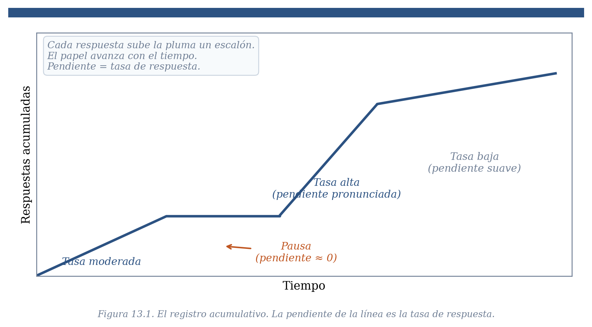
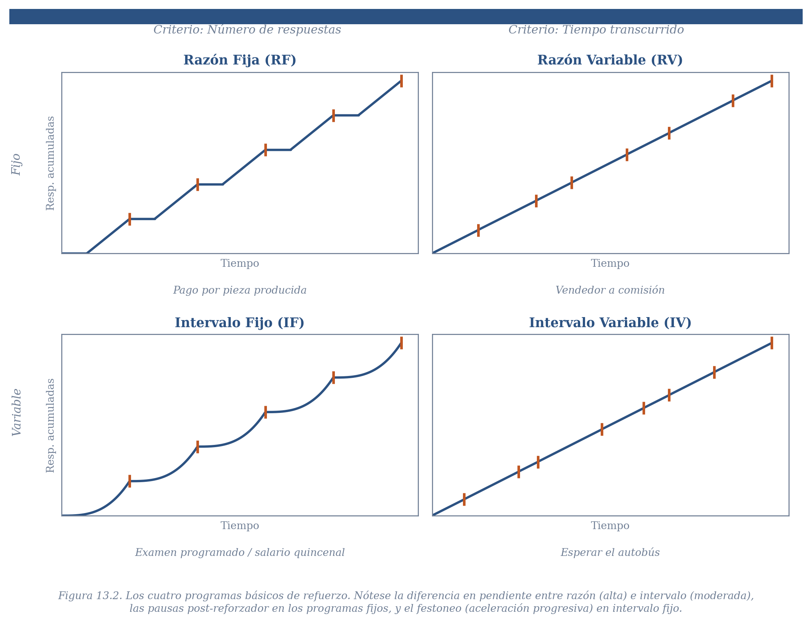
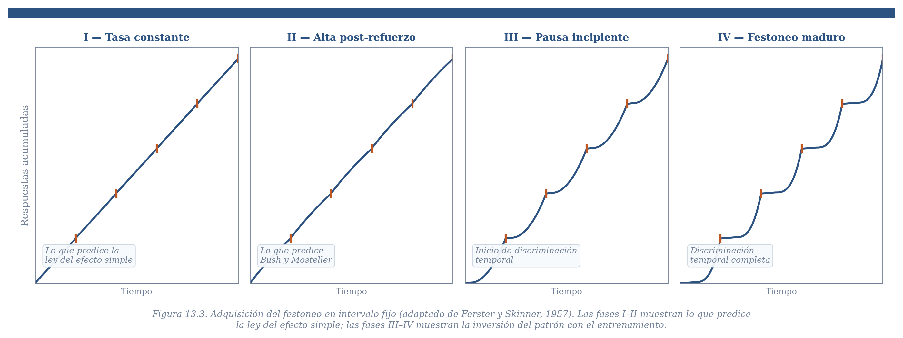
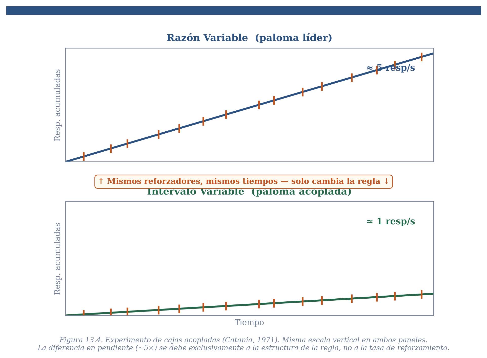
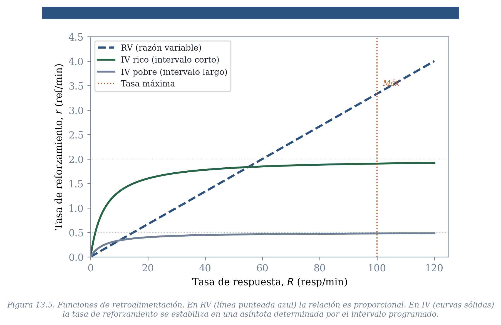
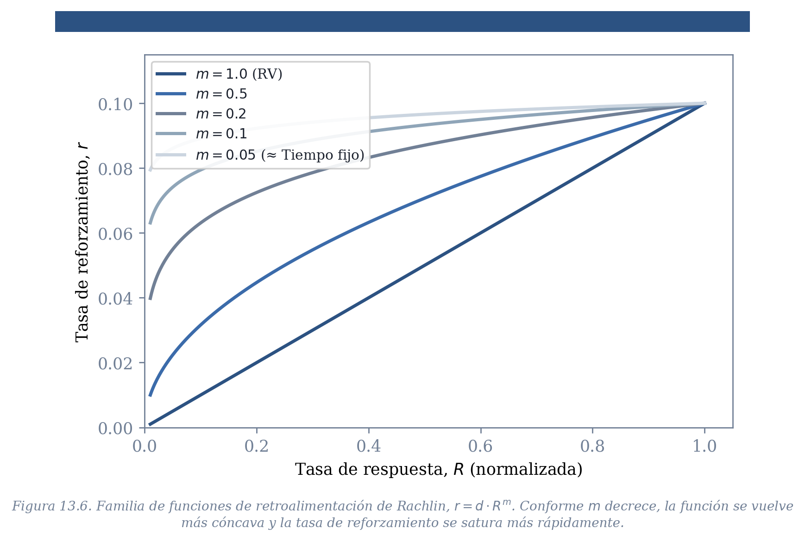

## Del Conocimiento a la Acción

Los capítulos anteriores construyeron una maquinaria sofisticada para resolver el problema de la predicción. A lo largo de los bloques de asignación de crédito y modelos formales, nuestro agente adaptativo adquirió la capacidad de detectar qué estímulos predicen sucesos biológicamente importantes, qué respuestas los producen, y cuánto vale cada predictor. El capítulo anterior mostró cómo ese conocimiento predictivo se traduce en acción a través de los sistemas de comportamiento: las predicciones activan patrones organizados de respuesta cuya forma refleja la historia evolutiva de la especie. Cada organismo llega a esta situación con una historia de aprendizaje que ha moldeado el valor de sus respuestas y la fuerza de sus predicciones.

Pero hay un problema que esa maquinaria no resuelve. Un depredador sabe que cierta estrategia de acecho produce presas, pero ¿con qué frecuencia debe intentarlo? Un empleado sabe que escribir informes produce un salario, pero ¿cuántos informes al mes? Un estudiante sabe que estudiar mejora sus calificaciones, pero ¿cómo distribuir ese esfuerzo a lo largo del semestre? En todos estos casos, el organismo ya posee el conocimiento relevante — lo que necesita es una regla para traducir ese conocimiento en una *distribución temporal de acciones*. ¿Cuánto de cada respuesta, cuándo, y a qué ritmo?

Este es el problema de la acción, y con él abrimos un nuevo bloque del libro. Los capítulos anteriores preguntaban *qué predice qué*. A partir de ahora, la pregunta central es *qué hacer dado lo que se sabe*. La diferencia no es menor: mientras la predicción puede evaluarse como correcta o incorrecta, la acción debe evaluarse en función de sus consecuencias a lo largo del tiempo — y esas consecuencias dependen de reglas del entorno que el organismo debe descubrir y a las que debe adaptarse.

Una observación empírica servirá como punto de partida. Piensen en las diversas formas en que las consecuencias de nuestras acciones llegan a nosotros. Un vendedor de coches gana una comisión por cada venta — la consecuencia depende del número de ventas cerradas. Un pescador arroja su línea y espera; el pez llega cuando llega, independientemente de cuántas veces el pescador sacuda la caña. Una persona que espera el autobús en la Ciudad de México puede esperar dos minutos o veinte — la frecuencia del transporte es variable e impredecible. Un trabajador asalariado recibe su pago cada quincena, haya trabajado mucho o poco. En cada caso, la relación entre lo que el organismo hace y la consecuencia que obtiene tiene una estructura diferente. Y esa estructura, como veremos, moldea profundamente la forma en que el organismo distribuye su comportamiento.

La contribución central de este capítulo es mostrar que una de las regularidades más robustas en toda la psicología — quizá *la* más robusta — es que el mismo organismo, trabajando por el mismo reforzador y con la misma motivación, exhibe patrones de respuesta radicalmente distintos dependiendo de las reglas que gobiernan la relación entre su comportamiento y sus consecuencias.

## De Thorndike a Skinner: una nueva unidad de análisis

La ley del efecto de Thorndike, que introdujimos en el capítulo 7, propone que las respuestas seguidas de consecuencias satisfactorias se fortalecen. El modelo de Bush y Mosteller del capítulo 8 formalizó esa idea como una ecuación de actualización: $Q_{t+1} = Q_t + \alpha(R_t - Q_t)$, donde el valor de la respuesta se ajusta en cada ensayo según el error de predicción. Esa formulación captura bien la *adquisición* del comportamiento — cómo un organismo que no sabe nada aprende gradualmente qué respuestas producen consecuencias.

Pero hay una limitación fundamental en el marco experimental de Thorndike y sus sucesores. La caja de escape de Thorndike, el laberinto en T, y el callejón de carrera comparten una propiedad: en cada ensayo, el organismo solo puede emitir la respuesta exitosa una vez. El gato escapa una vez por ensayo. La rata elige un brazo del laberinto una vez por ensayo. Lo que se mide es la latencia o la velocidad — cuánto tarda el organismo en ejecutar una respuesta cuya ocurrencia está determinada por el experimentador. La pregunta sobre *cuántas veces* y *con qué distribución temporal* responde el organismo no puede siquiera formularse en estos protocolos.

B. F. Skinner (1938) transformó esta situación con dos innovaciones que cambiaron la unidad de análisis del campo entero. La primera fue conceptual: distinguir entre respuestas *provocadas* — aquellas para las cuales puede identificarse un estímulo antecedente, como el parpadeo ante un soplo — y respuestas *emitidas* — aquellas que el organismo produce libremente sin un estímulo discreto que las desencadene. Piensen en las respuestas de revisar el teléfono, caminar hacia la cocina, iniciar una conversación, encender un cigarrillo: ninguna es provocada por un estímulo puntual. Todas ocurren en un flujo continuo, compitiendo entre sí por el tiempo del organismo. La segunda innovación fue metodológica: proponer la *tasa de respuesta* — el número de respuestas por unidad de tiempo — como la medida fundamental de la disposición del organismo a actuar. Si en una hora fumo cinco cigarros, mi tasa de fumar es de cinco respuestas por hora. Si mañana fumo ocho, la tasa aumentó. La tasa captura en una sola dimensión lo que los protocolos de ensayos discretos no podían medir: la probabilidad de que un organismo produzca espontáneamente una acción en cualquier momento del tiempo.

Para observar esa tasa, Skinner diseñó un espacio experimental con un dispositivo — una palanca para ratas, una tecla iluminada para palomas — que el organismo podía operar libremente, tantas veces como quisiera, a cualquier ritmo. Y para visualizar los patrones temporales del comportamiento, inventó el *registro acumulativo*: un registro continuo donde el eje horizontal marca el tiempo y el eje vertical acumula cada respuesta como un escalón. La pendiente de la línea resultante *es* la tasa de respuesta: pendiente pronunciada indica tasa alta; pendiente plana indica pausa.

Con estas herramientas, la ley del efecto adquiere una formulación nueva. En la versión de Thorndike, el efecto del refuerzo es seleccionar qué respuesta se fortalece. En la versión de Skinner, el efecto del refuerzo opera en dos niveles: primero, selecciona cuál de las respuestas que preceden al reforzador es la que queda vinculada a él (el problema del aprendizaje, que ya abordamos); segundo, determina la *tasa de ocurrencia* de esa respuesta seleccionada (el problema de la acción, que es el tema de este capítulo y los siguientes). La ley se expresa ahora como una función: $R = f(r)$, donde $R$ es la tasa de respuesta y $r$ es alguna medida del reforzamiento recibido. La forma de esa función — qué tan sensible es la tasa de respuesta a los cambios en el reforzamiento — será precisamente lo que necesitamos entender.

Una nota terminológica. Hasta ahora hemos llamado "sucesos biológicamente importantes" a las consecuencias que importan a los organismos. A partir de este capítulo, cuando esas consecuencias operen modificando la tasa de respuesta de una acción, las llamaremos *reforzadores* — el término estándar de la tradición operante. Un reforzador es un SBI que sigue a una respuesta y modifica su probabilidad futura de ocurrencia. El concepto es el mismo.

## Entornos intermitentes: los programas de refuerzo

El mundo fuera del laboratorio rara vez entrega consecuencias de manera continua. No todos los intentos de un depredador son exitosos: las presas frecuentemente escapan. No todas las visitas de una abeja a una flor terminan en acceso a néctar. No en todas las visitas a un mercado se encuentran mandarinas. La compra de un billete de lotería rara vez produce un premio. Un estudiante que levanta la mano en clase a veces recibe atención del profesor y a veces no. Las consecuencias biológicamente importantes son, en su inmensa mayoría, intermitentes.

Un protocolo experimental donde cada respuesta va seguida de refuerzo puede ser útil para estudiar la adquisición de una respuesta, pero no captura la riqueza de las posibles relaciones entre comportamiento y consecuencias en los entornos naturales. Skinner reconoció esto tempranamente — en parte por razones económicas, y en parte por accidente, dejó de reforzar cada respuesta — y se percató de que las reglas que determinan cuándo y cómo se entrega un reforzador producen efectos profundos y reproducibles sobre el comportamiento. A esas reglas las llamó *programas de refuerzo*.

Los programas de refuerzo son formalizaciones de una propiedad estadística del entorno: la regla que mapea acciones a consecuencias. En la terminología de los sistemas de retroalimentación que introdujimos en el capítulo 5, los programas describen la *función del entorno* — la transformación que convierte el comportamiento del organismo en una tasa de reforzamiento. La otra mitad del sistema es la *función del organismo*, $R = f(r)$: la transformación que convierte la tasa de reforzamiento en una tasa de respuesta. Las dos funciones operan acopladas en un lazo cerrado, exactamente como en los sistemas de retroalimentación que ya conocen.

Skinner identificó dos dimensiones fundamentales que definen las reglas del entorno. La primera es si la disponibilidad del reforzador depende del *número de respuestas* emitidas o del *tiempo transcurrido* desde el último reforzador. Piensen en la diferencia entre un vendedor que gana por comisión (cada venta cuenta) y un pescador que espera a que el pez muerda (el tiempo es lo relevante). La segunda dimensión es si el criterio — sea el número de respuestas o el tiempo — es *fijo* o *variable* de una ocasión a otra. El salario quincenal llega siempre cada quince días; la espera del autobús varía impredeciblemente.

Al combinar las dos dimensiones se generan cuatro programas básicos. En los *programas de razón*, el reforzador depende del número de respuestas: razón fija (RF) cuando ese número es constante, razón variable (RV) cuando varía aleatoriamente alrededor de una media. En los *programas de intervalo*, la disponibilidad del reforzador depende del tiempo transcurrido: intervalo fijo (IF) cuando el tiempo es constante, intervalo variable (IV) cuando varía aleatoriamente. Un punto crucial que conviene aclarar desde el inicio: en los programas de intervalo, transcurrido el tiempo requerido, el reforzador no se entrega automáticamente — el organismo debe emitir una respuesta para obtenerlo. El tiempo "abre" la oportunidad; la respuesta la ejecuta. Esta distinción separa los programas de intervalo de los programas de *tiempo fijo*, donde el reforzador se entrega independientemente de la respuesta — un arreglo que es, en esencia, condicionamiento clásico temporal.

{#ffig_13_1_registro_acumulativo.png width=750 fig-align="center"}

::: {.callout-note collapse="true" appearance="minimal"}
**[Ilustración del registro acumulativo creado por Skinner ]**
:::

## Los patrones: regularidades sorprendentes

La figura 13.2 muestra los registros acumulativos estilizados que se observan con cada programa, obtenidos después de un entrenamiento extenso. Estos patrones representan una de las regularidades más robustas en toda la ciencia del comportamiento. Se han replicado en ratas, palomas, monos, peces, humanos adultos y niños, bajo contextos experimentales enormemente diversos. Cuando se entiende la regla del entorno, el patrón del comportamiento se vuelve predecible con notable precisión.

{#fig_13_2_cuatro_programas.png width=750 fig-align="center"}

::: {.callout-note collapse="true" appearance="minimal"}
*Figura 13.2: Registros acumulativos idealizados para los cuatro programas básicos. VR: pendiente alta y sostenida, sin pausas. FR: pendiente alta con pausas planas después de cada reforzador. VI: pendiente moderada y estable. FI: festoneo (scalloping) — pausa después del reforzador seguida de aceleración progresiva. Las marcas diagonales sobre la línea indican la entrega del reforzador*
:::

Lo primero que llama la atención es que los programas fijos — tanto de razón como de intervalo — producen una *pausa* inmediatamente después de la obtención del reforzador. El organismo deja de responder durante un período variable, y luego retoma la actividad. En los programas de razón fija, después de la pausa el organismo responde a una tasa alta y constante hasta completar el requisito. En los programas de intervalo fijo, después de la pausa la tasa se va acelerando gradualmente conforme se acerca el momento en que el reforzador estará nuevamente disponible, produciendo el patrón curvilíneo llamado *festoneo* (*scallop*).

Esa pausa post-reforzamiento es notable porque, a primera vista, contradice la ley del efecto. Si el refuerzo fortalece la respuesta que lo precede, la tasa más alta debería ocurrir *justo después* del reforzador, cuando el efecto del fortalecimiento es más reciente. Lo que se observa es exactamente lo opuesto. La contradicción es instructiva: obliga a preguntar qué está ocurriendo que la versión más simple de la ley del efecto no captura.

La historia de ese patrón a lo largo del entrenamiento revela algo más. La figura 13.3 muestra cómo evoluciona el patrón de respuesta bajo un programa de intervalo fijo a lo largo de sesiones sucesivas.

{#fig_13_3_adquisicion_FI.png width=750 fig-align="center"}

::: {.callout-note collapse="true" appearance="minimal"}

*[FIGURA 13.3: Adquisición del patrón de intervalo fijo. Registro acumulativo esquemático mostrando cuatro fases de entrenamiento. Fase I: tasa alta y relativamente constante (lo que predeciría la ley del efecto simple). Fase II: tasa alta inmediatamente después del refuerzo, con pausas incipientes. Fase III: pausas más pronunciadas, inicio de festoneo. Fase IV: festoneo maduro — pausa limpia después del reforzador, aceleración progresiva. Adaptado de Ferster y Skinner, 1957]*
:::

En las primeras sesiones, el patrón es exactamente lo que el modelo de Bush y Mosteller del capítulo 8 predeciría: la tasa de respuesta es más alta inmediatamente después del refuerzo, porque el valor $Q$ de la respuesta acaba de ser actualizado positivamente. Es solo después de varias sesiones de entrenamiento — cuando el organismo ha tenido oportunidad de aprender la *estructura temporal* del programa — que el patrón se invierte y aparece el festoneo maduro. Este dato tiene dos implicaciones. La primera es que la ley del efecto simple no está equivocada — predice correctamente el comportamiento temprano. La segunda es que algo adicional opera con el entrenamiento: el organismo aprende a usar el reforzador como información temporal, no solo como fortalecedor.

La otra regularidad central es la diferencia en tasas de respuesta entre programas de razón y de intervalo. Los programas de razón variable producen consistentemente tasas más altas que los de intervalo variable. Esta diferencia podría parecer trivial — quizá los animales en razón variable simplemente reciben más reforzadores por unidad de tiempo, y la tasa de respuesta más alta es consecuencia de esa diferencia en tasa de reforzamiento. Para evaluar esta posibilidad, necesitamos un control riguroso.

## El experimento de cajas acopladas

Catania (1971) diseñó un experimento ingenioso para descartar la explicación por diferencia en tasas de reforzamiento. El arreglo, conocido como *protocolo de cajas acopladas* (*yoked*), funciona así: en una cámara, una paloma trabaja bajo un programa de razón variable — la velocidad a la que responde determina su tasa de reforzamiento y los intervalos entre reforzadores. En una segunda cámara, para otra paloma la disponibilidad de un reforzador ocurre cada vez que la paloma líder lo recibe. La segunda paloma solo necesita emitir una respuesta para recogerlo, pero la *disponibilidad* del reforzador depende enteramente de lo que hace la primera. El resultado es que ambas palomas experimentan exactamente la misma distribución temporal de reforzadores — la misma tasa de reforzamiento, los mismos intervalos entre reforzadores. Lo único que difiere es la *regla*: para la primera, la tasa de reforzamiento depende proporcionalmente de su tasa de respuesta; para la segunda, la tasa de reforzamiento es independiente de su tasa de respuesta.

{#fig_13_4_cajas_acopladas.png width=750 fig-align="center"}

::: {.callout-note collapse="true" appearance="minimal"}
*[FIGURA 13.4: Registros acumulativos del experimento de cajas acopladas (Catania, 1971). Panel superior: paloma bajo programa de razón variable, tasa alta (~5 respuestas/segundo). Panel inferior: paloma acoplada bajo programa de intervalo variable resultante, tasa mucho menor (~1 respuesta/segundo). Ambas reciben la misma tasa de reforzamiento. Las marcas de reforzador están alineadas verticalmente para hacer visible la igualdad en la entrega de refuerzos. Colores del libro.]*
:::
El resultado es inequívoco: la paloma bajo razón variable responde a una tasa aproximadamente cinco veces mayor que la paloma acoplada bajo intervalo variable, a pesar de recibir exactamente la misma tasa de reforzamiento. La tasa de reforzamiento no puede ser la explicación. Algo en la *estructura de la regla* — en la forma de la función de retroalimentación — produce la diferencia.

¿Qué puede explicar este resultado? Se han propuesto dos mecanismos complementarios, no mutuamente excluyentes. La distinción entre ellos retoma una que ya encontramos en el capítulo 7: la perspectiva *molecular* analiza el comportamiento evento por evento — qué propiedades de cada respuesta individual son seleccionadas por el refuerzo — mientras que la perspectiva *molar* analiza relaciones agregadas entre tasas de respuesta y tasas de reforzamiento a lo largo de períodos extendidos. La primera explicación opera en el nivel molecular; la segunda en el molar.

## Primera explicación: el reforzamiento diferencial de tiempos entre respuestas

Hasta ahora hemos hablado de la respuesta como un evento puntual — presionar la palanca, picar la tecla. Pero cada respuesta tiene propiedades adicionales que pueden ser objeto de selección por las consecuencias. Un tirador de penaltis no solo patea: lo hace con cierta fuerza, dirección y ángulo, y el resultado del tiro retroalimenta selectivamente esas propiedades. Los porteros que bloquean más tiros del lado derecho generan un sesgo en el tirador hacia el izquierdo. Las propiedades de la respuesta — no solo su ocurrencia — son moldeadas por el refuerzo.

Una propiedad especialmente relevante para los programas de refuerzo es el *tiempo entre respuestas* (TER): el intervalo temporal que separa una respuesta de la siguiente. El recíproco de la tasa de respuesta es precisamente el TER promedio: si respondo diez veces por minuto, el TER promedio es de seis segundos. Pero los tiempos entre respuestas no son uniformes. Los organismos responden en ráfagas — series rápidas de respuestas con TER cortos — separadas por pausas con TER largos. La distribución resultante está cargada hacia tiempos cortos, porque las ráfagas contienen más respuestas que los intervalos entre ellas.

Ahora viene el punto clave. En un programa de razón variable, cada respuesta tiene la misma probabilidad de producir el reforzador — una en $n$, donde $n$ es el requisito promedio. Esa probabilidad no depende de la duración del TER que precede a la respuesta: un TER corto y uno largo tienen la misma probabilidad de terminar en refuerzo. El programa es *neutro* respecto a la distribución de TER; la deja intacta. En un programa de intervalo variable, la situación es diferente. El reforzador se vuelve disponible después de que transcurre un tiempo, y se entrega a la primera respuesta que ocurre después de ese momento. Conforme pasa más tiempo desde la última respuesta, la probabilidad de que un reforzador se haya acumulado y esté esperando *crece*. Por lo tanto, las respuestas precedidas por TER largos tienen una probabilidad mayor de encontrar un reforzador disponible que las respuestas precedidas por TER cortos. El programa termina reforzando selectivamente los TER largos, lo cual desplaza la distribución de TER hacia duraciones más altas, lo cual produce tasas de respuesta más bajas. La asimetría entre los dos tipos de programa no es que uno refuerce TER cortos y el otro TER largos: es que uno es neutro y el otro sesga hacia TER largos.

La evidencia para esta explicación viene de dos fuentes. La primera es descriptiva: en programas de intervalo variable, la distribución de TER observados se asemeja efectivamente a la distribución de TER que fueron seguidos por refuerzo. La segunda es experimental: es posible modificar directamente la distribución de TER mediante programas diseñados para reforzar selectivamente ciertos intervalos. Los *programas de reforzamiento diferencial de tasas bajas* (DRL, por sus siglas en inglés) exigen que el organismo espere al menos cierto tiempo entre respuestas — digamos, 20 segundos — para obtener el reforzador. Bajo DRL, las palomas aprenden a responder con TER extraordinariamente largos, produciendo tasas bajísimas. Simétricamente, los programas que requieren TER menores a un cuarto de segundo producen tasas extremadamente altas. El TER es una propiedad genuinamente reforzable del comportamiento.

::: {.callout-note icon=false}
## 🖥 Simuladores del Capítulo 13

Este capítulo tiene dos simuladores interactivos que permiten explorar los mecanismos que acabamos de describir.

*Simulador 13.1 — Programas de Refuerzo.* Genera registros acumulativos para los cuatro programas básicos (RV, RF, IV, IF) con parámetros ajustables. El panel inferior muestra las funciones de retroalimentación del entorno — la relación entre la tasa de respuesta y la tasa de reforzamiento bajo cada tipo de programa. Con este simulador puedes verificar directamente las diferencias en pendiente, pausas y festoneo que describimos en las secciones anteriores.

*Simulador 13.2 — Reforzamiento diferencial de tiempos entre respuestas.* Este simulador hace visible algo que de otro modo es difícil de intuir: *por qué* los programas de razón e intervalo terminan reforzando diferentes TER, a pesar de que el experimentador no diseñó esa selección. El simulador genera un organismo virtual que responde en ráfagas — con TER cortos dentro de cada ráfaga y TER largos entre ellas — y muestra qué TER terminan siendo seguidos por refuerzo bajo cada programa. Cuatro paneles cuentan la historia completa: la distribución de todos los TER comparada con la de los TER reforzados, la probabilidad condicional de reforzamiento como función de la duración del TER, y la evolución de la distribución a lo largo del entrenamiento. La predicción central es clara: bajo RV, la curva de probabilidad condicional es plana (el programa es neutro); bajo IV, sube para TER largos (el programa sesga). Con el entrenamiento, esa asimetría desplaza la distribución de TER en direcciones opuestas — y con ella, la tasa de respuesta observable.

Antes de usar cada simulador, registra tu predicción. Los ejercicios están diseñados para que formules hipótesis específicas y las verifiques con la simulación.

📎 [Abrir simuladores en Google Colab](https://colab.research.google.com/github/arbouria/Libro-ACA-2026/blob/main/simuladores/programas_refuerzo.ipynb)
:::

## Segunda explicación: sensibilidad a las correlaciones

La explicación por tiempos entre respuestas opera a nivel molecular — en la microestructura temporal de las respuestas individuales. La segunda explicación opera a nivel molar — en la relación agregada entre tasas de respuesta y tasas de reforzamiento.

Recordemos la ley del efecto de Skinner: $R = f(r)$. La tasa de respuesta es una función de la tasa de reforzamiento. Pero la tasa de reforzamiento no es un dato fijo del entorno — es ella misma resultado de la interacción entre el comportamiento del organismo y la regla del programa. En un programa de razón variable RV-30, si el organismo responde 30 veces por minuto obtiene un reforzador por minuto; si responde 60 veces por minuto obtiene dos; si responde 120, obtiene cuatro. La relación entre tasa de respuesta y tasa de reforzamiento es *proporcional* — responder más rápido siempre produce más reforzadores. En un programa de intervalo variable IV-60s, una vez que el organismo responde con frecuencia suficiente para no "perderse" los reforzadores disponibles, responder más rápido no produce ningún reforzador adicional. La tasa máxima de reforzamiento está limitada por el valor del intervalo y es insensible a incrementos en la tasa de respuesta.

Para pensar en un ejemplo cotidiano: un traductor que cobra por cuartilla traducida tiene una relación proporcional entre esfuerzo y ganancia — cada cuartilla adicional produce más dinero. Una persona que espera el autobús tiene una relación diferente: una vez que está en la parada, el número de veces que asoma la cabeza para ver si viene no afecta cuándo llega.

La propuesta de Baum (1973) es que los organismos son sensibles a esta correlación entre su tasa de respuesta y su tasa de reforzamiento. No solo responden más cuando hay más refuerzo (eso es la ley del efecto simple); responden más cuando responder más produce más refuerzo — cuando la correlación es positiva. Un organismo cuyo comportamiento está controlado por esa correlación es una instancia del sistema de retroalimentación que introdujimos en el capítulo 5. La tasa de respuesta determina la tasa de reforzamiento, y esta a su vez determina la tasa de respuesta, hasta que el sistema alcanza un equilibrio.

La figura 13.5 muestra las funciones de retroalimentación — la transformación que el programa hace de la tasa de respuesta del organismo en una tasa de reforzamiento — para programas de razón variable y de intervalo variable.

{#fig_13_5_funciones_retroalimentacion.png width=750 fig-align="center"}

::: {.callout-note collapse="true" appearance="minimal"}
*[FIGURA 13.5: Funciones de retroalimentación (función del entorno). Eje horizontal: tasa de respuesta (R). Eje vertical: tasa de reforzamiento (r). La función de RV es una recta desde el origen (relación proporcional, pendiente = 1/n donde n es el requisito promedio). Las funciones de IV son curvas cóncavas que se aceleran rápidamente con tasas bajas y se estabilizan en una asíntota (1/intervalo programado). Se muestran dos curvas de IV: una "rica" (intervalo corto, asíntota alta) y una "pobre" (intervalo largo, asíntota baja). Una línea vertical punteada marca una tasa máxima de respuesta. Azul para RV, verde para IV rico, gris para IV pobre, naranja para la línea de tasa máxima.]*
:::

La forma de las funciones revela inmediatamente por qué los organismos responden más bajo razón que bajo intervalo. En razón, cada respuesta adicional acerca al organismo al siguiente reforzador — invertir más esfuerzo siempre rinde más. En intervalo, una vez alcanzada una tasa moderada, el esfuerzo adicional es desperdiciado. Un organismo sensible a estas correlaciones debería responder rápido bajo razón y moderadamente bajo intervalo. Y eso es exactamente lo que se observa.

## El reforzador como estímulo discriminativo

Las dos explicaciones anteriores tratan al reforzador como una consecuencia que modifica la probabilidad de la respuesta que lo precede — ya sea fortaleciendo ciertos TER o modulando la tasa de respuesta a través de correlaciones. Pero el reforzador puede desempeñar un papel adicional que no cabe en ninguna de esas dos funciones: actuar como una *señal* que predice las condiciones que vendrán a continuación.

Recuerden que en los capítulos de asignación de crédito vimos cómo los organismos aprenden a usar estímulos del entorno como predictores de sucesos biológicamente importantes. Skinner extendió esa lógica con un movimiento que tiene la misma estructura que su innovación sobre las respuestas. Así como liberó a la respuesta de necesitar un estímulo provocador — transformándola de evento discreto provocado en flujo continuo de acción emitida, medida como tasa — de la misma forma liberó al estímulo de tener que provocar una respuesta discreta. En lugar de un estímulo que elicita, Skinner propuso un estímulo que *dispone la ocasión*: un contexto en cuya presencia ciertas respuestas producen reforzadores y otras no. Los llamó *estímulos discriminativos*. Su sala de estudio dispone la ocasión para concentrarse; el bar dispone la ocasión para una cerveza. No son estímulos que provocan respuestas como un reflejo — son contextos que informan al organismo sobre la regla respuesta-reforzador actualmente vigente.

La idea potente de Skinner es que los propios reforzadores pueden convertirse en estímulos discriminativos. Consideren un programa de intervalo fijo de 60 segundos. Cada vez que el organismo obtiene un reforzador, sabe algo: en los próximos 60 segundos, ninguna respuesta producirá otro reforzador. El reforzador señala un período de "sequía" inminente. Un organismo que ha aprendido esta relación dejará de responder inmediatamente después del reforzador — no porque el reforzamiento haya debilitado la respuesta, sino porque la ha informado. La pausa post-reforzamiento en los programas fijos no es un fracaso de la ley del efecto; es un éxito del aprendizaje discriminativo.

Piensen en un ejemplo de su vida cotidiana. Un examen parcial es, en primera instancia, un reforzador (o un resultado aversivo, dependiendo de la calificación). Pero también funciona como estímulo discriminativo: les predice que la probabilidad de otro examen en los próximos días es muy baja. El patrón de estudio que resulta — alta intensidad antes del examen, caída abrupta después — tiene la misma forma que el festoneo de las palomas bajo intervalo fijo. No es coincidencia: la estructura temporal del programa es la misma.

Este análisis extiende de manera natural los principios del bloque anterior. La asignación de crédito a estímulos, que estudiamos en el capítulo 6, opera aquí sobre los propios reforzadores: el organismo aprende qué señales — incluyendo la ocurrencia misma del reforzador — predicen la disponibilidad de futuras oportunidades de reforzamiento. La diferencia con el condicionamiento clásico es que lo que se predice no es un suceso biológicamente importante sino una *relación respuesta-reforzador*: si esta respuesta, en este momento, producirá o no una consecuencia.

## La función de retroalimentación: formalización

Hasta ahora hemos descrito las funciones de retroalimentación cualitativamente. Formalizar su forma precisa permite hacer predicciones cuantitativas y revela algo sobre la estructura del problema.

Para los programas de razón, la formalización es inmediata. Si el requisito promedio es $n$ respuestas por reforzador, entonces la tasa de reforzamiento $r$ es directamente proporcional a la tasa de respuesta $R$:

$$r = \frac{R}{n}$$

Cada respuesta es una fracción $1/n$ de un reforzador. La función es una línea recta desde el origen con pendiente $1/n$. Duplicar la tasa de respuesta duplica la tasa de reforzamiento — sin límite teórico.

Para los programas de intervalo, la formalización es más interesante. El reforzador se programa cada $t$ segundos en promedio, pero solo se entrega cuando el organismo responde. Si el organismo responde a una tasa lo suficientemente alta, no se "pierde" ningún reforzador disponible y la tasa de reforzamiento se aproxima a $1/t$. Si la tasa de respuesta es muy baja, puede que el reforzador esté disponible pero el organismo no responda a tiempo, y se pierdan oportunidades. La función resultante es una curva cóncava que crece rápidamente con tasas de respuesta bajas y se aplana conforme la tasa aumenta, acercándose asintóticamente a $1/t$.

Rachlin (1978) propuso una parametrización elegante que unifica ambos tipos de programa en una sola expresión. (Staddon, 1979, y Prelec, 1982, ofrecen derivaciones más rigurosas de la función de retroalimentación para programas de intervalo, partiendo de supuestos diferentes sobre la distribución de respuestas en el tiempo. Las tres formulaciones coinciden en lo esencial: la función es cóncava y asintótica. Presentamos la de Rachlin por ser la más accesible algebraicamente.)

$$r = d \cdot R^m$$

donde $d$ es una constante de escala y $m$ es un exponente entre 0 y 1 que captura el *tipo* de función de retroalimentación. Cuando $m = 1$, la función es lineal — un programa de razón. Conforme $m$ se acerca a 0, la función se aplana cada vez más, representando programas donde la tasa de reforzamiento es cada vez más insensible a la tasa de respuesta. En el límite, $m = 0$ corresponde a un programa de tiempo fijo, donde el reforzador llega independientemente del comportamiento.

{#fig_13_6_rachlin.png width=750 fig-align="center"}

::: {.callout-note collapse="true" appearance="minimal"}
*[FIGURA 13.6: Familia de funciones de retroalimentación de Rachlin. Eje horizontal: tasa de respuesta (R). Eje vertical: tasa de reforzamiento (r). Cinco curvas para m = 1.0, 0.5, 0.2, 0.1, 0.05. La curva con m = 1 es lineal (razón). Conforme m decrece, las curvas se vuelven progresivamente más cóncavas. Todas parten del origen y convergen en el mismo punto cuando R alcanza la tasa máxima. Etiqueta para m = 1: "RV"; etiqueta para m = 0.05: "≈ Tiempo fijo". Colores del libro: azul para m = 1, gradiente hacia gris para m decrecientes.]*
:::

La expresión de Rachlin tiene una virtud adicional. Noten que el recíproco de $r$ es el tiempo entre reforzadores y el recíproco de $R$ es el tiempo entre respuestas. La ecuación puede leerse en cualquiera de los dos marcos — tasas o tiempos — según convenga. En capítulos posteriores, cuando formalicemos la *función del organismo* ($R$ como función de $r$), el punto de equilibrio del sistema será la intersección de las dos funciones: el punto donde lo que el organismo produce (tasa de respuesta) es consistente con lo que el entorno devuelve (tasa de reforzamiento).

## Lo que la ley del efecto simple no explica (y lo que sí)

Conviene hacer un balance. La ley del efecto en su versión más directa — las respuestas que preceden al refuerzo se fortalecen — predice correctamente varios aspectos de los datos: las tasas más altas bajo razón que bajo intervalo (dado que en intervalo las respuestas lentas son selectivamente reforzadas, mientras que en razón el programa es neutro respecto a la velocidad), la relación positiva entre tasa de refuerzo y tasa de respuesta, y el comportamiento temprano bajo programas de intervalo fijo (tasa alta después del reforzador, antes de que se desarrolle la discriminación temporal). Estos son logros del modelo de Bush y Mosteller que ya conocen, aplicado ahora a la distribución temporal de respuestas.

Pero la ley del efecto simple, sin principios adicionales, no explica la pausa post-reforzamiento en los programas fijos (que requiere aprendizaje discriminativo temporal), la forma específica del festoneo en intervalo fijo (que requiere sensibilidad a la posición temporal dentro del intervalo), ni la magnitud exacta de la diferencia entre razón e intervalo cuando las tasas de reforzamiento están igualadas (que requiere sensibilidad a las correlaciones o al reforzamiento diferencial de TER).

Para inicios de los años 60, el panorama era el siguiente: la ley del efecto de Thorndike, transformada y refinada por Skinner, había ampliado su dominio desde la adquisición de respuestas individuales hasta el mantenimiento del comportamiento en estado estable. Se había reconocido que las reglas del entorno — los programas de refuerzo — determinan no solo la tasa de respuesta sino su distribución temporal. Se había descubierto que los propios reforzadores pueden actuar como señales discriminativas. Y se había iniciado el análisis formal de los programas como funciones de retroalimentación.

Pero dos resultados experimentales obtenidos al inicio de esa década transformarían el campo. Herrnstein (1961) descubrió que cuando los organismos pueden elegir entre dos respuestas que operan bajo programas distintos, la *proporción* de respuestas dedicadas a cada alternativa iguala la proporción de reforzadores obtenidos — una regularidad cuantitativa conocida como la *ley de igualación*. Este resultado desplazó la pregunta central del campo: ya no se trataba de explicar la tasa de respuesta bajo un solo programa, sino de explicar la *distribución* del comportamiento entre múltiples fuentes de reforzamiento que compiten por el tiempo del organismo. La ley de igualación y sus extensiones son el tema del siguiente capítulo.

## Conexiones

### Hacia atrás

**Sistemas de retroalimentación (capítulo 5).** La interacción entre el organismo y los programas de refuerzo es un sistema de retroalimentación de lazo cerrado: la tasa de respuesta determina, a través de la función del entorno, la tasa de reforzamiento, y esta a su vez determina, a través de la función del organismo, la tasa de respuesta. La novedad respecto al capítulo 5 es que ahora tenemos una taxonomía formal de las funciones del entorno — los programas — y podemos parametrizar su forma (la expresión de Rachlin). Encontrar el equilibrio del sistema requiere especificar ambas funciones y hallar su intersección, que es lo que haremos en capítulos posteriores.

**Bush y Mosteller (capítulo 8).** La ley del efecto simple es el modelo de Bush y Mosteller aplicado al valor $Q$ de una respuesta: $Q$ sube cuando el refuerzo ocurre, baja cuando no, y se estabiliza cuando la tasa de refuerzo es constante. Esa formulación genera dos predicciones específicas para programas de refuerzo. La primera — que la tasa de respuesta debería ser proporcional a la tasa de refuerzo — es aproximadamente correcta para comparaciones dentro de un mismo tipo de programa. La segunda — que la tasa de respuesta debería ser máxima inmediatamente después del reforzador — es correcta durante las primeras sesiones de entrenamiento bajo intervalo fijo, pero se invierte con la experiencia. La inversión señala que un principio adicional (aprendizaje discriminativo temporal) opera sobre la línea base que B&M establece.

**Rescorla-Wagner (capítulo 11).** La función discriminativa del reforzador que explica las pausas en programas fijos es, en esencia, un nuevo problema de asignación de crédito: el organismo aprende qué señales predicen la disponibilidad del reforzador. El reforzador se convierte en un estímulo condicionado que predice la ausencia temporal de oportunidades de reforzamiento. Los mismos principios de competencia entre predictores — que Rescorla-Wagner formaliza — operan aquí sobre la dimensión temporal.

**Traducción del conocimiento en acción (capítulo 12).** El capítulo anterior mostró cómo los sistemas de comportamiento canalizan las predicciones en acciones organizadas. Este capítulo complementa esa perspectiva: las reglas del entorno moldean la *distribución temporal* de esas acciones. Los sistemas de comportamiento determinan la *forma* de la respuesta; los programas de refuerzo determinan su *frecuencia*.

### Hacia adelante

**La ley de igualación y la elección (capítulo siguiente).** La diferencia entre razón e intervalo, aun con tasas de refuerzo igualadas, deja abierta la pregunta de qué controla exactamente la distribución del comportamiento cuando hay varias opciones disponibles simultáneamente. Herrnstein (1961) descubrió que esa distribución obedece una regla cuantitativa precisa — la ley de igualación — que reemplaza la tasa absoluta de refuerzo por la tasa *relativa* como variable independiente. El paso de un programa a dos programas concurrentes transforma el problema de la acción en un problema de elección.

**Maximización local.** Una vez establecida la regularidad de la igualación, surge la pregunta de qué mecanismo la produce. Los modelos de maximización local proponen que los organismos no necesitan calcular proporciones globales: basta con que en cada momento elijan la alternativa que ofrece la mayor probabilidad instantánea de refuerzo. El mejoramiento (*melioration*) y la maximización momentánea de Shimp son dos versiones de esta idea, y ambas generan igualación como resultado de equilibrio sin que el organismo "sepa" que está igualando.

**Optimización en equilibrio.** Si tanto la función del organismo como la función del entorno están especificadas, el estado estable del sistema es su intersección — el punto donde el organismo no tiene incentivo para cambiar su tasa de respuesta. Staddon y Rachlin formalizan esa perspectiva: la conducta en estado estable puede entenderse como la solución de un problema de optimización sujeto a restricciones. Esta perspectiva conecta los programas de refuerzo con los modelos económicos de la elección y con la pregunta de si los organismos maximizan alguna cantidad — y si la igualación es o no una consecuencia de esa maximización.

**La ley del efecto relativa.** El bloque cierra con una formulación que juega un doble papel. Como regla de *aprendizaje*, la ley del efecto relativa describe cómo se actualiza el *valor* de una respuesta en función de las consecuencias obtenidas — es una regla de adquisición del conocimiento, análoga a Bush y Mosteller pero operando sobre respuestas en contextos de elección. Como regla de *acción*, describe cómo el organismo traduce esos valores en una distribución de comportamiento — una regla de respuesta que genera las proporciones observadas en la igualación. Esa dualidad — la misma ecuación leída como algoritmo de aprendizaje y como función de elección — es la resolución formal del problema que abrió este bloque: la relación entre lo que el organismo sabe y lo que hace.

**Incertidumbre y teoría de la información (módulo siguiente).** A lo largo de este capítulo hemos descrito los programas de reforzamiento desde la perspectiva del investigador: una regla que especifica cuántas respuestas o cuánto tiempo se requiere para obtener un reforzador. Pero si cambiamos el punto de vista y nos colocamos en el lugar del organismo, el panorama se transforma. Para el organismo, cada programa es una fuente de incertidumbre acerca de cuándo llegará el próximo reforzador. En los programas fijos, esa incertidumbre puede reducirse: el festoneo que observamos en intervalo fijo es precisamente el organismo usando información temporal para predecir la disponibilidad del reforzador. En los programas variables, en cambio, el entorno es "sin memoria" — el tiempo transcurrido desde el último reforzador no ofrece ninguna pista sobre cuándo llegará el siguiente. Son entornos de máxima incertidumbre. Desde esta perspectiva, la tarea del organismo no es solo responder para obtener reforzadores, sino recolectar información y reducir la ambigüedad de un entorno inherentemente incierto. En el siguiente módulo del libro abandonaremos la descripción puramente externa de los programas para adentrarnos en la teoría de la información y los modelos bayesianos — herramientas que formalizan exactamente esa tarea.

---

## Resumen

Los organismos que han aprendido a predecir la estructura de su entorno enfrentan un segundo problema: decidir qué hacer, cuánto y cuándo. El estudio de este problema requirió un cambio en la unidad de análisis: de respuestas discretas en ensayos controlados a la tasa de ocurrencia de respuestas emitidas libremente a lo largo del tiempo. Skinner introdujo tanto el concepto (la distinción entre respuestas provocadas y emitidas) como la metodología (la cámara operante y el registro acumulativo) que hicieron posible ese cambio.

Los entornos naturales no entregan consecuencias de manera continua. Skinner formalizó las posibles reglas que relacionan acciones con consecuencias como *programas de refuerzo*, que varían en dos dimensiones: si el criterio para obtener el reforzador es un número de respuestas o un tiempo transcurrido, y si ese criterio es fijo o variable. Los cuatro programas resultantes producen patrones de respuesta distintos y extraordinariamente reproducibles, que constituyen una de las regularidades empíricas más sólidas de la psicología.

Dos mecanismos complementarios contribuyen a explicar estos patrones. El primero es el reforzamiento diferencial de tiempos entre respuestas: la estructura del programa determina qué TER tienden a ser seguidos por refuerzo, y esa propiedad de la respuesta es susceptible de selección por sus consecuencias. El segundo es la sensibilidad a las correlaciones entre tasas de respuesta y tasas de reforzamiento: los organismos responden más cuando responder más produce más refuerzo. Los programas de refuerzo pueden formalizarse como funciones de retroalimentación — la función del entorno en un sistema de lazo cerrado — cuya forma determina la estructura de la correlación entre comportamiento y consecuencias.

La conclusión central del capítulo es que para entender el comportamiento no basta con observar al organismo: es necesario especificar con detalle las reglas que describen la relación entre acciones y consecuencias, y formalizar esas reglas como propiedades del entorno a las que el organismo debe adaptarse.

---

## Ejercicios

**1.** Un programa de razón fija RF-20 exige 20 respuestas por reforzador. Un programa de intervalo fijo IF-60s entrega un reforzador cada 60 segundos (más la primera respuesta después del intervalo). Supón que un organismo responde a una tasa constante de 20 respuestas por minuto bajo ambos programas. Calcula la tasa de reforzamiento que obtendría en cada caso. ¿Cuál programa genera más reforzadores por minuto a esa tasa de respuesta? ¿Qué pasaría si el organismo duplicara su tasa de respuesta en cada programa?

**2.** Usa la función de retroalimentación de Rachlin, $r = d \cdot R^m$, con $d = 0.1$. Calcula $r$ para tasas de respuesta de 10, 50 y 100 respuestas por minuto, con $m = 1.0$ (razón), $m = 0.5$ y $m = 0.1$ (intervalo). ¿A qué tasa de respuesta la diferencia entre razón e intervalo se vuelve más pronunciada? ¿Qué relación tiene esto con la forma de las funciones de retroalimentación?

**3.** En el capítulo 8 vimos que el modelo de Bush y Mosteller predice que la tasa de respuesta más alta debería ocurrir inmediatamente después del reforzador (porque $Q$ acaba de ser actualizado positivamente). Explica por qué esta predicción es correcta para las primeras sesiones bajo intervalo fijo pero se invierte con el entrenamiento extenso. ¿Qué principio adicional necesitas para explicar la inversión?

**4.** Diseña un experimento (no necesita ser realizable, solo conceptualmente claro) que permita distinguir entre la explicación por TER y la explicación por correlaciones. Especifica qué programa usarías, qué variable manipularías y qué resultado favorecería cada explicación. (Pista: piensa en un programa que mantenga constante la correlación entre tasa de respuesta y tasa de refuerzo pero altere la distribución de TER reforzados.)

**5.** Imagina que un estudiante estudia bajo un programa de "intervalo fijo" natural: sus exámenes son cada tres semanas. Describe el patrón de estudio que predecirías basándote en los datos de este capítulo. Ahora imagina que el profesor cambia a exámenes sorpresa (intervalo variable). ¿Cómo cambiaría el patrón? Explica tu predicción en términos de la función discriminativa del examen como señal temporal.

**6.** *(Reflexión)* Este capítulo presentó una regularidad notable: el mismo organismo, con la misma motivación, produce patrones de comportamiento radicalmente distintos bajo diferentes programas de refuerzo. ¿Qué implica esto sobre dónde debemos buscar las causas del comportamiento — en las propiedades del organismo o en las propiedades del entorno? Relaciona tu respuesta con la distinción entre la función del organismo y la función del entorno en los sistemas de retroalimentación.

---

## Lecturas Recomendadas

**Ferster, C. B., & Skinner, B. F. (1957).** *Schedules of Reinforcement.* Appleton-Century-Crofts. — El atlas original. Más de 900 páginas de registros acumulativos bajo prácticamente toda combinación imaginable de programas. No es un libro para leer de corrido, pero hojear los registros comunica, mejor que cualquier resumen verbal, la regularidad y reproducibilidad de los patrones.

**Catania, A. C. (1971).** Reinforcement schedules: The role of responses preceding the one that produces the reinforcer. *Journal of the Experimental Analysis of Behavior, 15*, 271–287. — El experimento de cajas acopladas descrito en el capítulo. Breve, elegante, y central para entender por qué la tasa de reforzamiento no basta para explicar la tasa de respuesta.

**Baum, W. M. (1973).** The correlation-based law of effect. *Journal of the Experimental Analysis of Behavior, 20*, 137–153. — La propuesta de que la ley del efecto opera sobre correlaciones entre tasas, no sobre eventos individuales. Un artículo corto que desafía la interpretación molecular del refuerzo.

**Rachlin, H. (1978).** A molar theory of reinforcement schedules. *Journal of the Experimental Analysis of Behavior, 30*, 345–360. — La formalización de las funciones de retroalimentación con la función de potencia. Esencial para entender los programas como propiedades del sistema de retroalimentación.

**Staddon, J. E. R. (2001).** *Adaptive Dynamics: The Theoretical Analysis of Behavior.* MIT Press. — Los capítulos sobre programas de refuerzo presentan la perspectiva de sistemas dinámicos que adoptamos aquí, con un tratamiento formal de las funciones de retroalimentación y sus equilibrios.
