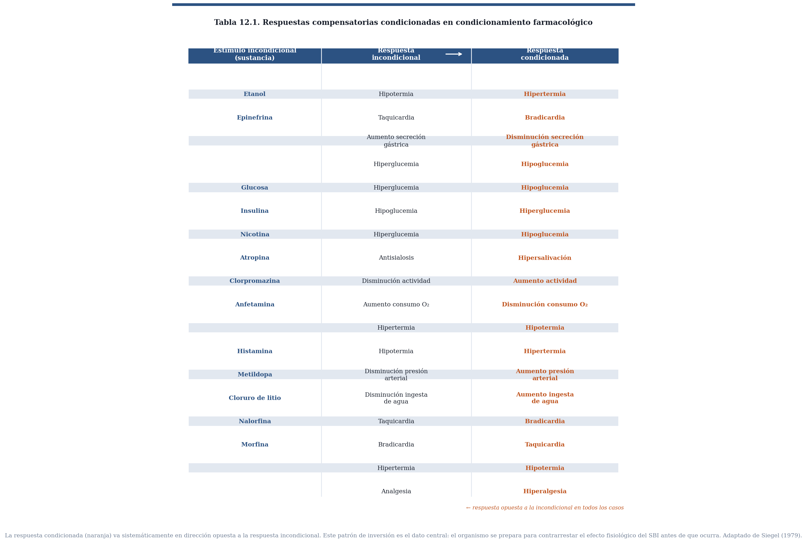
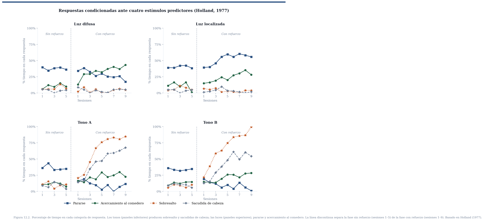
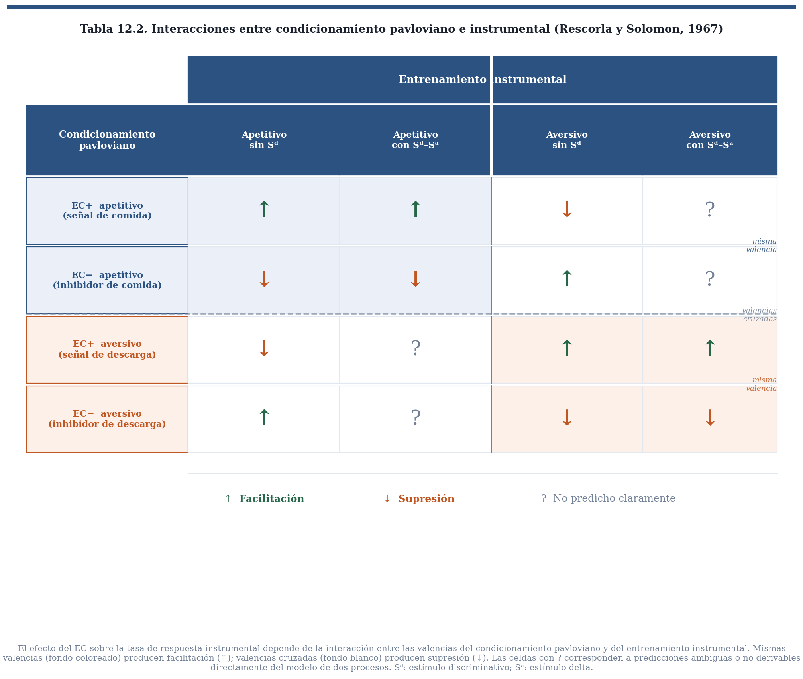
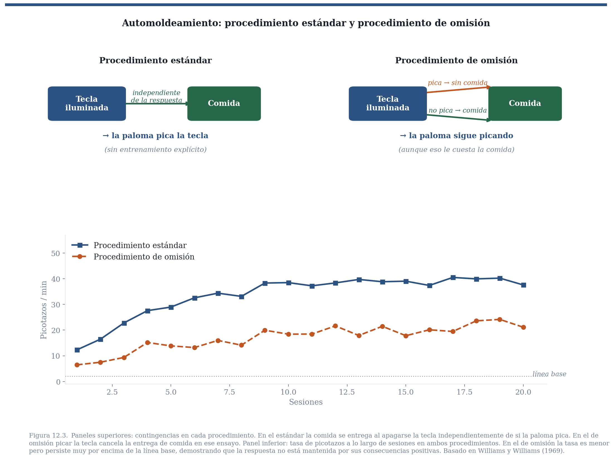
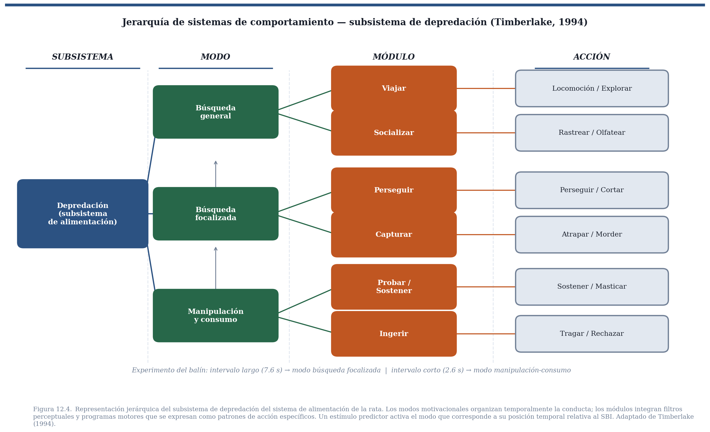

En los capítulos anteriores de este bloque vimos que una tarea central del aprendizaje es permitirle a un organismo predecir la ocurrencia de sucesos biológicamente importantes. Revisamos los sesgos inductivos que acotan el espacio de estímulos candidatos y el mecanismo de reducción del error de predicción que asigna valor predictivo a los candidatos más informativos. Pero esa descripción deja abierta una pregunta que, pensándolo bien, es la más urgente: ¿de qué sirve predecir si la predicción no cambia nada de lo que el organismo hace?

De poco serviría aprender que un cielo cargado predice lluvia si ese conocimiento no llevara a buscar un paraguas. Para una presa, detectar el rugido de un depredador no tiene valor alguno si no reorganiza inmediatamente la conducta hacia el escape. El conocimiento del entorno y la acción sobre él no son dos procesos independientes: el segundo es la razón de ser del primero. Este capítulo pregunta qué principios dan cuenta de los cambios conductuales que se observan ante estímulos que predicen sucesos biológicamente importantes. Como veremos, la respuesta no es simple ni uniforme, y su complejidad revela algo fundamental sobre cómo funciona el comportamiento adaptable.

## 1. Primera respuesta: sustitución de estímulos

Pavlov ofreció una respuesta inicial simple y poderosa. En sus experimentos con perros sujetos con arneses que restringían sus movimientos, medía un reflejo sencillo: la cantidad de saliva que producía la comida en la boca. Al estudiar el condicionamiento, observó que un estímulo neutro presentado repetidamente antes de la comida terminaba por provocar salivación por sí solo. Su conclusión fue que si un estímulo antecede de manera confiable a un suceso biológicamente importante, termina por adquirir la capacidad de provocar la respuesta que originalmente producía ese suceso. El estímulo condicionado, en ese sentido, *sustituye* al estímulo incondicionado.

La idea era coherente con su concepción del reflejo como unidad básica de análisis del comportamiento. En ese marco, el aprendizaje consiste en ampliar el conjunto de estímulos que evocan respuestas ya existentes, no en generar conductas nuevas. Y funcionaba perfectamente en el arreglo experimental de Pavlov: organismo inmóvil, respuesta simple, medición directa del reflejo. El problema es que ese arreglo era también una trampa. Al restringir al animal y aislar una sola respuesta, impedía ver lo que el aprendizaje realmente produce cuando el organismo tiene libertad de movimiento.

## 2. La anticipación no es una copia del reflejo

La dificultad comenzó cuando se observó que, en muchos casos, la respuesta ante el estímulo predictor no reproducía la respuesta incondicional y, en ocasiones, parecía oponérsele directamente. La respuesta de una rata ante una descarga eléctrica es saltar y acelerar el ritmo cardiaco; la respuesta ante el estímulo que predice esa descarga es congelarse y *desacelerar* el ritmo cardiaco. Mismo SBI, respuestas opuestas ante el predictor y ante el evento mismo.

El caso más sistemático lo documentaron Siegel y colaboradores en el dominio farmacológico. Una inyección de epinefrina provoca taquicardia como respuesta incondicional; un estímulo que predice esa inyección provoca bradicardia. Lo mismo ocurre con decenas de sustancias: morfina, alcohol, nicotina, insulina, clorpromazina, entre otras. La tabla 12.1 recoge la sistematicidad del patrón: en prácticamente todos los casos estudiados, la respuesta condicionada va en dirección opuesta a la respuesta incondicional.

::: {.callout-note collapse="true" appearance="minimal"}
**[Respuestas compensatorias condicionadas en condicionamiento farmacológico. Tres columnas: estímulo incondicional (sustancia), respuesta incondicional, respuesta condicionada. Incluye etanol (hipotermia → hipertermia), epinefrina (taquicardia → bradicardia), morfina (analgesia → hiperalgesia), insulina (hipoglucemia → hiperglucemia), entre otros casos. Adaptado de Siegel, 1979. El patrón sistemático de inversión es el dato central.]**
:::

Siegel interpretó este patrón como *respuestas compensatorias*: el organismo se prepara para contrarrestar el efecto fisiológico del SBI antes de que ocurra. El mecanismo, propuso, subyace a los fenómenos de tolerancia a las drogas: con el uso repetido, el predictor contextual (el ambiente donde se consume, el ritual de preparación) evoca respuestas compensatorias que amortiguan el efecto de la droga, requiriendo dosis crecientes para obtener el mismo efecto. La consecuencia clínica más dramática es la sobredosis por descontextualización: un adicto que recae en un entorno diferente al habitual no activa las respuestas compensatorias típicas, y una dosis que sería tolerable en el contexto habitual puede ser letal.

Estos resultados cerraron la puerta a la sustitución de estímulos como principio general. La pregunta se desplazó: si la respuesta no es una copia del reflejo, ¿qué principio determina qué conducta se observa ante un predictor?

## 3. La forma de la respuesta depende de lo que se anticipa y de cómo se anuncia

Que la respuesta al predictor no sea una copia del reflejo no significa que sea arbitraria. Jenkins y Moore expusieron palomas a un procedimiento en el que la iluminación de una tecla por unos segundos era seguida por acceso a un SBI: comida para unas, agua para otras. Fotografiaron las respuestas de las palomas en el momento del contacto con la tecla. Cuando el SBI era agua, la respuesta era similar a la de beber: el pico se insertaba lentamente y la garganta mostraba movimientos de deglución. Cuando el SBI era comida, el pico golpeaba la tecla con movimientos secos y rápidos, como al comer. Mismo predictor, misma ubicación espacial, topografías funcionalmente distintas según lo que anuncian.

:::{.callout-video}
### ▶ Video: Respuestas para comida y agua

Este clip muestra las respuestas de palomas ante una tecla iluminada predictora de agua (izquierda) versus predictora de comida (derecha), tomadas en el momento del contacto.

::: {.content-visible when-format="html"}

<iframe
  src="https://www.youtube.com/embed/50EmqiYC9Xw"
  title="Respuestas para predictores de comida y agua"
  frameborder="0"
  allow="accelerometer; autoplay; clipboard-write; encrypted-media; gyroscope; picture-in-picture"
  allowfullscreen>
</iframe>

:::

::: {.content-visible unless-format="html"}
▶ **Ver video:** [Respuestas para predictores de comida y agua](https://www.youtube.com/watch?v=50EmqiYC9Xw)
:::

:::

El mismo principio opera cuando distintos tipos de señales anuncian el mismo SBI. Peter Holland presentó a ratas cuatro estímulos —dos luces y dos tonos— todos seguidos de comida. Ante los tonos, las ratas mostraban sacudidas de cabeza y sobresalto. Ante la luz localizada, se paraban sobre sus patas traseras y se orientaban al comedero. Ante la luz difusa, la conducta dirigida al comedero era predominante desde el inicio. Topografías completamente distintas, misma consecuencia anticipada. La forma de la respuesta condicionada no estaba determinada solo por el SBI ni solo por el predictor, sino por la combinación de ambos filtrada por la biología del organismo.

{#fig_12_2_holland.png width=750 fig-align="center"}

::: {.callout-note collapse="true" appearance="minimal"}
**[Resultados de Holland (1977). Cuatro paneles, uno por cada tipo de estímulo (luz difusa, luz localizada, tono A, tono B). Eje horizontal: sesiones de condicionamiento. Eje vertical: porcentaje de tiempo en cada tipo de respuesta. Las líneas representan: pararse (■), acercamiento al comedero (●), sobresalto (★), sacudida de cabeza (○). En los paneles de tono, sobresalto y sacudida de cabeza dominan; en los de luz, pararse y acercamiento al comedero. El patrón se establece rápidamente y persiste.]**
:::

Un resultado adicional del trabajo de Holland merece atención porque establece algo sobre la naturaleza del aprendizaje subyacente. Una luz ya establecida como predictora de comida bloqueó la adquisición de valor predictivo de un tono presentado simultáneamente con ella en una segunda fase de entrenamiento — el efecto de bloqueo que vimos en el capítulo sobre Rescorla y Wagner. Lo relevante aquí es que la luz nunca había evocado las sacudidas de cabeza características de los tonos: sus respuestas condicionadas eran completamente distintas en topografía. Pero la *información* que portaba sobre el SBI era idéntica. El bloqueo ocurrió porque lo que se aprende es información sobre la estructura causal del entorno, no una asociación entre un estímulo y una forma particular de respuesta. Las diversas topografías que observamos son traducciones de esa información a través de los sistemas de comportamiento del organismo, tema al que volveremos más adelante.

## 4. El predictor en el flujo conductual

Hasta aquí, el estudio de la traducción del conocimiento en acción había ocurrido en condiciones algo artificiales: organismos inmovilizados o en un vacío conductual, donde la única pregunta posible era qué respuesta específica evocaba el predictor. Pero los organismos reales no esperan pasivos a que llegue el siguiente estímulo. Están en movimiento constante: buscando alimento, explorando, descansando, interactuando socialmente. Es en ese flujo conductual donde los predictores aparecen y donde su efecto debe analizarse.

A principios de la década de 1940, William Estes y B. F. Skinner introdujeron un paradigma que desplazó la pregunta en esa dirección. Su diseño constaba de dos fases. Primero, entrenaron a ratas a apretar una palanca para obtener comida, hasta que respondieran a una tasa estable. Luego, intercalado con esa conducta en curso, presentaron ocasionalmente un tono durante unos segundos que terminaba con una descarga eléctrica. Durante la presencia del tono las ratas dejaban de apretar la palanca, retomando su tasa habitual una vez que el tono terminaba. El efecto no era una nueva respuesta evocada sino una reorganización del comportamiento ya en marcha: lo que Estes y Skinner llamaron *supresión condicionada* o respuesta emocional condicionada.

El ejemplo cotidiano más cercano lo conocemos bien quienes vivimos en la Ciudad de México: cuando suena una alarma sísmica, la conducta que uno estuviera realizando —escribir, cocinar, hablar por teléfono— se interrumpe y se reorganiza en torno a la amenaza anticipada. Al terminar la alerta, el comportamiento previo se retoma. Ese es exactamente el patrón que Estes y Skinner documentaron en el laboratorio.

Años más tarde, Rescorla y Solomon extendieron el paradigma sistemáticamente, combinando respuestas instrumentales mantenidas por SBI positivos o negativos con estímulos predictores de SBI positivos o negativos. Su análisis mostró que el efecto del predictor sobre la conducta en curso no depende solo de la valencia del predictor, sino de la *interacción algebraica* entre el estado motivacional que sustenta la respuesta instrumental y el que evoca el estímulo condicionado. Un predictor de eventos aversivos suprime una respuesta mantenida por comida, pero puede facilitar una respuesta de escape o evitación. Un predictor de comida facilita una respuesta de aproximación, pero podría interferir con una conducta de evitación. Un EC inhibitorio —señal de ausencia del SBI— opera en dirección contraria a un EC excitatorio, funcionando como señal de seguridad que modula la conducta instrumental a la inversa.

::: {.callout-note collapse="true" appearance="minimal"}

**[Combinaciones de procedimientos pavlovianos e instrumentales según Rescorla y Solomon (1967). Filas: tipo de condicionamiento pavloviano (EC+ apetitivo, EC– apetitivo, EC+ aversivo, EC– aversivo). Columnas: tipo de entrenamiento instrumental y contexto (apetitivo sin Sd, apetitivo con Sd–Sa, aversivo sin Sd, aversivo con Sd–Sa). Celdas: dirección predicha del efecto sobre la tasa de respuesta instrumental (↑ facilitación, ↓ supresión, ? no predicho claramente). Las interacciones mismas valencias producen facilitación; las valencias cruzadas producen supresión.]**
:::

El predictor no actúa sobre una respuesta específica: actúa sobre el estado motivacional del organismo, y ese estado interactúa con la conducta en curso. El efecto conductual es el producto de esa interacción.

## 5. Predictores que adquieren valor hedónico

Los efectos descritos hasta aquí —respuestas compensatorias, topografías condicionadas, modulación de conducta instrumental— son efectos sobre el *comportamiento manifiesto*. Hay otro efecto, menos visible pero igualmente fundamental: los predictores pueden adquirir el valor afectivo del suceso biológicamente importante que anuncian. No simplemente se comportan de manera orientada a la meta; el predictor mismo comienza a gustar o a disgustar.

Pensemos en qué aprenden un niño y un pollo recién nacido sobre qué cosas del mundo son comestibles. Algunos alimentos son apetecibles por razones innatas. Pero para muchos otros, el valor hedónico es completamente aprendido. Aprendemos a comer brócoli, a beber café, a disfrutar del chile picante — experiencias que en el primer contacto pueden ser desagradables y que adquieren valor positivo gradualmente. Un pollo recién nacido tiene que aprender a distinguir gusanos de piedras y de excremento; todos tienen la textura y el tamaño aproximados de un objeto comedible, pero solo uno tiene valor nutritivo. La pregunta es cómo se forma esa preferencia.

Los experimentos de John García sobre aversión condicionada al sabor ofrecen un modelo. En sus estudios clásicos, ratas bebían agua con sabor a sacarina y horas después recibían una inyección que producía malestar gastrointestinal. Una sola experiencia bastaba para que las ratas rechazaran en el futuro el agua con ese sabor, aun cuando la sacarina en sí es inocua. Lo que se había adquirido no era solo una respuesta de evitación: era una nueva propiedad afectiva del estímulo. El sabor que antes era neutro o agradable había adquirido valor hedónico negativo — se volvió repugnante. Las ratas no simplemente *evitaban* la sacarina; mostraban activamente señales de aversión al probarla, como si fuera algo intrínsecamente desagradable.

El proceso opera simétricamente en la dirección positiva. Estímulos repetidamente asociados con SBIs apetitivos adquieren valor hedónico positivo. La visión del logo de una cadena de restaurantes favorita puede producir un placer anticipatorio real, no solo la activación de una conducta dirigida hacia él.

Esta capacidad de los predictores para adquirir valor hedónico tiene una consecuencia importante para el estudio del aprendizaje de preferencias en sentido amplio. Parte de lo que llamamos gustos, preferencias estéticas y aversiones no son propiedades innatas de los objetos sino propiedades aprendidas a través de la historia de asociaciones con SBIs. La traducción del conocimiento en acción incluye, por lo tanto, no solo la reorganización del comportamiento observable sino la restructuración del valor afectivo del mundo.

## 6. Predictores como imanes y repelentes

Si los predictores adquieren valor hedónico, cabe esperar que también orienten espacialmente al organismo hacia o desde la fuente de predicción. Brown y Jenkins describieron este efecto en palomas sin entrenamiento previo en picar teclas. En su procedimiento, una tecla se iluminaba durante unos segundos y al apagarse quedaba disponible acceso a comida en el comedero, independientemente de lo que la paloma hiciera durante la presentación del estímulo. Las palomas no necesitaban picar la tecla: bastaba con ir al comedero cuando se apagara la luz. Sin embargo, después de unas pocas presentaciones, las palomas comenzaban a picar regularmente la tecla iluminada. Brown y Jenkins llamaron a este resultado *automoldeamiento*: la respuesta de picar la tecla aparecía sin entrenamiento explícito, impulsada por la relación predictiva entre el estímulo y el SBI.

:::{.callout-video}
### ▶ Video: Automoldeamiento de la respuesta de picar una tecla

Este clip muestra las respuestas de palomas ante una tecla iluminada predictora de agua (izquierda) versus predictora de comida (derecha), tomadas en el momento del contacto.

::: {.content-visible when-format="html"}

<iframe
  src="https://www.youtube.com/embed/cacwAvgg8EA"
  title="Automoldeamiento de la respuesta de picar una tecla"
  frameborder="0"
  allow="accelerometer; autoplay; clipboard-write; encrypted-media; gyroscope; picture-in-picture"
  allowfullscreen>
</iframe>

:::

::: {.content-visible unless-format="html"}
▶ **Ver video:** [Respuestas para predictores de comida y agua](https://www.youtube.com/watch?v=cacwAvgg8EA)
:::

:::

Una objeción natural es que las palomas quizás picaban porque, ocasionalmente, sus picotazos precedían al acceso a comida — condicionamiento supersticioso, en el sentido que describió Skinner. Para descartar esa posibilidad, Williams y Williams modificaron el procedimiento de una manera decisiva: si la paloma picaba la tecla iluminada, la comida *no* se entregaba en ese ensayo. Solo cuando la paloma no picaba obtenía el acceso al SBI. Este es el *procedimiento de omisión*: responder ante el predictor tiene un costo directo y real en términos de obtención del SBI. Si el picotazo fuera mantenido por sus consecuencias, el procedimiento de omisión debería eliminarlo rápidamente. No lo hizo: las palomas continuaron picando la tecla incluso cuando eso les costaba la comida.

{#fig_12_3_autoshaping.png width=750 fig-align="center"}

::: {.callout-note collapse="true" appearance="minimal"}
**[FIGURA 12.3: Comparación esquemática de los procedimientos de automoldeamiento estándar y de omisión. Dos paneles superiores muestran la contingencia en cada procedimiento: en el estándar, picar la tecla es independiente de la comida; en el de omisión, picar la tecla previene la comida. Panel inferior: tasa de respuesta de picar la tecla a lo largo de sesiones en ambas condiciones. En el procedimiento de omisión la tasa se reduce parcialmente pero persiste muy por encima de cero, demostrando que la respuesta no está mantenida por sus consecuencias positivas. Basado en Williams y Williams (1969).]**
:::

El resultado revela que la orientación hacia el predictor no está gobernada por las consecuencias de las respuestas dirigidas a él. Está gobernada por la relación predictiva entre el estímulo y el SBI: el predictor actúa como un imán que atrae el comportamiento del organismo hacia él, independientemente de si ese acercamiento resulta adaptativo en un contexto particular. La imagen del imán captura algo real: el acercamiento hacia predictores de SBIs apetitivos y el alejamiento ante predictores de SBIs aversivos o ante predictores de la *ausencia* de un SBI positivo son efectos simétricos del mismo principio. El estímulo que anuncia algo biológicamente relevante adquiere *valor hedónico o de incentivo* que orienta espacialmente la conducta — un fenómeno que la literatura denomina motivación de incentivo.

Esta propiedad opera fundamentalmente sobre predictores localizables. Un estímulo difuso — un cambio de iluminación general en el ambiente — no produce el mismo efecto de atracción que un estímulo puntual en el espacio. Cuando el predictor no tiene una ubicación definida, el organismo no puede orientarse hacia él, y el efecto de imán se transforma en conducta dirigida al sitio donde el SBI suele aparecer — como en los experimentos de Holland donde la luz difusa producía principalmente conducta de acercamiento al comedero.

## 7. Sistemas de comportamiento

Los resultados acumulados en este capítulo dibujan una imagen del organismo radicalmente diferente de la que asumía la teoría del reflejo: no un sistema que espera estímulos para reaccionar, sino un agente en movimiento constante, organizado funcionalmente en torno a metas biológicamente importantes, que ante un estímulo predictor reorganiza su conducta de maneras específicas y sensibles al contexto. William Timberlake y Jerry Hogan formularon el marco teórico que integra esta visión con la biología evolutiva de cada especie.

Su propuesta es que el comportamiento puede describirse como *sistemas funcionales* organizados por la historia evolutiva y las exigencias del nicho ecológico. Cada sistema está ligado a una tarea adaptativa —alimentación, depredación, defensa, reproducción, interacción social— y se descompone en subsistemas, modos motivacionales, módulos y patrones de acción organizados jerárquicamente. El sistema de alimentación de una rata carnívora, por ejemplo, incluye un subsistema de depredación. Ese subsistema lleva al organismo a diferentes *modos* según la situación: búsqueda general cuando la comida no está a la vista, búsqueda focalizada cuando hay indicios de proximidad, y manipulación-consumo cuando el alimento ya está presente. Dentro de cada modo, *módulos* específicos integran filtros perceptuales y programas motores apropiados para el entorno particular: rastrear, perseguir, inmovilizar, manipular, ingerir.

{#fig_12_4_timberlake.png width=750 fig-align="center"}

::: {.callout-note collapse="true" appearance="minimal"}
**[Representación jerárquica del sistema de depredación de la rata (subsistema del sistema de alimentación). Cuatro columnas: Subsistema (Depredación), Modo (Búsqueda general / Búsqueda focalizada / Manipulación-consumo), Módulo (Viajar, Perseguir, Capturar, Probar, Ingerir, Rechazar, Acaparar) y Acción (Locomoción/Exploración, Rastrear/Cortar, Atrapar/Morder, Gnaw/Sostener, Masticar/Tragar, Escupir/Limpiar, Cargar). Las flechas muestran cómo los estímulos en cada nivel activan módulos y acciones específicas. Adaptado de Timberlake (1994).]**
:::

En este marco, el impacto de un estímulo predictor depende de dónde encaja en la jerarquía. Una señal temporal y difusa de la proximidad de una presa activa el modo de búsqueda general. Una señal localizada activa la búsqueda focalizada y el organismo se orienta y aproxima. Una señal que indica que el alimento ya está disponible para manipulación activa el modo de consumo. El predictor no produce una respuesta fija: posiciona al organismo en un punto de la jerarquía conductual, y desde ahí la conducta sigue su curso natural guiada por las propiedades de los estímulos disponibles.

Tres experimentos ilustran cómo el sistema de comportamiento de la especie filtra y transforma el significado del predictor.

En el primero, Timberlake usó un pequeño balín metálico rodante como señal que predecía la entrega de comida en ratas. Las ratas interactuaban intensamente con el balín: lo perseguían, lo atrapaban, lo transportaban y lo mordisqueaban. El movimiento del balín activaba los filtros perceptuales del módulo de captura predatoria, evocando comportamientos funcionalmente idénticos a los de caza. Timberlake encontró además una disociación que revela la estructura jerárquica: cuando el intervalo entre el balín y la comida era de 7.6 segundos, la rata lo perseguía activamente (modo de búsqueda focalizada); cuando el intervalo se reducía a 2.6 segundos, la rata abandonaba el balín y se dirigía directamente al comedero (transición al modo de manipulación-consumo). El mismo estímulo activa modos diferentes según su posición temporal relativa al SBI.

En el segundo experimento, Timberlake y Grant usaron a una rata viva, sujeta a una plataforma, como estímulo predictor de comida para la rata sujeto. Las ratas sujeto no intentaban morder ni comer a la rata-señal. Como forrajeadoras sociales que en condiciones naturales siguen a congéneres para encontrar alimento, la señal activó el módulo social del sistema de alimentación. Las ratas sujeto mostraron comportamientos de contacto social: olfateo, acicalamiento y trepar sobre la rata-señal — respuestas completamente distintas a las que producía un bloque de madera de tamaño similar, ante el cual solo mostraban orientación sin ninguna interacción social. Las ratas tratan a la rata-señal como lo que es: una fuente de información sobre comida que tiene valor hedónico, no como comida en sí. Y así fue — pero la respuesta de información social era exactamente la apropiada para una especie que forrajea en grupo.

El tercer experimento subraya que los sistemas de comportamiento son específicos a la especie. Los hámsteres son roedores solitarios que compiten por el alimento. Cuando Timberlake repitió el experimento usando a otro hámster como señal de comida, el resultado fue opuesto: la señal inhibió el acercamiento, activando probablemente un módulo de competencia o defensa. Misma lógica experimental, misma relación predictor-SBI, conducta radicalmente distinta porque la biología evolutiva de la especie es diferente.

Lo que los tres experimentos tienen en común es que el organismo no responde al predictor como si fuera la meta final. Lo procesa a través de su biología y su historia de aprendizaje, y activa la secuencia conductual que corresponde a ese predictor en ese sistema funcional particular. El condicionamiento clásico, desde esta perspectiva, no genera respuestas nuevas: modula los patrones de comportamiento preorganizados que la especie ya posee y las secuencias previamente aprendidas por el organismo a lo largo de su historia individual.

## 8. La ventaja adaptativa de anticipar

Después de recorrer la evidencia presentada en este capítulo, queda una pregunta de orden más general. Aun si aceptamos que los estímulos predictores producen respuestas compensatorias, adquieren valor hedónico, atraen o repelen, modulan conducta en curso y activan sistemas organizados de comportamiento, debemos preguntar si todo ello representa una ventaja adaptativa en condiciones ecológicas reales, más allá del laboratorio. Karen Hollis abordó esta cuestión directamente.

En experimentos con peces territoriales, condicionó a machos a anticipar, mediante un estímulo predictor, dos tipos de encuentros biológicamente importantes. Cuando el predictor anunciaba la llegada de un macho rival, los machos condicionados lograban defender su territorio de manera más efectiva: se posicionaban de manera más agresiva y lograban una ventaja clara en los combates. Cuando el predictor anunciaba la llegada de una hembra receptiva, los machos condicionados mostraban algo difícil de lograr en su especie: atenuaban su agresividad territorial inicial —que suele ser un obstáculo para el apareamiento— cortejaban con mayor rapidez y, crucialmente, producían significativamente más crías que los machos no condicionados.

La señal no solo reorganizaba el comportamiento de manera inmediata: cambiaba el resultado reproductivo de los organismos. El valor de la predicción no reside solo en conocer mejor la estructura del entorno, sino en posicionar al organismo conductualmente antes de que el evento llegue, cuando todavía hay tiempo de prepararse.

Estos resultados enlazan directamente con el argumento que abre el libro: la selección natural opera a través del éxito del comportamiento en la solución de problemas adaptativos. El condicionamiento clásico habrá evolucionado —y se habrá mantenido en linajes tan distantes como peces, ratas y humanos— porque anticipar un suceso biológicamente importante antes de que ocurra otorga una ventaja real en la competencia por recursos, territorios y parejas.

## Conclusión

Este capítulo cierra el módulo sobre asignación de crédito. La historia que hemos contado en este bloque va del problema —cómo aprender qué predice qué— hasta el mecanismo formal —el error de predicción como señal de actualización— y termina aquí, con la pregunta de qué hace el organismo con lo que aprendió.

La respuesta no es simple ni uniforme. Aprender a predecir un suceso biológicamente importante transforma al organismo en al menos cuatro dimensiones: cambia las respuestas fisiológicas que preparan al organismo para el evento (respuestas compensatorias); cambia el valor afectivo de los estímulos del entorno (adquisición de valor hedónico); activa secuencias motoras orientadas hacia o desde el predictor (motivación de incentivo); y reorganiza el comportamiento en curso en función del estado motivacional evocado (modulación instrumental). La forma específica que adoptan estos cambios depende de la naturaleza del SBI anticipado, de las propiedades del predictor, de los sistemas funcionales propios de la especie, y de las posibilidades de acción que el entorno físico ofrece — lo que la literatura llama *affordances*: un predictor de comida en un comedero localizado produce conducta de acercamiento solo si el espacio lo permite; el mismo predictor en un entorno sin posibilidades de aproximación producirá otro patrón de reorganización. No hay una respuesta condicionada: hay una reorganización condicionada.

El siguiente módulo desplazará el foco de los predictores a las acciones: de los estímulos que anuncian SBIs a las respuestas que los producen, y de ahí a los principios que gobiernan cómo los organismos distribuyen su comportamiento en el tiempo para obtener el mayor beneficio posible dado su entorno. La pregunta será cuándo actuar, con qué frecuencia, y bajo qué reglas de distribución del comportamiento. Son preguntas que solo pueden formularse cuando el organismo tiene control sobre la ocurrencia del SBI — cuando puede producirlo, no solo predecirlo.

## Conexiones

### Hacia atrás

Este capítulo es la consecuencia conductual de los capítulos de asignación de crédito. Los capítulos 6 y 7 establecieron las condiciones bajo las cuales los organismos aprenden a predecir SBIs a través de estímulos y respuestas respectivamente. Los capítulos 8 y 11 formalizaron ese aprendizaje: Bush y Mosteller introdujeron el error de predicción para eventos individuales; Rescorla y Wagner lo extendieron a compuestos de estímulos, derivando formalmente el bloqueo. El bloqueo por Holland que discutimos en la sección 3 es exactamente la misma demostración empírica que el capítulo 11 explicó formalmente: la luz bloquea al tono porque ya reduce el error de predicción a cero, no porque sea contigua al SBI.

La sección sobre Estes y Skinner y  Rescorla y Solomon (sección 4) conecta el condicionamiento pavloviano con el instrumental, anticipando el tema del siguiente módulo. Su análisis de estados motivacionales cruzados es la primera vez en el libro que las dos formas de aprendizaje — predecir y producir — aparecen en el mismo experimento.

### Hacia adelante

El módulo que sigue estudia el comportamiento instrumental: respuestas que *producen* SBIs en lugar de simplemente predecirlos. La distinción entre comportamiento evocado (reflexivo, condicionado clásicamente) y comportamiento emitido (operante, seleccionado por sus consecuencias) que Skinner formuló es el punto de partida de ese módulo. Este capítulo establece por qué esa distinción importa: los principios que gobiernan la reorganización conductual ante predictores no son los mismos que gobiernan la distribución del comportamiento emitido en el tiempo. Ambos dependen de la historia de refuerzos, pero lo hacen de maneras cualitativamente distintas.

El aprendizaje de preferencias discutido en la sección 5 reaparecerá en el módulo sobre valor: cómo los SBIs adquieren valor y cómo ese valor guía la distribución del comportamiento en situaciones de elección.

## Resumen

La teoría de sustitución de estímulos — la primera propuesta sobre cómo el aprendizaje se traduce en acción — resultó insuficiente ante la evidencia de respuestas compensatorias en dirección opuesta a la respuesta incondicional. La forma de la respuesta ante el predictor depende de la naturaleza del SBI anticipado (Jenkins y Moore) y del tipo de señal disponible (Holland), no de la topografía del reflejo original. Los estímulos predictores adquieren valor hedónico propio, subyaciendo al aprendizaje de preferencias y aversiones. En el flujo conductual, los predictores actúan como moduladores del estado motivacional del organismo, con efectos de facilitación o supresión que dependen de la interacción algebraica entre los estados motivacionales en juego (Estes, Skinner, Rescorla y Solomon). Los predictores localizables adquieren valor de incentivo que los convierte en imanes o repelentes espaciales: el automoldeamiento y el procedimiento de omisión establecen que esta atracción no está gobernada por las consecuencias de las respuestas dirigidas al predictor. El modelo de sistemas de comportamiento de Timberlake y Hogan integra estos resultados con la biología evolutiva: los predictores modulan patrones de comportamiento preorganizados, y la forma de esa modulación depende del sistema funcional y de la especie. Los experimentos de Hollis demostraron que esta traducción del conocimiento en acción produce ventajas adaptativas reales en términos de éxito territorial y reproductivo.

## Ejercicios

**1.** Un paciente con dolor crónico recibe morfina regularmente en el hospital, siempre en la misma habitación y con los mismos rituales (enfermera, jeringa, olor del cuarto). Después de un tiempo, el médico decide dar de alta al paciente y continuar la misma dosis en casa. Usando la teoría de Siegel sobre respuestas compensatorias, ¿qué predices sobre el efecto de la primera dosis en casa en comparación con las dosis en el hospital? ¿Qué predicción hace esta teoría sobre la probabilidad de sobredosis?

**2.** En el experimento de Jenkins y Moore, la forma de la respuesta condicionada ante la tecla iluminada refleja la naturaleza del SBI, no la topografía de la respuesta incondicional. Diseña un experimento análogo usando una especie y un SBI de tu elección que permita distinguir entre sustitución de estímulos y motivación de incentivo como explicaciones de la respuesta condicionada. ¿Qué resultados esperarías bajo cada predicción?

**3.** Rescorla y Solomon predicen que el efecto de un EC excitatorio apetitivo sobre una respuesta instrumental depende del SBI que mantiene esa respuesta. Un EC+ predictivo de comida se superpone a dos grupos de ratas: uno cuya palanca-respuesta es reforzada con comida, y otro cuya palanca-respuesta es reforzada con evitación de descarga eléctrica. ¿Cuál es la predicción del modelo de estados motivacionales para cada grupo? ¿Facilita o suprime el EC+ la respuesta de palanquear en cada caso?

**4.** El procedimiento de omisión de Williams y Williams es conceptualmente más poderoso que un diseño de control yoked para descartar el condicionamiento supersticioso. Explica por qué. ¿Qué explicación alternativa descarta el control yoked que el procedimiento de omisión no descarta, y viceversa?

**5.** En el experimento del balín de Timberlake, el intervalo entre la señal y la comida determinaba qué modo conductual se activaba: búsqueda focalizada con 7.6 segundos, y transición a consumo con 2.6 segundos. ¿Qué implica este resultado sobre la representación temporal que el organismo tiene del SBI anticipado? ¿Cómo distingues esta explicación de la alternativa de que simplemente la respuesta más reciente al SBI se refuerza con mayor probabilidad?

**6.** *(Reflexión)* El modelo de sistemas de comportamiento predice que la misma relación predictor-SBI puede producir respuestas completamente distintas en especies diferentes. Identifica un caso de comportamiento humano cotidiano donde puedas reconocer la huella de sistemas funcionales preorganizados (alimentación, afiliación social, defensa, reproducción) siendo modulados por predictores aprendidos. ¿Qué tipo de evidencia te llevaría a preferir una explicación en términos de sistemas de comportamiento sobre una explicación en términos de hábitos aprendidos por refuerzo?

## Lecturas recomendadas

**Siegel, S. (1983).** Classical conditioning, drug tolerance, and drug dependence. En R. G. Smart et al. (Eds.), *Research advances in alcohol and drug problems* (Vol. 7). Plenum. — Presentación accesible de la teoría de respuestas compensatorias con abundante evidencia farmacológica. El punto de entrada más directo a la literatura sobre tolerancia condicionada.

**Holland, P. C. (1977).** Conditioned stimulus as a determinant of the form of the Pavlovian conditioned response. *Journal of Experimental Psychology: Animal Behavior Processes, 3*(1), 77–104. — El artículo original de Holland. Las secciones de método y resultados son accesibles y las figuras son el referente estándar para ilustrar la dependencia de la respuesta condicionada en el tipo de señal.

**Rescorla, R. A., & Solomon, R. L. (1967).** Two-process learning theory: Relationships between Pavlovian conditioning and instrumental learning. *Psychological Review, 74*(3), 151–182. — El artículo teórico que establece el marco de dos procesos e introduce el análisis de interacciones motivacionales. Denso pero importante.

**Timberlake, W., & Lucas, G. A. (1989).** Behavior systems and learning: From misbehavior to general principles. En S. B. Klein & R. R. Mowrer (Eds.), *Contemporary learning theories*. Erlbaum. — La presentación más completa del modelo de sistemas de comportamiento. Los primeros dos tercios son accesibles para estudiantes de licenciatura con el bagaje de este libro.

**Hollis, K. L. (1997).** Contemporary research on Pavlovian conditioning: A "new" functional analysis. *American Psychologist, 52*(9), 956–965. — Revisión accesible de la evidencia sobre ventajas adaptativas del condicionamiento, escrita para audiencia general. Buen punto de cierre después de leer el capítulo.

**Garcia, J., & Koelling, R. A. (1966).** Relation of cue to consequence in avoidance learning. *Psychonomic Science, 4*(3), 123–124. — El experimento original sobre aversión al sabor. Tres páginas que cambiaron la concepción del condicionamiento clásico. Ya lo conocen del capítulo de asignación de crédito a estímulos; vale la pena releerlo ahora desde la perspectiva del valor hedónico adquirido.
