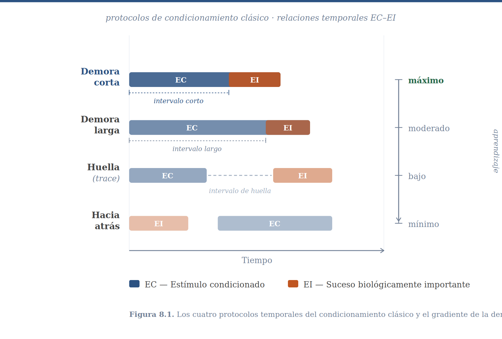
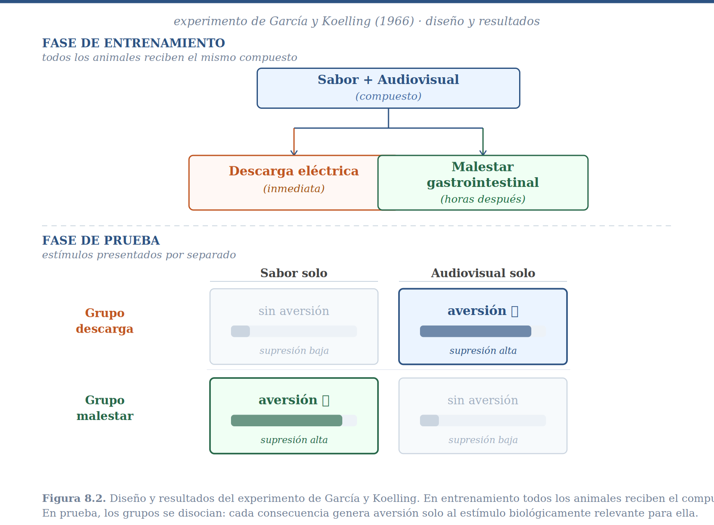
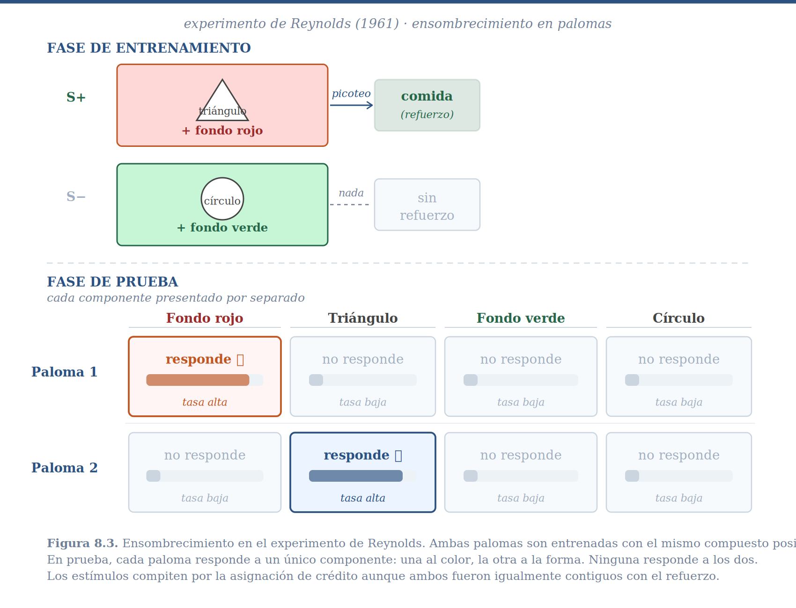
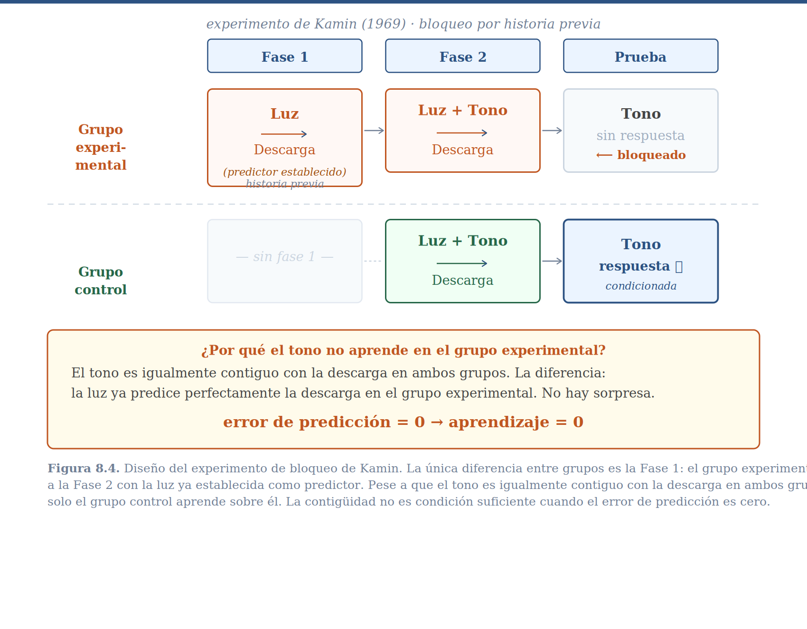

Al final del capítulo anterior dejamos a nuestro organismo en una situación paradójica. Los sistemas de retroalimentación que describimos son notablemente eficaces: pueden orientar un cuerpo hacia una fuente de luz, mantener la temperatura dentro de un margen preciso, seguir una presa en movimiento. Pero tienen una limitación que el ejemplo del conductor y las gasolineras ilustró de manera directa: responden a lo que está ocurriendo ahora, sin ninguna capacidad de anticipar lo que está por ocurrir. El conductor que carga gasolina solo cuando el tanque ya está vacío llegará varado tarde o temprano. El conductor experimentado actúa antes —carga cuando ve que se aproxima un tramo largo, porque ha aprendido que esa señal predice la necesidad futura.

Ese salto, de reactivo a anticipatorio, requiere algo que los mecanismos del Bloque I no tenían: la capacidad de aprender que ciertos eventos del entorno predicen la llegada de sucesos biológicamente importantes. Pero esto introduce de inmediato un problema que no es trivial. Cuando ocurre algo importante —aparece comida, ataca un depredador, se produce un malestar— el entorno está lleno de estímulos simultáneos y el pasado está lleno de eventos candidatos. ¿A cuál de todos ellos se le debe atribuir la responsabilidad? ¿Qué evento, de entre los centenares que precedieron al suceso, fue realmente su causa?

A este problema de adaptación se le conoce como el **problema de la asignación de crédito**, y es el tema central de este capítulo.

## El Problema: Un Espacio Enorme de Candidatos

Considera la situación concreta de un perro callejero que encuentra comida en una banqueta. En ese momento hay docenas de estímulos presentes simultáneamente: el olor del asfalto húmedo, el sonido de una bocina lejana, la figura de un transeúnte que se aleja, el color de la bolsa que contenía la comida, la hora del día, el olor particular del barrio. Y más allá de los estímulos presentes, hay una historia de eventos que ocurrieron antes: algo cruzó por ahí cinco minutos atrás, hubo un camión de basura en la mañana, llovió ayer. Cualquiera de estos factores podría, en principio, predecir dónde y cuándo aparecerá comida en el futuro.

O considera tu propia experiencia: regresas a casa después de comer en un restaurante nuevo y experimentas un fuerte malestar estomacal. ¿Qué lo causó? Las posibilidades son abrumadoras. Podría ser el platillo que ordenaste, el olor del restaurante, la música que sonaba, algo que comiste ayer, algo que tocaste en el transporte público, el estrés acumulado del día. Esta lista podría extenderse indefinidamente hacia el pasado. Sin algún mecanismo que filtre ese espacio de posibilidades, el aprendizaje sería computacionalmente intratable —un organismo que evaluara sistemáticamente cada candidato posible quedaría paralizado antes de poder actuar.

Y sin embargo, la mayoría de los organismos aprenden relaciones predictivas con una eficiencia sorprendente, en tiempo real, sin acceso a bases de datos ni laboratorio de estadística. La pregunta es cómo.

La respuesta es que los organismos no buscan en todo el espacio de candidatos. Buscan en un subconjunto reducido y ordenado, definido por un conjunto de reglas que llamamos **sesgos inductivos**. Estos sesgos hacen dos cosas: primero, reducen drásticamente el espacio de candidatos posibles; segundo, establecen un orden de prioridad para evaluarlos. Antes de examinarlos en detalle, conviene preguntarse de dónde vienen y por qué tienen la forma que tienen.

## El Genoma Como Archivo Causal

El genoma no es un acumulador indiferente de variación aleatoria. La fracción del genoma que ha sido modelada por la selección natural —la parte que afecta el éxito reproductivo y que ha cambiado bajo la presión del entorno— es, en sentido literal, un registro comprimido de las regularidades estadísticas del entorno ancestral: qué eventos tendían a co-ocurrir, con qué frecuencias, en qué secuencias temporales. Cada generación, los organismos con mecanismos mejor calibrados a esas regularidades dejaron más descendientes, y ese proceso iterativo —que la ecuación de Price formalizó en el capítulo sobre selección natural— produjo, acumulativamente, un sistema nervioso que llega al mundo ya "informado" sobre la estructura causal más probable de su entorno.

Desde esta perspectiva, la selección natural es una forma de aprendizaje filogenético. No es el aprendizaje de un organismo individual durante su vida, sino el aprendizaje de una especie a lo largo de sus generaciones. Y al igual que el aprendizaje individual produce cambios en el organismo que reflejan las regularidades del entorno que ese individuo ha experimentado, el aprendizaje filogenético produce cambios en el acervo genético que reflejan las regularidades del entorno que esa especie ha habitado. Los sesgos inductivos son el producto más visible de ese proceso: no restricciones arbitrarias impuestas desde fuera, sino conocimiento filogenético sobre la estructura causal del mundo, destilado por selección durante escalas de tiempo inaccesibles para cualquier individuo.

Veremos más adelante en el curso que hay una manera precisa de medir cuánta información contiene un organismo sobre su entorno, y que la selección natural puede entenderse como el proceso que maximiza esa cantidad, generación tras generación. Por ahora, lo que importa es la consecuencia directa para los sesgos: si el entorno ancestral tenía una estructura causal particular —si los eventos biológicamente importantes tendían a ser precedidos por ciertas clases de estímulos, con ciertas demoras temporales, en ciertos contextos sensoriales— entonces la selección favorecerá organismos que busquen primero en esa parte del espacio de candidatos. Eso es exactamente lo que observaremos.

## El Sistema de Comportamiento Como Primer Filtro

Antes de examinar los sesgos inductivos específicos, hay un nivel de organización más fundamental que los estructura a todos: los **sistemas de comportamiento**.

Jerry Hogan y John Timberlake desarrollaron una perspectiva que ha sido influyente precisamente porque da sustrato funcional a la idea de relevancia biológica. Su propuesta es que el comportamiento de los organismos no es una colección arbitraria de respuestas inconexas, sino que está organizado en sistemas funcionales pre-estructurados por la evolución. Un sistema de comportamiento es un conjunto coordinado de mecanismos perceptuales, motivacionales y motores que evolucionó para resolver un problema adaptativo específico: el sistema de alimentación, el sistema de defensa ante depredadores, el sistema reproductivo. Cada uno tiene sus propias estructuras de detección, sus propias respuestas características, su propia lógica temporal.

Lo que hace crucial esta organización para la asignación de crédito es la siguiente observación: cuando ocurre un suceso biológicamente importante, no genera una activación genérica del organismo. Activa el sistema de comportamiento apropiado para ese tipo de suceso. La presentación de comida activa el sistema de alimentación, con todas sus estructuras perceptuales y motoras. Un depredador activa el sistema de defensa. Y esta activación de un sistema específico tiene una consecuencia inmediata: reduce drásticamente el espacio de estímulos que serán siquiera considerados como candidatos a la asignación de crédito.

Cuando el sistema de alimentación está activo, los estímulos relevantes para la alimentación —sabores, olores, señales visuales de comida— son procesados preferentemente. Los estímulos irrelevantes para la alimentación —sonidos ambientales neutros, características del suelo— reciben mucha menos atención. El sistema de comportamiento funciona así como un filtro atencional de primer orden: antes de que operen los sesgos específicos que examinaremos a continuación, el tipo de suceso biológicamente importante ya ha limitado severamente el espacio de búsqueda.

En el lenguaje del aprendizaje automático contemporáneo, podríamos decir que los sistemas de comportamiento son *priors* estructurados: no comenzamos asignando probabilidades iguales a todos los estímulos del universo, sino con un espacio de hipótesis ya preconfigurado donde ciertas dimensiones de estimulación son a priori más probables de ser relevantes, dado el tipo de suceso que ocurrió. Este insight de Hogan y Timberlake no es solo teórico —lo veremos confirmado empíricamente en cada uno de los experimentos que siguen.

## El Primer Sesgo: Contigüidad Temporal

### El Experimento de Pavlov

Dentro del sistema de comportamiento que el suceso biológicamente importante ha activado, el primer sesgo que opera es la **contigüidad temporal**: los eventos que ocurrieron aproximadamente al mismo tiempo que el suceso son candidatos más plausibles que los que ocurrieron hace mucho tiempo. La intuición es directa —la mayoría de los mecanismos causales biológicamente relevantes producen sus efectos con relativa rapidez— y fue el primero en recibir atención sistemática.

A principios del siglo XX, Ivan Pavlov le dio sentido experimental a este sesgo. El protocolo básico es conocido: a un perro se le presenta un estímulo auditivo —un tono— seguido por acceso a comida. El tono, inicialmente neutral, adquiere la capacidad de provocar salivación precisamente porque predice la llegada de la comida. Pavlov y sus sucesores exploraron sistemáticamente distintas variaciones temporales del procedimiento. En el condicionamiento de demora, el tono inicia primero y la comida llega mientras el tono sigue activo: el intervalo relevante es el que transcurre entre el inicio del tono y el inicio de la comida. Cuando ese intervalo es corto —de medio segundo a dos segundos— el aprendizaje es excelente; cuando se extiende a varios segundos o minutos, el aprendizaje disminuye sistemáticamente aunque el tono permanezca presente. En el condicionamiento de huella, el tono termina completamente antes de que inicie la comida, dejando un intervalo vacío entre ambos; el aprendizaje decrece con la duración de ese intervalo. Y en el condicionamiento hacia atrás —la comida se presenta primero, el tono después— el aprendizaje es mínimo o nulo.

{#fig-protocolos_temporales width=90%}

::: {.callout-note collapse="true" appearance="minimal"}
**Descripción.** Los cuatro procedimientos temporales básicos del condicionamiento clásico. Eje horizontal: tiempo. Las barras sólidas indican la duración de cada estímulo. De arriba a abajo: condicionamiento de demora corta (EC activo cuando llega el EI — máximo aprendizaje), demora larga (EC aún activo pero intervalo mayor), huella (EC apagado antes de que llegue el EI — intervalo de huella vacío), y condicionamiento hacia atrás (EI antes que EC — mínimo aprendizaje). La flecha lateral indica el gradiente de la demora: la fuerza del condicionamiento disminuye sistemáticamente conforme aumenta el intervalo entre el inicio del EC y el inicio del EI.
:::

El patrón que emerge de estos estudios es el **gradiente de la demora**: la fuerza del condicionamiento disminuye sistemáticamente conforme aumenta el tiempo entre el estímulo candidato y el suceso biológicamente importante. Dependiendo de la preparación, después de menos de un minuto de intervalo frecuentemente no se observa aprendizaje alguno. Nota que este gradiente no es binario —contiguo o no contiguo— sino continuo: mientras más cercanos en el tiempo, mayor es el crédito asignado.

El gradiente de la demora tiene una interpretación directa en términos del problema de asignación de crédito. Frente al espacio enorme de candidatos posibles, el organismo descarta todos los que no ocurrieron aproximadamente al mismo tiempo que el suceso. El espacio se reduce radicalmente. Pero conviene preguntarse de inmediato: ¿es siempre esto una buena política?

## ¿Es la Contigüidad Condición Necesaria? El Experimento de García

El gradiente de la demora parecía establecer la contigüidad como un principio fundamental: sin proximidad temporal, no hay aprendizaje. Pero esta generalización ya había empezado a ceder antes de que alguien la pusiera explícitamente a prueba.

A finales de los años cincuenta, John García trabajaba en un laboratorio de radiación estudiando los efectos de la exposición sobre ratas. Observó algo que nadie buscaba: las ratas desarrollaban aversión a su comida habitual después de ser irradiadas, aunque el malestar gástrico causado por la radiación tardara horas en aparecer. Nadie había diseñado ese experimento. Las horas de demora entre la ingesta y el malestar deberían haber hecho el aprendizaje imposible, según el gradiente que Pavlov había establecido. Y sin embargo ocurría.

García diseñó entonces un experimento para explorar ese resultado de manera sistemática. El diseño publicado con Koelling en 1966 tiene una elegancia particular: en lugar de manipular una variable a la vez, pone en juego dos tipos de estímulos y dos tipos de consecuencia simultáneamente, de modo que los resultados de los cuatro grupos se iluminan mutuamente.

A todas las ratas se les daba acceso a un bebedero con agua azucarada; cada lametazo producía simultáneamente un tono y un destello de luz. Así, el estímulo era siempre un compuesto: sabor por un lado, señal audiovisual por otro. Luego los grupos se separaban. A la mitad se les administraba una descarga eléctrica inmediata con cada lametazo; a la otra mitad se les inyectaba una sustancia que producía malestar gastrointestinal con un retraso de horas.

{#fig-garcia width=90%}

::: {.callout-note collapse="true" appearance="minimal"}
**Descripción.** En la fase de entrenamiento todos los animales reciben el compuesto sabor+audiovisual contiguo con su respectiva consecuencia: descarga eléctrica inmediata (grupo izquierdo) o malestar gastrointestinal con retraso de horas (grupo derecho). En la fase de prueba los estímulos se presentan por separado. El grupo con descarga desarrolla aversión al estímulo audiovisual pero no al sabor; el grupo con malestar desarrolla aversión al sabor pero no al audiovisual. El mismo compuesto produce resultados completamente distintos dependiendo del tipo de consecuencia, lo que demuestra que la naturaleza del suceso biológicamente importante determina qué dimensiones del estímulo entran en el espacio de candidatos para la asignación de crédito.
:::

Los resultados cruzaron de manera llamativa. Las ratas con descarga eléctrica no dejaron de beber el agua dulce, pero sí evitaban el bebedero cuando este producía el tono y la luz. Las ratas con malestar gastrointestinal hacían exactamente lo contrario: dejaban de beber el agua dulce, pero no presentaban aversión al tono ni a la luz.

Los dos grupos no ilustran el mismo fenómeno y vale la pena separarlos.

En el grupo de descarga, ambos componentes del compuesto eran igualmente contiguos con la consecuencia —el shock llegaba con cada lametazo, sin demora. A pesar de esa igualdad temporal, el aprendizaje fue selectivo: solo el estímulo audiovisual adquirió valor aversivo. Este es el resultado más limpio del experimento. Con contigüidad idéntica para los dos componentes, el sistema de defensa seleccionó uno y descartó el otro. La contigüidad no decidió qué se aprendió: la naturaleza del suceso biológicamente importante sí lo hizo.

En el grupo de enfermedad, el resultado es diferente en su estructura aunque paralelo en su forma: las ratas aprendieron a evitar el sabor, no el audiovisual. Pero la consecuencia llegó horas después —territorio completamente fuera del gradiente pavloviano. El aprendizaje ocurrió de todas maneras. La contigüidad no era condición necesaria. La explicación no está en el mecanismo sino en la función: para un omnívoro que puede ingerir toxinas naturales cuyo efecto tarda horas en manifestarse, un sistema de aprendizaje que requiriera contigüidad estricta entre sabor y malestar sería inútil. La selección natural produjo, en cambio, un sistema preparado para asociar sabores con consecuencias gastrointestinales a través de demoras que reflejan la firma temporal real de los venenos en el entorno ancestral.

Que la contigüidad no sea condición necesaria no significa que sea irrelevante. Estudios posteriores que variaron la demora entre la ingesta y el malestar encontraron un gradiente: la aversión aprendida era más intensa cuando el intervalo era más corto. Y cuando se presentaban dos sabores antes de inducir el malestar, la aversión se formaba con mayor fuerza hacia el sabor temporalmente más cercano a la consecuencia. El sistema de aprendizaje sigue siendo sensible a la proximidad temporal —pero la ventana dentro de la cual esa sensibilidad opera es mucho más ancha que la que Pavlov había descrito, y esa anchura es en sí misma una adaptación evolutiva.

A lo que acabamos de describir —la dependencia del tipo de estímulo que entra al espacio de candidatos respecto a la naturaleza del suceso biológicamente importante— se le conoce como el sesgo de **relevancia biológica**, también llamado *preparedness* en la literatura anglosajona.

### La Relevancia Biológica Como Sesgo Evolutivo

Para las ratas omnívoras que viven principalmente en la oscuridad, cuando el suceso biológicamente importante es un malestar gastrointestinal, el espacio de candidatos relevantes está conformado por estímulos gustativos, no por estímulos visuales o auditivos. Al sentirnos mal del estómago, nosotros mismos hacemos lo mismo: lo primero que preguntamos es qué comimos, aunque nuestra última comida haya sido muchas horas antes. Rara vez nos preguntamos qué música escuchábamos.

Este sesgo no es arbitrario. Refleja la historia evolutiva de la especie y su nicho ecológico. Para un omnívoro nocturno, la toxicidad de los alimentos se señaliza principalmente por el sabor; la visión no proporciona información confiable sobre toxicidad en entornos oscuros. Para las palomas, en cambio, que forrajean visualmente durante el día en ambientes abiertos, la dimensión relevante es la estimulación visual, no el sabor. Cuando a las palomas se les induce malestar gastrointestinal contiguo con una señal visual, aprenden la aversión con facilidad; no así cuando el estímulo es gustativo.

La coevolución entre aves y polillas tóxicas ilustra con elegancia cómo los sesgos de relevancia biológica y las señales en el entorno se moldean mutuamente a lo largo del tiempo. Algunas polillas evolucionaron toxicidad, y simultáneamente evolucionaron patrones de coloración llamativos —el aposematismo— que señalizan esa toxicidad de manera visualmente detectable. Las aves que aprenden rápidamente a asociar esos patrones visuales con el malestar sobreviven mejor. Y otro grupo de polillas no tóxicas evolucionó para imitar esos patrones, aprovechando el sesgo de relevancia biológica visual de las aves para evadir la depredación: el mimetismo batesiano. El sistema completo —toxicidad, coloración aposemática, sesgo de aprendizaje visual de las aves, mimetismo— es un ejemplo de cómo la selección natural moldea simultáneamente las señales en el entorno y los sesgos que las detectan.

### El Sesgo de Novedad

Los estudios de García también revelaron un tercer sesgo: la **novedad**. Cuando antes de inducir el malestar gástrico se presenta a las ratas dos sabores —uno familiar, que han probado repetidamente en días previos, y uno novedoso, que prueban por primera vez—, ambos igualmente contiguos con la consecuencia, las ratas desarrollan aversión al sabor novedoso pero no al familiar. El sistema de aprendizaje prioriza estímulos que no han sido procesados previamente.

La lógica adaptativa es clara. Si un organismo ha consumido un alimento familiar múltiples veces sin consecuencias aversivas, la probabilidad de que ese alimento sea la causa de un episodio aislado de enfermedad es baja. En cambio, un alimento nuevo es un candidato más plausible. El sesgo hacia la novedad reduce la probabilidad de desarrollar aversiones incorrectas a alimentos seguros y dirige la búsqueda hacia los verdaderos culpables.

## ¿Es la Contigüidad Condición Suficiente?

Hasta aquí hemos visto que la contigüidad, modulada por la relevancia biológica y la novedad, es suficiente para generar aprendizaje cuando hay un solo candidato presente y el suceso es genuinamente nuevo. Pero el entorno natural raramente presenta un solo estímulo a la vez. El perro callejero que encuentra comida percibe simultáneamente docenas de estímulos, todos igualmente contiguos con el hallazgo. Si la contigüidad fuera suficiente, el perro aprendería que todos y cada uno de esos estímulos predicen comida, lo cual sería inútil: un predictor que siempre está presente no discrimina nada.

La pregunta de si la contigüidad es condición suficiente se exploró sistemáticamente a finales de los años sesenta. La respuesta resultó ser negativa, de dos maneras distintas.

### Ensombrecimiento: Los Estímulos Compiten

B. J. Reynolds realizó a finales de los años cincuenta un experimento sencillo con palomas. A dos palomas se les entrenó a discriminar entre dos teclas: una tecla positiva, que cuando era picada producía acceso al comedero, y una negativa, que no lo producía. Ambas teclas estaban iluminadas con compuestos de dos estímulos que variaban en forma y color: la tecla positiva mostraba un triángulo blanco sobre fondo rojo; la negativa, un círculo blanco sobre fondo verde. Después del entrenamiento, Reynolds presentó los cuatro estímulos por separado para determinar cuál había adquirido control sobre la conducta.

{#fig-reynolds width=90%}

::: {.callout-note collapse="true" appearance="minimal"}
**Descripción.** Fase de entrenamiento: ambas palomas reciben el mismo compuesto positivo (triángulo blanco sobre fondo rojo → comida) y el mismo compuesto negativo (círculo blanco sobre fondo verde → nada). Fase de prueba: cada componente se presenta por separado. La paloma 1 responde al fondo rojo pero no a la forma; la paloma 2 responde a la forma triangular pero no al color. Ninguna responde a ambos componentes del compuesto positivo, a pesar de que ambos fueron igualmente contiguos con el refuerzo durante el entrenamiento. Los estímulos compiten por la asignación de crédito.
:::

El resultado fue que cada paloma respondía a solo uno de los dos componentes del compuesto positivo. Una paloma respondía al color rojo e ignoraba la forma; la otra respondía a la forma triangular e ignoraba el color. A pesar de que ambos elementos habían sido perfectamente contiguos con la recompensa durante el entrenamiento, solo uno de ellos adquirió control conductual en cada animal.

A este fenómeno se le llama **ensombrecimiento**: un elemento saliente del compuesto —más intenso, más novedoso, más contrastante— "ensombrece" el aprendizaje sobre elementos menos salientes. La implicación es fundamental: los estímulos no aprenden en paralelo de manera independiente. Compiten entre sí por la asignación de crédito. Lo que aprende uno afecta lo que puede aprender el otro.

Retomando el ejemplo del perro amenazante: si el perro te ataca, para algunos de ustedes el predictor establecido será el gruñido, para otros el color del pelaje, para otros la raza. Los factores que determinan cuál elemento gana la competencia incluyen la saliencia perceptual —qué tan intenso o contrastante es el estímulo— y las predisposiciones de relevancia biológica que acabamos de discutir. Lo que el ensombrecimiento establece es que esta competencia existe, y que ganarla no es simplemente cuestión de ser contiguo con el suceso.

### Bloqueo: La Historia del Organismo Importa

Si el ensombrecimiento muestra que la contigüidad no basta cuando dos estímulos compiten simultáneamente, el experimento de bloqueo de Leon Kamin demuestra algo más llamativo: la historia previa de un estímulo puede suprimir completamente el aprendizaje sobre otro estímulo, incluso cuando ambos son igualmente contiguos con el suceso biológicamente importante.

El punto se entiende bien con un ejemplo cotidiano. Imagina que después de visitar varios restaurantes has aprendido que los manteles de tela son un buen predictor de la calidad de la comida. Visitas ahora un restaurante nuevo que tiene manteles de tela y, además, música clásica de fondo. La comida es igualmente buena. ¿Habrás aprendido que la música clásica predice buena comida? Para saberlo tendrías que observar si, al elegir entre dos restaurantes nuevos sin manteles de tela, preferirías el que tiene música clásica. La intuición sugiere que probablemente no. Una vez que el mantel de tela ya predecía perfectamente la buena comida, la música clásica no añadía información nueva.

Leon Kamin puso a prueba esta intuición en 1969 en uno de los experimentos más influyentes en la historia del estudio del aprendizaje. El diseño trabajó con dos grupos de ratas. Al grupo experimental se le entrenó primero con luz sola seguida de descarga eléctrica, hasta que la luz era un predictor establecido. Luego, ese mismo grupo recibió presentaciones del compuesto luz más tono seguido de descarga. Al grupo control, se le presentó el compuesto desde el inicio, sin la fase previa con la luz. En ambos casos, la tercera fase consistió en presentar el tono solo para medir cuánto habían aprendido las ratas sobre él.

{#fig-kamin width=90%}

::: {.callout-note collapse="true" appearance="minimal"}
**Descripción.** La única diferencia entre grupos es la Fase 1: el grupo experimental llega a la Fase 2 con la luz ya establecida como predictor de la descarga; el grupo control no tiene historia previa. En la Fase 2 ambos grupos reciben el compuesto luz+tono seguido de descarga. En la prueba, solo el grupo control muestra respuesta condicionada al tono. El tono es igualmente contiguo con la descarga en ambos grupos — la diferencia es que en el grupo experimental la luz ya predice perfectamente la descarga, el error de predicción es cero, y no hay nada nuevo que aprender.
:::

Los resultados fueron claros. Las ratas del grupo control —que no tenían experiencia previa con la luz— aprendieron a responder al tono. Las del grupo experimental —cuya luz ya era un predictor establecido— no mostraron prácticamente ningún aprendizaje sobre el tono. El término para este fenómeno es **bloqueo**: la experiencia previa con un predictor establecido bloquea el aprendizaje sobre nuevos estímulos incorporados al compuesto.

¿Por qué ocurre el bloqueo? La interpretación que el experimento sugiere es que las ratas del grupo experimental, al encontrar el compuesto luz más tono seguido de descarga, no se sorprenden: la luz ya predecía la descarga. No hay nada nuevo que aprender. El tono es informacionalmente redundante —su presencia o ausencia no modifica la predictibilidad del suceso. Y si no hay información nueva, no hay razón para modificar el sistema.

Esta interpretación revela algo profundo sobre la lógica del aprendizaje: el sistema no responde a la mera ocurrencia del suceso biológicamente importante, sino a la *sorpresa* que ese suceso produce. El aprendizaje es proporcional a la discrepancia entre lo que ocurrió y lo que se esperaba. Si la predicción era perfecta, el error es cero y no hay aprendizaje. Si ocurre algo inesperado, el error es distinto de cero y el sistema se actualiza. Kamin llamó a esta idea predictibilidad; en el capítulo siguiente la veremos formalizada con precisión matemática como **error de predicción**.

## Optimalidad: ¿Cuándo Funciona la Contigüidad y Cuándo Falla?

Hemos descrito la contigüidad como un sesgo inductivo y hemos dicho que es el resultado de aprendizaje filogenético. Conviene ahora preguntarse con más precisión cuándo es una política óptima y cuándo no.

Un sesgo es óptimo cuando la estructura del entorno para el que fue diseñado coincide con la estructura del entorno donde se aplica. La contigüidad temporal como heurística para causalidad funciona bien cuando los mecanismos causales biológicamente relevantes producen sus efectos con rapidez. Considera los casos más frecuentes en el entorno ancestral de la mayoría de los animales: un depredador que ataca produce dolor en segundos; un alimento que desencadena saciedad lo hace en minutos; una pareja potencial que emite una señal está presente cuando la emite. En estos contextos, la relación causal tiene una firma temporal característica: el efecto sigue a la causa con relativa inmediatez.

En esos entornos, la contigüidad es una heurística potente porque permite ignorar la inmensa mayoría del historial de eventos pasados y concentrar la búsqueda en los candidatos temporalmente recientes. El costo de ignorar candidatos lejanos en el tiempo es bajo, porque causas lejanas son improbables dado el tipo de mecanismos que operan.

Pensemos en el parámetro que controla la anchura del gradiente de la demora —qué tan rápido declina el aprendizaje conforme aumenta el intervalo entre estímulo y consecuencia. En los experimentos pavlovianos, ese parámetro está calibrado para intervalos de segundos a minutos. Esa calibración no es arbitraria: refleja la distribución real de demoras causales en el entorno ancestral. Un organismo con un gradiente demasiado estrecho —que solo aprende sobre eventos del último segundo— pierde muchas relaciones causales reales. Uno con un gradiente demasiado amplio —que considera como candidatos todo lo que ocurrió en la última semana— incluye tanto ruido que el espacio de candidatos vuelve a ser inmanejable. El valor óptimo está en algún punto entre estos extremos, y ese punto depende de la distribución de demoras causales en el entorno.

El experimento de García es el contraejemplo perfecto al parámetro estándar. Las toxinas que producen malestar gastrointestinal tienen perfiles temporales peculiares: muchos venenos naturales requieren horas para ser absorbidos y producir síntomas. Un organismo cuyo gradiente de demora solo cubriera minutos sería incapaz de aprender a evitar la mayoría de los alimentos tóxicos en la naturaleza. La selección natural resolvió esto de manera elegante: para la clase específica de relación sabor-malestar gastrointestinal, el gradiente de la demora es mucho más ancho que para otras relaciones causales. Esto no contradice el principio general de la contigüidad —lo especializa: la anchura óptima del gradiente depende del mecanismo causal específico que se está detectando.

El sesgo de relevancia biológica opera, en este sentido, en dos niveles simultáneos. Por un lado, define qué dimensiones del estímulo son siquiera candidatos para la asignación de crédito dado el tipo de consecuencia: sabores para el malestar gastrointestinal en omnívoros, señales visuales para el dolor externo. Por otro, calibra la anchura del gradiente de demora para cada tipo de relación: estrecho donde el mecanismo causal es rápido —depredador y dolor—, amplio donde es lento —toxina y malestar—. Y el sistema nervioso ha sido construido para que esta calibración diferencial ocurra de manera automática, dependiendo del tipo de suceso biológicamente importante que activa el sistema de comportamiento relevante.

Nótese que esta es exactamente la lógica de los pasajes de optimalidad de los capítulos anteriores: el parámetro que controla la sensibilidad al error —*b* en kinesis, *k* en taxias— tiene un valor óptimo que depende del entorno, y la solución verdaderamente óptima es poder ajustar ese valor adaptativamente. La anchura del gradiente de la demora es otro parámetro con esta misma propiedad. La selección natural lo ha ajustado de manera diferenciada para diferentes clases de relaciones causales, pero ese ajuste es fijo para cada especie. El aprendizaje individual puede, dentro de ciertos límites, afinar esa calibración a las condiciones específicas del entorno del organismo.

-

*Básico.* Antes de correr el simulador, predice: ¿a qué intervalo habrá caído la fuerza de condicionamiento a la mitad en cada preparación? Verifica tu predicción con el gráfico. (Pista: cuando exp(−t/τ) = 0.5, despeja t.)

*Intermedio.* Modifica `tau_pavlov` a 5, 15 y 60 segundos. Para cada valor, describe el tipo de entorno —¿qué clase de mecanismos causales predominan?— que haría óptimo ese gradiente. ¿Qué costo paga el organismo con un tau demasiado estrecho? ¿Y con uno demasiado amplio?

*Avanzado.* Diseña una "especie" con dos parámetros tau independientes: uno estrecho para relaciones audiovisuales y uno amplio para relaciones gustativas. ¿Cuándo y por cuánto supera la especie especializada a la generalista?

---

*Básico.* En el escenario de bloqueo, el estímulo B es tan contiguo con el EI como el estímulo A durante la Fase 2. ¿Por qué no aprende? Observa el valor de la variable `error` al inicio de la Fase 2 y explica qué ocurre con él.

*Intermedio.* Modifica el experimento de bloqueo de modo que `lam` cambie de 1.0 a 1.5 en la Fase 2 —el EI se vuelve más intenso. ¿Qué ocurre ahora con B? Este resultado tiene un nombre en la literatura experimental (el "desbloqueo"). ¿Por qué tiene sentido desde la perspectiva del error de predicción?

*Avanzado.* El ensombrecimiento depende de la diferencia en `alpha_A` y `alpha_B`. Encuentra el valor mínimo de esa diferencia para que el ensombrecimiento sea "completo" —es decir, para que B aprenda menos del 10% del máximo posible. ¿Cómo depende ese umbral del valor de `beta`? ¿Qué dice esto sobre la interacción entre saliencia del estímulo y tasa de aprendizaje del EI?

---

## Hacia el Modelo Formal

Los experimentos de Pavlov, García, Reynolds y Kamin describen, en conjunto, un sistema de aprendizaje con propiedades precisas. Es sensible a la contigüidad, pero no esclavamente. Está modulado por la relevancia biológica del suceso. Procesa estímulos en competencia, no de manera independiente. Y su motor no es la mera co-ocurrencia de un estímulo con un suceso, sino la información que ese estímulo aporta sobre la predicción de ese suceso.

Estos hechos no son una colección de curiosidades —son las restricciones que debe satisfacer cualquier modelo formal del aprendizaje asociativo. El bloqueo, en particular, plantea un desafío conceptual preciso: ¿por qué un estímulo contiguo con un suceso biológicamente importante no aprende nada, si ese suceso ocurrió? La respuesta que los experimentos sugieren es que el sistema no responde a la ocurrencia del suceso —responde a la *sorpresa* que ese suceso produce. Si el suceso ya estaba predicho, su ocurrencia no es sorprendente y no hay información nueva que incorporar. El tono no aprende en el experimento de Kamin porque el error de predicción es cero: la luz ya predecía perfectamente la descarga, y la descarga ocurrió exactamente como se esperaba.

Esta intuición se formaliza de manera precisa en el modelo propuesto por Bush y Mosteller en 1951, que estudiaremos en el capítulo siguiente. El modelo parte de una idea simple: lo que controla el aprendizaje no es el valor absoluto del suceso biológicamente importante, sino la discrepancia entre el suceso obtenido y el suceso predicho —el error de predicción. Cuando la predicción es perfecta, el error es cero y no hay aprendizaje. Cuando hay sorpresa, el error es distinto de cero y el sistema se actualiza.

Noten la conexión con lo que ya conocen. El error de predicción es la misma operación que la señal de error en los sistemas de retroalimentación del capítulo 5: la discrepancia entre el estado deseado y el estado actual. Y es la misma operación que aparece en la ecuación de Price: la diferencia entre el rasgo del individuo y el promedio de la población, ponderada por el éxito relativo. El mismo principio reaparece ahora en el aprendizaje asociativo. El capítulo siguiente formaliza ese principio y muestra cómo una ecuación sorprendentemente simple captura el ensombrecimiento, el bloqueo, la extinción y docenas de otros fenómenos del condicionamiento clásico.

---

## Conexiones

### Hacia atrás: Selección Natural y Retroalimentación

Los sesgos inductivos son el resultado directo del proceso que describimos en el capítulo sobre selección natural. El genoma, actuando como archivo causal acumulado a lo largo de generaciones, codifica las regularidades estadísticas del entorno ancestral en forma de predisposiciones a aprender ciertas relaciones más fácilmente que otras. La ecuación de Price es el mecanismo mediante el cual esos sesgos fueron refinados: los organismos con sesgos mejor calibrados al entorno dejaron más descendientes, y esa covarianza entre el sesgo y el éxito reproductivo produjo el ajuste acumulativo que observamos hoy.

La señal de error en los sistemas de retroalimentación —la discrepancia entre el set point y el valor actual— es la misma operación que ahora reaparece como error de predicción: la discrepancia entre lo que el organismo esperaba y lo que ocurrió. La arquitectura es la misma; cambia el tipo de variable que se compara.

### Hacia adelante: Asignación de Crédito a Respuestas (Capítulo 9)

El problema que hemos abordado en este capítulo es la asignación de crédito a estímulos: ¿qué eventos del entorno predicen el suceso biológicamente importante? El capítulo 9 plantea el problema análogo para respuestas: ¿qué acciones del organismo *producen* ese suceso? Los principios son estructuralmente similares —contigüidad, relevancia, novedad, competencia— pero el hecho de que el organismo mismo genera la variabilidad sobre la que opera la selección introduce complejidades adicionales. El trabajo de Staddon y Simmelhag que veremos en ese capítulo conecta directamente con la teoría de sistemas de comportamiento introducida aquí.

### Hacia adelante: Bush y Mosteller y el Error de Predicción (Capítulo 10)

El bloqueo de Kamin establece la evidencia central que motiva el primer modelo formal del aprendizaje asociativo. El aprendizaje no responde a la ocurrencia del suceso biológicamente importante sino a la *sorpresa* que ese suceso produce —la discrepancia entre lo que ocurrió y lo que el organismo esperaba. En 1951, Bush y Mosteller formalizaron esa intuición en una ecuación de actualización cuya estructura es simple: el valor de un estímulo se ajusta en cada ensayo en proporción a esa discrepancia. La velocidad del ajuste está controlada por un parámetro α que cumple la misma función que *b* en kinesis y *k* en taxias: determinar qué tanto le importa al sistema la diferencia entre predicción y resultado. El capítulo 8 desarrolla ese modelo a partir de los datos sobre aprendizaje de estímulos que hemos visto aquí.

### Hacia adelante: Rescorla-Wagner y la Competencia entre Estímulos (Capítulo 11)

El modelo de Bush y Mosteller captura el error de predicción para un estímulo en solitario, pero no deriva el bloqueo. El bloqueo requiere algo adicional: que el error de predicción no se calcule sobre el valor de un estímulo individual sino sobre la suma de los valores de *todos* los estímulos presentes simultáneamente. Esa extensión —propuesta por Rescorla y Wagner en 1972— convierte la competencia entre estímulos en una consecuencia matemática de la ecuación, no en un supuesto adicional. Cuando A ya predice perfectamente el suceso biológicamente importante, la suma de valores iguala al máximo posible, el error es cero, y B no aprende nada aunque sea perfectamente contiguo. El capítulo 11 examina ese modelo y sus consecuencias, que van bastante más lejos del bloqueo.

---

## Resumen

El problema de la asignación de crédito pregunta cuál de los innumerables eventos que preceden a un suceso biológicamente importante merece ser identificado como su predictor. El espacio de candidatos es enorme, y sin guía la búsqueda es computacionalmente intratable.

Los organismos resuelven este problema con una cascada de sesgos inductivos que operan en distintos niveles. El primer filtro lo proporcionan los sistemas de comportamiento: el tipo de suceso biológicamente importante activa el sistema funcionalmente apropiado, y ese sistema determina qué dimensiones del entorno son siquiera relevantes. Dentro del sistema activo, la contigüidad temporal opera como primer sesgo: los eventos cercanos en el tiempo son candidatos prioritarios porque la mayoría de los mecanismos causales biológicamente relevantes operan con rapidez. La relevancia biológica especifica adicionalmente qué dimensiones del estímulo —sabor, sonido, imagen— son más probables de ser causalmente relevantes para cada tipo de consecuencia, reflejando la historia evolutiva de la especie en su nicho ecológico particular. La novedad prioriza estímulos nuevos sobre familiares, porque causas nuevas son más plausibles para efectos nuevos.

Pero la contigüidad no es ni necesaria ni suficiente. No es necesaria porque las aversiones al sabor demuestran que se puede aprender con demoras de horas. No es suficiente porque el ensombrecimiento y el bloqueo demuestran que la contigüidad no garantiza aprendizaje cuando hay competencia entre estímulos. El principio subyacente, que el bloqueo de Kamin revela con especial claridad, es que el aprendizaje no es proporcional a la ocurrencia del suceso sino a la sorpresa que ese suceso produce —la discrepancia entre lo que ocurrió y lo que el organismo esperaba. Esa discrepancia es el error de predicción, concepto que los capítulos 8 y 9 formalizarán en dos pasos: primero para estímulos individuales, luego para estímulos en competencia.

---

## Ejercicios

**1.** El capítulo propone que los sesgos inductivos son "conocimiento filogenético sobre la estructura causal del mundo". Explica con tus propias palabras qué significa esto. ¿Qué tendría que haber sido cierto en el entorno ancestral de los roedores omnívoros para que el sesgo de relevancia biológica gustativa —buscar la causa del malestar gastrointestinal en los sabores recientes— haya evolucionado? ¿Qué tipo de entorno haría desadaptativo ese mismo sesgo?

**2.** El experimento de García usó un compuesto de sabor + estímulo audiovisual. Las ratas con malestar gastrointestinal aprendieron a evitar el sabor pero no el estímulo audiovisual; las ratas con descarga eléctrica hicieron lo contrario. Reformula este resultado en términos de sistemas de comportamiento: ¿qué sistema activa cada tipo de consecuencia, y cómo determina ese sistema qué dimensiones del estímulo entran en el espacio de candidatos? En el grupo de descarga, ambos componentes del compuesto eran igualmente contiguos con el shock; en el grupo de enfermedad, la consecuencia llegó horas después. ¿Cambia esta asimetría de demoras la interpretación del resultado en términos de sistemas de comportamiento, o el fenómeno es el mismo independientemente de la demora? Justifica tu respuesta.

**3.** El gradiente de la demora tiene un valor óptimo que depende del tipo de mecanismo causal. Para cada uno de los siguientes pares causa-efecto, razona cuál sería el rango de demoras que debería cubrir el gradiente óptimo, y por qué: (a) depredador → ataque, (b) toxina de digestión lenta → malestar, (c) pareja potencial → apareamiento. ¿Qué predice este análisis sobre las diferencias entre especies con dietas o nichos ecológicos distintos?

**4.** En el experimento de bloqueo de Kamin, el grupo control aprende sobre el tono aunque el tono es igualmente contiguo con la descarga para ambos grupos. Usa el concepto de error de predicción para explicar por qué el grupo control aprende y el experimental no. Luego predice qué ocurriría si en la Fase 2 del experimento la descarga fuera el doble de intensa que en la Fase 1. ¿Cambiaría el resultado para el grupo experimental? ¿Por qué?

**5.** Usa el Simulador 6.2 para explorar qué ocurre cuando `lam` cambia de 1.0 a 1.5 en la Fase 2 del bloqueo. Este resultado, llamado "desbloqueo", fue una de las primeras evidencias experimentales a favor del modelo de Rescorla-Wagner. Explica en términos intuitivos —sin la ecuación formal, que veremos en el siguiente capítulo— por qué el cambio en la intensidad del EI "desbloquea" el aprendizaje sobre el estímulo que había sido bloqueado.

**6.** *(Reflexión)* El capítulo afirma que los sesgos inductivos son soluciones evolutivas a un problema computacional real, no limitaciones arbitrarias. Pero también pueden producir errores sistemáticos cuando el organismo se encuentra en un entorno diferente del ancestral. Describe dos situaciones del entorno humano contemporáneo en que los sesgos de contigüidad o relevancia biológica llevan a conclusiones erróneas sobre la causalidad. ¿Qué tienen en común esas situaciones? ¿Qué dice esto sobre el alcance y los límites del aprendizaje filogenético?

---

## Lecturas Recomendadas

**García, J., & Koelling, R. A. (1966).** Relation of cue to consequence in avoidance learning. *Psychonomic Science, 4*, 123–124. — El artículo original en dos páginas. Imprescindible por su claridad y porque el experimento habla por sí mismo.

**Kamin, L. J. (1969).** Predictability, surprise, attention, and conditioning. En B. A. Campbell & R. M. Church (Eds.), *Punishment and Aversive Behavior*. Appleton-Century-Crofts. — El experimento original del bloqueo con el análisis conceptual completo. Accesible y con la lógica del experimento explicada paso a paso.

**Seligman, M. E. P. (1970).** On the generality of the laws of learning. *Psychological Review, 77*, 406–418. — El artículo que sistematizó la evidencia de relevancia biológica y acuñó el término *preparedness*. Vista panorámica más allá de los experimentos individuales.

**Timberlake, W., & Lucas, G. A. (1989).** Behavior systems and learning: From misbehavior to general principles. En S. B. Klein & R. R. Mowrer (Eds.), *Contemporary Learning Theories*. Erlbaum. — La exposición más accesible del enfoque de sistemas de comportamiento aplicado al aprendizaje.

**Domjan, M. (2005).** Pavlovian conditioning: A functional perspective. *Annual Review of Psychology, 56*, 179–206. — Revisión de cómo los principios del condicionamiento reflejan soluciones evolutivas a problemas adaptativos. Nivel moderado; muy recomendable como lectura de integración después de este capítulo.

---
