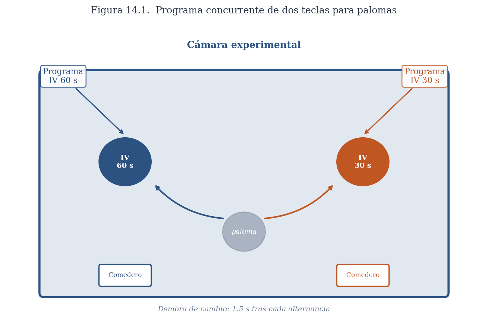
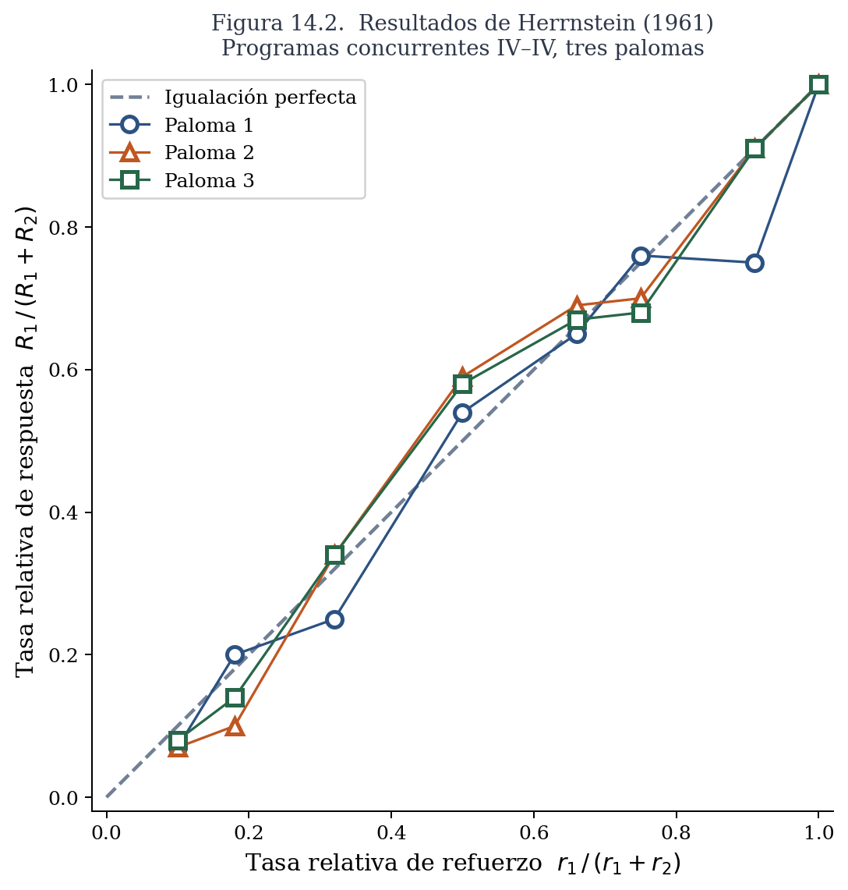
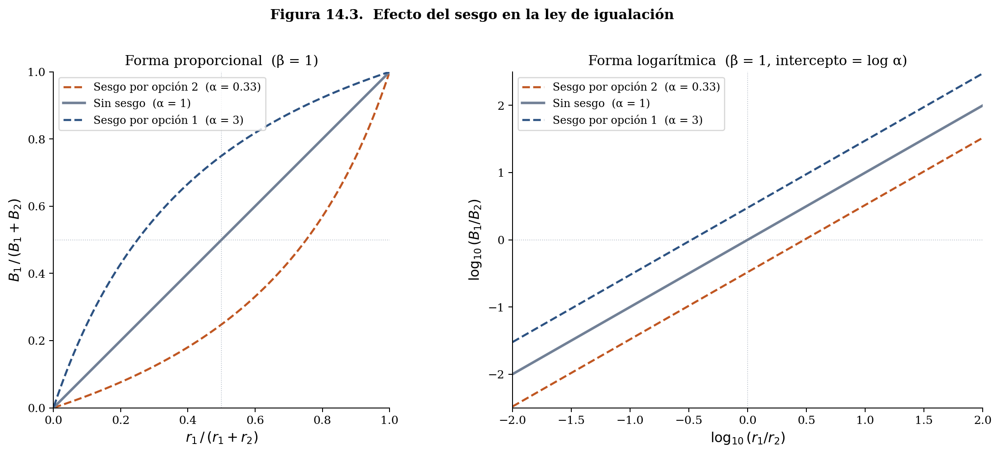
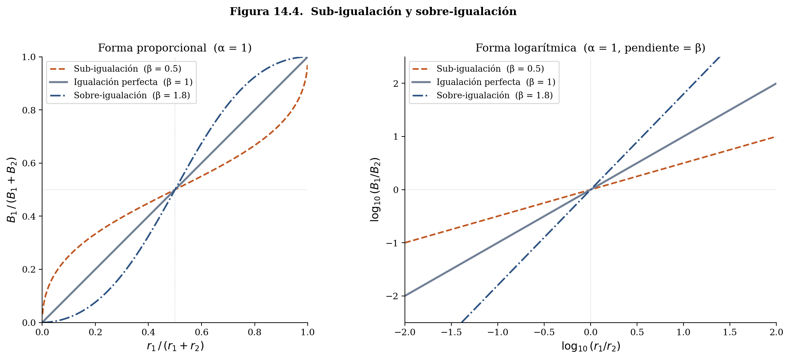
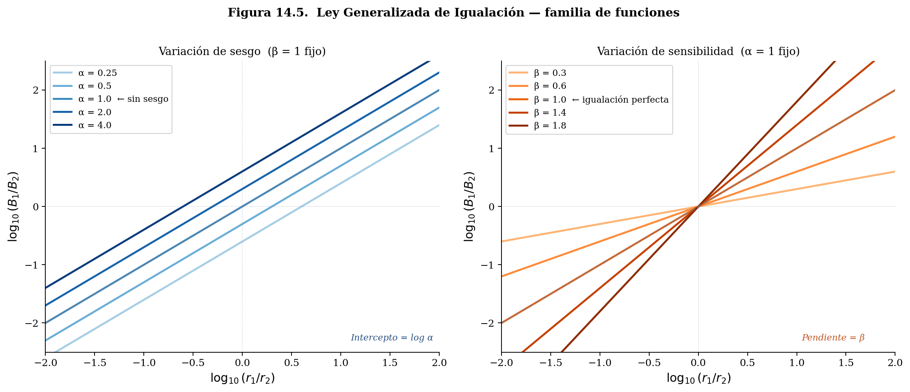

Los capítulos anteriores de este libro estudiaron cómo los organismos adquieren conocimiento sobre su entorno: qué señales predicen sucesos biológicamente importantes, qué acciones los producen, cómo se actualiza ese conocimiento con la experiencia. Esa pregunta asume que hay acciones que evaluar. Pero la pregunta inversa —dado que el organismo ya sabe algo sobre las consecuencias de sus acciones, ¿cómo decide qué hacer?— es igualmente fundamental y merece sus propios modelos. Los capítulos que siguen forman una sección sobre modelos de la acción: los principios que gobiernan cómo los organismos distribuyen su comportamiento entre las alternativas disponibles.

Lo que hizo posible formular esa pregunta de forma precisa fue una decisión conceptual de Skinner que ya encontramos en los capítulos sobre programas de refuerzo y sobre la traducción del condicionamiento clásico en acción: tratar al comportamiento como *emitido*. Al concebir la conducta no como una respuesta discreta elicitada por un estímulo específico sino como un flujo continuo de acción cuya tasa es la variable de interés, Skinner creó las condiciones para una pregunta nueva. Si el comportamiento es un flujo, ese flujo puede distribuirse entre alternativas, y la distribución resultante puede medirse y modelarse. Herrnstein, trabajando en el mismo laboratorio, tomó esa variable y preguntó algo que Skinner no había preguntado: ¿cómo se reparte ese flujo de acción cuando hay dos opciones disponibles simultáneamente, cada una con sus propias consecuencias? La respuesta a esa pregunta es el tema de este capítulo.

Antes de entrar en ella conviene ubicar este tipo de decisiones dentro de un mapa más amplio. Un organismo en constante acción enfrenta en cada momento decisiones de naturaleza muy diferente. Un estudiante, al escuchar el despertador, puede levantarse o apagarlo y regresar a dormir; puede bañarse o no; elige entre opciones de desayuno, entre distintas formas de llegar a la universidad, entre entrar a clase o tomar un café con una amistad, entre estudiar por la tarde, ir al gimnasio o ver una película. A estas se les conoce como decisiones *basadas en el valor*: el agente elige entre alternativas cuyas consecuencias tienen diferente peso o importancia para él.

Sin embargo, no son las únicas. El conductor que maneja de noche tiene que decidir si lo que ve enfrente es el reflejo de la luna o una piedra —una *decisión perceptual* sobre si un objeto está presente en su entorno. Ante la vasta exposición a propiedades simultáneas de su entorno, el agente tiene que decidir a cuál de ellas atender: escuchar la radio, a su acompañante, a las señales de tránsito o a los autos en el espejo retrovisor. Al encontrarse con un perro callejero tiene que decidir si es agresivo o amigable; al encontrarse con una persona, si ha tenido experiencia previa con ella. Buena parte de la psicología, desde sus inicios en la psicofísica, ha estudiado modelos de este tipo de *decisión perceptual*, a los que dedicaremos capítulos posteriores. Y más adelante en el libro estudiaremos también los modelos de *estructuras de preferencia*, que describen la arquitectura interna de los valores que alimentan las decisiones basadas en valor.

Este capítulo y los siguientes se concentran en las decisiones basadas en el valor, y dentro de ellas, en un subtipo particularmente importante: las que se repiten.

## Decisiones Basadas en el Valor

Considera los siguientes dos escenarios. Una persona está en el último día de vacaciones en una ciudad a la que no va a volver. Tiene que elegir en cuál de dos restaurantes comer. La elección se dará a partir, entre otras cosas, del precio, el menú y el ambiente —esto es, del valor en ese momento de cada uno de los dos restaurantes. En un segundo escenario, esos mismos dos restaurantes están en el barrio donde esa persona vive permanentemente. Come en uno de los dos todos los días.

La presentación recurrente de las oportunidades de elección crea nuevos problemas de adaptación para el agente. Debe determinar si las consecuencias de las opciones cambian en función de las elecciones y el paso del tiempo —el trato de los meseros puede mejorar conforme se visita más frecuentemente un restaurante, o la calidad de la comida puede variar según el día de la semana. Para estimar el valor de cada restaurante, la persona debe visitarlo con cierta frecuencia; una vez establecido ese valor, debe determinar cómo distribuir sus visitas entre los dos a lo largo del tiempo. Y debe mantener cierta flexibilidad para modificar sus elecciones, de modo que pueda detectar si la calidad varía aleatoriamente con el tiempo —quizás por cambios en el cocinero.

Cada uno de estos dos escenarios representa un problema de adaptación diferente. Al primero, siguiendo a Gallistel, le llamamos *optar*: es una decisión única, sin historia ni consecuencias futuras que gestionar. Al segundo le llamamos *asignación*: la elección se repite, las consecuencias de cada visita alimentan la siguiente, y el problema no es solo elegir bien hoy sino distribuir el comportamiento inteligentemente a lo largo del tiempo.

Los problemas de asignación son ubicuos en la vida de la mayoría de los organismos. Una abeja que enfrenta dos parcelas con flores ilustra bien su estructura. Mientras más tiempo pasa la abeja visitando una parcela, el polen disponible en ella disminuye; al mismo tiempo, las flores de la otra parcela siguen llenas. La abeja enfrenta entonces dos problemas entrelazados: cuánto tiempo dedicarle a cada parcela en total, y cuándo salir de una para visitar la otra. El primero es un problema de distribución del comportamiento a lo largo del tiempo —cuánto tiempo asignar a cada alternativa como función del rendimiento de cada una. El segundo es un problema de decisión local sobre el momento del cambio. En este capítulo y los siguientes nos concentramos en el primero: la distribución de respuestas y tiempos en equilibrio, una vez que el organismo ha tenido suficiente experiencia con las alternativas disponibles.

## Elección Recurrente

La forma más sencilla de estudiar experimentalmente la elección recurrente la desarrolló Richard Herrnstein en el laboratorio de Skinner y se conoce como *programas de refuerzo concurrentes*. El protocolo consiste en presentarle al organismo dos o más opciones de respuesta simultáneamente disponibles —en el caso de las palomas, dos teclas iluminadas en lados opuestos de la cámara—, cada una reforzada de acuerdo a un programa independiente. El animal puede responder libremente a cualquiera de las dos teclas en cualquier momento, y en cada sesión diaria se registra cuántas respuestas emite a cada tecla y cuántos refuerzos obtiene de cada una.

{#fig14_1_camara_concurrente.png width=750 fig-align="center"}

::: {.callout-note collapse="true" appearance="minimal"}
*[FIGURA 14.1: Diagrama esquemático de un programa concurrente de dos teclas para palomas. Ambas teclas están disponibles simultáneamente durante toda la sesión]*
:::

Para que la distribución de respuestas registrada refleje cómo el organismo valora cada opción y no simplemente su capacidad de explotar la disponibilidad simultánea de ambas teclas, los experimentos incluyen un requisito de demora al cambio (*changeover delay*, COD): el organismo debe permanecer en una tecla durante un intervalo mínimo —típicamente entre 1.5 y 2 segundos— antes de que el primer refuerzo disponible en la otra tecla sea entregado. Sin ese requisito, un organismo podría picotear brevemente la tecla izquierda y cambiar de inmediato a la derecha para recoger el refuerzo que estuviera esperando allí, obteniendo crédito de ambos programas a un costo prácticamente nulo. El COD garantiza que las respuestas registradas sean distribuciones reales de tiempo y esfuerzo entre las alternativas, no artefactos de alternación rápida.

Con un par de programas dado, el animal se expone a sesiones diarias hasta que la distribución de respuestas sea constante de una sesión a la siguiente —típicamente entre 30 y 45 días por condición. Los datos que se analizan son los de los últimos cinco días de cada condición, cuando el comportamiento ha alcanzado el equilibrio y los agentes han aprendido acerca de las consecuencias de cada opción de respuesta. El procedimiento se repite para todos los pares de programas que se estudian. Lo que se obtiene es una descripción del comportamiento en estado estable, no de su dinámica de adquisición.

Skinner hizo posible estudiar una variable agregada del comportamiento: la tasa de una respuesta —número de respuestas dividida entre el tiempo disponible. Herrnstein estudió una nueva variable agregada: la tasa relativa de respuestas en un periodo de tiempo.

$$
\frac{R_1} {(R_1 +R_2)}
$$

Con esa nueva unidad de análisis disponible, Herrnstein se preguntó si la proporción de respuestas guardaba alguna relación sistemática con la proporción de refuerzos obtenidos de cada opción.

## La Ley de Igualación

En 1961, Richard Herrnstein reportó los resultados del primer estudio sistemático con programas concurrentes de intervalo variable. Entrenó a palomas bajo varios pares de programas IV y midió la proporción de respuestas a cada tecla en equilibrio. El resultado fue sorprendente por su precisión: la tasa relativa de respuestas —la proporción de respuestas dedicada a cada tecla— igualaba la tasa relativa de refuerzos obtenidos de esa tecla:

$$
\frac {R_1} {(R_1 + R_2)} = \frac {r_1} {(r_1 + r_2)}
$$

donde $R_1$ y $R_2$ son las tasas de respuesta y $r_1$ y $r_2$ son las tasas de refuerzo obtenidas de cada tecla. A esta relación se le conoce como la *ley de igualación*.

{#fig14_2_fig14_2_herrnstein1961.png width=750 fig-align="center"}

::: {.callout-note collapse="true" appearance="minimal"}
*[FIGURA 14.2: FIGURA 14.2: Resultados de Herrnstein (1961) con tres palomas en programas concurrentes IV-IV. Eje horizontal: tasa relativa de refuerzo (r₁/(r₁+r₂)). Eje vertical: tasa relativa de respuesta (R₁/(R₁+R₂)). Cada punto representa los datos promediados de los últimos cinco días bajo una condición. Los puntos se alinean cerca de la diagonal de pendiente unitaria que representa la igualación perfecta]*
:::

La ley de igualación no es un resultado trivial. En los programas de intervalo variable, el refuerzo no se cancela cuando el animal no responde: permanece disponible hasta que el animal emita una respuesta a esa tecla. Esto significa que el animal puede obtener todos los refuerzos disponibles con una amplísima variedad de distribuciones de respuesta —respondiendo exclusivamente a una tecla, alternando regularmente, o cualquier patrón intermedio. Lo llamativo del resultado de Herrnstein es que, dentro de ese amplísimo rango de distribuciones que producirían el mismo número total de refuerzos, los organismos exhiben consistentemente la distribución que iguala las tasas relativas. La igualación no es la única distribución posible; es la que se observa.

La robustez del resultado es notable. En las décadas siguientes, la igualación se replicó en docenas de experimentos con ratas, peces, monos, humanos y diversas especies de aves, bajo múltiples pares de programas y con distintos tipos de refuerzos. Figura entre las relaciones cuantitativas más discutidas y replicadas en la psicología experimental de la segunda mitad del siglo XX.

### Igualación de Tiempos Asignados

Herrnstein midió respuestas discretas —picoteos a una tecla. Pero muchos comportamientos naturales no son discretos: el tiempo que una abeja pasa en una parcela, el tiempo que un animal dedica a un área de forrajeo, la duración de una conversación. Baum y Rachlin estudiaron si la igualación se extendía a la distribución del tiempo asignado. Colocaron palomas en una cámara rectangular dividida en dos mitades, con un comedero en cada extremo reforzando de acuerdo a programas IV independientes, y midieron el tiempo que el animal pasaba en cada mitad. El resultado fue igualación de tiempos:

$$
\frac{T_1}{T_1 + T_2} = \frac{r_1}{r_1 + r_2}
$$

La proporción de tiempo asignada a cada alternativa iguala la proporción de refuerzos obtenidos de esa alternativa. Que el resultado se obtuviera tanto con respuestas discretas como con tiempo asignado sugiere que la igualación es un principio general sobre la distribución del comportamiento, no un artefacto de la forma de medir.

## Desviaciones de la Igualación Perfecta

La igualación estricta —que la proporción de respuestas iguale exactamente la proporción de refuerzos— es el resultado típico, pero no el único. Baum identificó dos clases de desviaciones sistemáticas que emergen bajo ciertas condiciones.

### Sesgo

Si en una visita al supermercado les ofrecen probar, sin ningún costo, frijoles negros o bayos, algunos de ustedes preferirán los frijoles negros. Dada esa preferencia, si ambos tienen el mismo precio, comprarán los negros. Pero si los negros cuestan el doble, en algún punto la diferencia de precio superará esa preferencia y comprarán los bayos. Aquí hay dos variables separadas: tu preferencia por un tipo de frijol —el sesgo— y tu sensibilidad a la diferencia de precio. Ambas influyen en la decisión, pero son independientes entre sí.

En los programas concurrentes ocurre algo análogo. Cuando los refuerzos de las dos opciones son de distinto tipo —diferentes alimentos, refuerzos de diferente magnitud— el organismo puede mostrar una preferencia intrínseca por uno de ellos que se suma al efecto de las tasas de refuerzo. Esta preferencia se llama *sesgo*: en la gráfica de tasa relativa de respuesta contra tasa relativa de refuerzo, el sesgo desplaza la función hacia arriba o hacia abajo respecto a la diagonal de igualación perfecta. Cuando la tasa de refuerzo de las dos opciones es idéntica ($r_1/r_2 = 1$) pero la tasa de respuesta no es 0.5, la diferencia refleja un sesgo por una de las alternativas, independiente de las tasas de refuerzo.

{#fig14_3_sesgo.png width=750 fig-align="center"}

::: {.callout-note collapse="true" appearance="minimal"}
*[FIGURA 14.3: Efecto del sesgo en la relación entre tasa relativa de respuesta y tasa relativa de refuerzo. Cuando hay sesgo por la opción 1, la función se desplaza hacia arriba: para cada tasa relativa de refuerzo, la proporción de respuestas a la opción 1 es mayor que la predicha por igualación perfecta. El sesgo en favor de la opción 2 produce el efecto opuesto]*
:::

### Sensibilidad

Una segunda desviación ocurre cuando los organismos no son linealmente sensibles a la diferencia entre las tasas de refuerzo. Considera un caso cotidiano: en el supermercado, el mismo producto está disponible en dos marcas a precios distintos, $11.00 y $5.50. La diferencia objetiva es de 2 a 1, pero los valores numéricos son difíciles de comparar de un vistazo, y según la persona esa diferencia se percibirá como mayor o menor que 2 a 1. Algo análogo ocurre con las tasas de refuerzo: la diferencia objetiva entre dos programas puede transformarse psicológicamente en una diferencia mayor o menor, ya sea por cómo el sistema de valor procesa las magnitudes o por la dificultad de discriminar entre ellas.

Supón que un programa concurrente tiene tasas de refuerzo en razón 2 a 1. La igualación perfecta predice que el organismo responderá dos veces más frecuentemente a la opción más rica. Pero si la diferencia psicológica percibida entre ambas tasas es menor que la diferencia objetiva, el organismo responderá en una proporción más cercana a la indiferencia que a la igualación. A este patrón se le llama *sub-igualación*: la distribución de respuestas es menos extrema de lo que predice la tasa relativa de refuerzo.

Lo contrario también es posible. Cuando el organismo amplifica las diferencias en tasas de refuerzo —respondiendo de forma más extrema en la opción más rica de lo que la proporción de refuerzos justifica— se observa *sobre-igualación*. Asumiremos que el sesgo y la sensibilidad varían independientemente el uno del otro.

{#fig14_4_sensibilidad.png width=750 fig-align="center"}

::: {.callout-note collapse="true" appearance="minimal"}
*[FIGURA 14.4: Sub-igualación y sobre-igualación. En la sub-igualación, la función de tasa relativa de respuesta está por debajo de la diagonal cuando la opción 1 es la más rica, y por encima cuando es la más pobre: el organismo sub-estima las diferencias de refuerzo. En la sobre-igualación el patrón se invierte: el organismo exagera las diferencias.]*
:::

## La Ley Generalizada de Igualación

Para capturar el sesgo y la sensibilidad en un solo modelo, Baum propuso expresar la ley de igualación en términos de razones de respuesta y refuerzo —en lugar de proporciones— y transformar esa relación como una función de potencia:

$$
\frac{B_1}{B_2} = \alpha \left(\frac{r_1}{r_2}\right)^\beta
$$

donde $\alpha$ es el parámetro de sesgo y $\beta$ es el parámetro de sensibilidad. La igualación perfecta corresponde al caso $\alpha = 1$ y $\beta = 1$.

Aplicando logaritmos a ambos lados, la ecuación se convierte en una familia de líneas rectas:

$$
\log \frac{B_1}{B_2} = \beta \log\frac{r_1}{r_2} + \log \alpha
$$

En esa forma, $\beta$ es la pendiente de la función y $\log \alpha$ es el intercepto. La sub-igualación corresponde a pendientes menores que uno; la sobre-igualación, a pendientes mayores que uno. El sesgo desplaza la línea verticalmente sin cambiar su pendiente.

{#fig14_5_ley_generalizada.png width=750 fig-align="center"}

::: {.callout-note collapse="true" appearance="minimal"}
*[[FIGURA 14.5: La ley generalizada de igualación en coordenadas logarítmicas. Las líneas de la familia superior muestran diferentes valores de sesgo (intercepto, $\log\alpha$) con sensibilidad fija ($\beta = 1$). Las líneas de la familia inferior muestran diferentes valores de sensibilidad (pendiente, $\beta$) sin sesgo ($\alpha = 1$). La igualación perfecta es la línea de pendiente 1 que pasa por el origen.]*
:::

La transformación logarítmica no es solo un truco algebraico para linearizar la función: también revela su parentesco con un principio psicofísico clásico. S.S. Stevens propuso que muchas dimensiones sensoriales siguen una función de potencia —la magnitud percibida de un estímulo es proporcional a una potencia de su magnitud física. La ley generalizada de igualación dice algo análogo para la elección: la razón de respuestas es proporcional a una potencia de la razón de refuerzos, con el exponente $\beta$ midiendo cuánto amplifica o atenúa el sistema las diferencias en tasas de refuerzo.

Esta analogía con Stevens sugiere además dos interpretaciones posibles del parámetro $\beta$. La primera lo trata como una propiedad intrínseca del sistema de valor: así como el exponente de la función de potencia varía según la dimensión sensorial —la percepción de brillo sigue un exponente distinto que la percepción de peso—, la sensibilidad $\beta$ podría variar según el tipo de refuerzo, independientemente del sujeto o del contexto experimental. La segunda interpretación lo trata como el resultado de restricciones de discriminabilidad: $\beta$ refleja la dificultad del organismo para distinguir entre las tasas de refuerzo de las dos opciones, dificultad que depende tanto del sistema sensorial del organismo como de las condiciones del experimento. Considera un ejemplo: la diferencia entre dos sabores placenteros suele ser más fácil de discriminar que la diferencia entre dos sonidos melódicos de distinta intensidad. Esa diferencia en discriminabilidad podría deberse a una propiedad intrínseca del valor gustativo frente al auditivo —interpretación 1—, o podría deberse a que el sistema sensorial humano distingue mejor estímulos por la vía gustativa que por la auditiva —interpretación 2—. La segunda interpretación predice que la diferencia desaparecería en especies con sistemas auditivos más agudos, como los murciélagos. Ambas interpretaciones son empíricamente distinguibles y abren preguntas que la descripción en términos de $\beta$ por sí sola no responde.

Esa analogía con Stevens plantea además una pregunta más profunda que este capítulo deja abierta. En psicofísica, la función de potencia de Stevens no es solo una descripción: se deriva de supuestos sobre cómo el sistema sensorial transforma magnitudes físicas en magnitudes percibidas. ¿Existe una derivación análoga para la elección? ¿De qué principios sobre la relación entre valor y acción se sigue que la razón de respuestas sea una función de potencia de la razón de refuerzos, con $\beta$ como parámetro de sensibilidad y $\alpha$ como sesgo? La respuesta requiere un modelo de la elección como función del valor —no solo una descripción del patrón en equilibrio. Ese modelo es el tema del capítulo sobre la ley relativa del efecto, donde veremos que la ley generalizada de igualación emerge como consecuencia algebraica de dos axiomas elementales sobre cómo las diferencias de valor se traducen en diferencias de probabilidad de acción.

::: {.callout-tip}
## 🕹️ SIMULADOR 14.1 — Ley generalizada de igualación
[*El simulador muestra la función de la ley generalizada en coordenadas linealea y logarítmicas. Puedes ajustar los parámetros $\beta$ (sensibilidad) y $\alpha$ (sesgo) y observar cómo cambia la línea.*](https://colab.research.google.com/github/arbouria/Libro-ACA-2026/blob/main/Simuladores/Cap14_ley_generalizada.ipynb){target="_blank"}
:::

## ¿Qué Computa el Organismo? Dos Preguntas Sobre Igualación

La ley de igualación describe con precisión el estado de equilibrio. Pero esa descripción admite dos tipos de pregunta que conviene no confundir, porque pertenecen a niveles de explicación distintos —distintos en el sentido en que los distinguimos en el capítulo 1.

La primera pregunta es *funcional*: ¿es la igualación un comportamiento adaptativamente ventajoso? ¿Podría haber sido seleccionada evolutivamente porque resuelve bien el problema de asignación? Esta es una pregunta sobre la función del mecanismo, no sobre su estructura interna.

La segunda pregunta es *algorítmica*: ¿qué proceso computa el organismo momento a momento para producir el patrón de igualación? ¿Qué variables actualiza, qué regla de elección sigue, qué información necesita? Esta pregunta puede tener una respuesta completamente diferente a la primera. Un mecanismo puede ser funcionalmente equivalente a maximizar sin que "maximizar" sea el algoritmo que ejecuta —igual que un termostato mantiene la temperatura óptima de una habitación sin calcular ningún óptimo.

Consideramos cada pregunta por separado.

### ¿Es la Igualación Funcionalmente Equivalente a Maximizar?

Una primera observación es que igualación podría ser, a nivel funcional, una instancia de maximización del total de refuerzos disponibles. Para evaluar esta posibilidad hay que considerar la función que relaciona la tasa total de refuerzos ($r_1 + r_2$) con la distribución relativa de respuestas:

$$
r_{total}= f\left(\frac{R_1}{R_1 + R_2}\right)
$$

Dado que en programas de IV los refuerzos no se cancelan hasta que se obtienen, al animal le conviene seguir visitando ambas opciones para recoger todos los reforzadores disponibles. Sin embargo, el número de distribuciones de respuesta que garantizarían obtener todos los refuerzos es enorme: el organismo podría alternar regularmente (0.5) o pasar casi todo el tiempo en una de las opciones con visitas ocasionales a la otra. Lo sorprendente es que, dentro de ese amplio rango de distribuciones que maximizan el refuerzo total, lo que se observa empíricamente es la proporción de respuestas que iguala la tasa de refuerzo relativa. En programas IV-IV, la igualación es una forma de maximizar —aunque no la única. Que un organismo iguale en esas condiciones es, por tanto, funcionalmente compatible con haber sido seleccionado para maximizar refuerzos a lo largo de su historia evolutiva.

Sin embargo, que igualación sea funcionalmente equivalente a maximizar no nos dice nada sobre el algoritmo que la produce. Pasemos ahora a esa segunda pregunta.

### ¿Cuál es el Algoritmo? Maximización vs. Rentabilidad

Dos algoritmos distintos podrían dar cuenta del patrón de igualación. El primero propone que el organismo maximiza directamente la tasa global de refuerzo. El segundo propone algo más local: que el organismo iguala la rentabilidad de cada opción. La diferencia entre ambos no es solo de vocabulario —implica representaciones distintas y, como veremos, predicciones distintas.

Para ver la diferencia con claridad, consideremos dos ingenieros que deben programar un robot de servicio encargado de recoger basura en dos puestos de comida separados por una calle.

El primer ingeniero programa al robot con una meta global: recoger la mayor cantidad posible de basura por hora. En la versión más simple, el robot no necesita representar por separado el valor de cada puesto. Puede registrar cuánta basura recoge en total y cómo distribuye su tiempo entre los dos. Si al aumentar el tiempo dedicado a un puesto aumenta la basura total recogida, sigue moviéndose en esa dirección; si disminuye, corrige. El sistema opera como un ascenso de colina —el mismo mecanismo que estudiamos en el capítulo 4— sobre una variable global. El robot necesita solo dos contadores: el total de basura recogida y la distribución relativa de tiempo.

El segundo ingeniero tiene una meta distinta: igualar la rentabilidad del tiempo dedicado a cada puesto. En ese caso, el robot sí necesita separar la información por alternativa. Debe registrar cuánta basura recoge en el puesto A y cuánto tiempo pasa ahí, cuánta recoge en el puesto B y cuánto tiempo pasa ahí. Solo con esos cuatro registros puede calcular dos rentabilidades locales: basura por minuto en A y basura por minuto en B. La regla ya no compara el total global, sino las tasas locales de retorno de cada alternativa. El robot necesita cuatro contadores.

Esta diferencia en arquitectura computacional —dos contadores versus cuatro— es lo que distingue los dos algoritmos cuando se los aplica al comportamiento del organismo. De acuerdo al algoritmo de maximización global, el organismo no distingue entre las dos respuestas disponibles ni entre el refuerzo asociado con cada una: computa y actualiza únicamente la suma de refuerzos y la tasa relativa de respuestas. Este modelo no es una instancia de elección basada en el valor de respuestas individuales; el origen de cada refuerzo es irrelevante. En la hipótesis de rentabilidad, en cambio, el organismo mantiene registros separados por alternativa y compara las tasas locales de cada una.

La hipótesis de rentabilidad propone, en concreto, que el organismo distribuye su comportamiento de modo que *iguala la rentabilidad* de las distintas opciones disponibles. La rentabilidad de una opción es la tasa de refuerzo que produce por unidad de respuesta o por unidad de tiempo. La tasa de interés bancaria es la rentabilidad de cada peso invertido: te dice cuánto ganarás por cada $1,000 pesos depositados en tu cuenta. La hipótesis de rentabilidad propone que los organismos distribuyen el comportamiento de modo que, en equilibrio, obtengan la misma tasa de refuerzo local de todas las opciones disponibles.

Derivemos este principio del patrón de igualación. La igualación para respuestas y tiempos puede expresarse en forma de razones —en lugar de frecuencias relativas:

$$
\frac {R_1} {R_2} = \frac {r_1} {r_2} \qquad \frac {T_1} {T_2} = \frac {r_1} {r_2}
$$

Razones y tasas relativas son dos formas equivalentes:

$$
\frac{R_1}{R_2} = \frac{r_1}{r_2} \qquad \Longrightarrow \qquad \frac{R_1}{R_1 + R_2} = \frac{r_1}{r_1 + r_2}
$$

Trabajando con razones y reordenando términos, en equilibrio la igualación implica:

$$
\frac{r_1}{R_1} = \frac{r_2}{R_2} \qquad \text{o bien} \qquad \frac{r_1}{T_1} = \frac{r_2}{T_2}
$$

Esta nueva forma de expresar la ley de igualación refleja que lo que se iguala es la rentabilidad de las distintas opciones de respuesta: los refuerzos obtenidos por respuesta o por segundo son iguales en ambas alternativas. Igualar las razones de respuesta a las razones de refuerzo es la misma proposición que decir que se igualan las rentabilidades.

Un ejemplo numérico hace visible lo que esto significa en la práctica. Supón un programa concurrente con dos opciones: la opción A reforzada con un programa IV de 30 segundos (tasa de refuerzo $r_1 = 2$ refuerzos por minuto) y la opción B reforzada con un programa IV de 60 segundos ($r_2 = 1$ refuerzo por minuto). La ley de igualación predice que el organismo dedica a A el doble de sus respuestas:

$$
\frac{R_1}{ R_2} = \frac{2}{ 1} = 2
$$

Supón ahora que en una sesión de 60 minutos el organismo emite 300 respuestas en total: 200 a la opción A y 100 a la opción B. Si la tasa de respuesta es suficiente para recoger todos los refuerzos disponibles —lo que ocurre típicamente bajo programas IV— el organismo obtiene aproximadamente 120 refuerzos de A y 60 de B. Las rentabilidades resultan:

$$
\frac{r_1}{R_1} = \frac{120}{200} = 0.60 \text{ refuerzos por respuesta} \qquad \frac{r_2}{R_2} = \frac{60}{100} = 0.60 \text{ refuerzos por respuesta}
$$

Las rentabilidades son iguales. Cualquier otra distribución de las 300 respuestas entre las dos opciones produciría rentabilidades distintas. La igualación es la condición de equilibrio que iguala las tasas de refuerzo locales.

Computacionalmente, este algoritmo requiere que el organismo mantenga cuatro contadores —respuestas y refuerzos para cada opción— y calcule sus tasas locales. La regla de elección es: asigna más tiempo o respuestas a la opción cuya rentabilidad actual sea mayor. El proceso se detiene —o se vuelve estacionario— cuando ambas rentabilidades son iguales.

El contraste es exactamente el de los dos robots: el organismo del modelo de maximización global opera con dos contadores y no necesita saber de qué alternativa provino cada refuerzo; el organismo del modelo de rentabilidad opera con cuatro y no puede funcionar sin esa distinción. Ambos producirían el mismo patrón en equilibrio bajo programas IV-IV —lo que hace imposible distinguirlos con ese diseño. Necesitamos condiciones donde sus predicciones difieran.

### Maximización vs. Rentabilidad: Un Experimento Decisivo

Considera el siguiente escenario. Una estudiante es la única heredera de dos tías de edad avanzada. El monto de la herencia que le dejará una de ellas depende directamente del número de visitas que la sobrina le haga; la cantidad que dejará la otra tiene un tope máximo y solo depende de que la sobrina la visite ocasionalmente. La estrategia óptima para la sobrina es asignar la mayor parte de sus visitas a la tía cuya herencia crece con cada visita, y visitar ocasionalmente a la otra —la suficiente para no perder lo que ya acumuló. El escenario ilustra un programa concurrente donde una opción sigue un programa de razón variable y la otra un programa de intervalo variable.

En los programas de razón variable, a diferencia de los de intervalo, la rentabilidad de la respuesta no cambia con el tiempo que el organismo pasa en otra opción: cada respuesta tiene la misma probabilidad de producir un refuerzo, independientemente de cuándo fue la última vez que el organismo respondió a esa tecla. En contraste, en los programas de intervalo, la probabilidad de refuerzo aumenta con el tiempo transcurrido desde la última visita.

Esa diferencia tiene una consecuencia crucial cuando se combinan ambos programas en un programa concurrente RV-IV. De acuerdo a la maximización global, la estrategia óptima es responder casi exclusivamente a la tecla con el programa de razón —que produce refuerzos en proporción directa al número de respuestas emitidas— y visitar ocasionalmente la tecla con el programa de intervalo, solo para recoger el refuerzo que esté esperando. Esta estrategia maximiza el número total de refuerzos por unidad de tiempo.

De acuerdo a la hipótesis de rentabilidad, en cambio, el organismo distribuye sus respuestas de modo que las tasas de refuerzo locales de ambas opciones sean iguales. Para ver por qué eso produce una predicción distinta a la de la maximización, hay que examinar cómo varía la rentabilidad de cada opción con la distribución del comportamiento.

La rentabilidad del programa de razón es una constante: cada respuesta produce en promedio $1/n$ refuerzos, donde $n$ es la razón media, independientemente de cuánto tiempo lleve el organismo sin visitar esa tecla. Con RV 10, cada respuesta rinde 0.10 refuerzos en promedio —siempre.

La rentabilidad del programa de intervalo, en cambio, depende de con qué frecuencia lo visita el organismo. El IV no cancela refuerzos: los retiene hasta que el organismo responde. Mientras más tiempo pasa el organismo sin visitar la tecla del IV, más probable es que haya un refuerzo esperando. Esto tiene una consecuencia importante: los refuerzos del IV pueden cosecharse con visitas breves y espaciadas. En una sesión de 60 minutos, un IV de 1 minuto genera 60 refuerzos en total —uno por minuto— y el organismo puede recogerlos prácticamente todos dedicando solo una fracción pequeña de sus respuestas a esa tecla.

El siguiente ejemplo hace visible la diferencia. Supón una sesión de 60 minutos con tasa de respuesta constante de 30 respuestas por minuto —1,800 respuestas en total— y un programa concurrente RV 10 — IV 1 min.

| Distribución | Respuestas RV | Respuestas IV | Refuerzos RV | Refuerzos IV | Total |
|:---|---:|---:|---:|---:|---:|
| Maximización (95% en RV) | 1,710 | 90 | 171 | 60 | **231** |
| Igualación (67% en RV) | 1,200 | 600 | 120 | 60 | **180** |
| Exclusivo IV (0% en RV) | 0 | 1,800 | 0 | 60 | **60** |

Dos cosas saltan a la vista. Primero, los refuerzos del IV son 60 en las tres distribuciones: en la segunda fila el organismo visita el IV durante 20 minutos y recoge todos los refuerzos disponibles; en la primera fila, con solo 90 respuestas de visitas breves, también los recoge casi todos —porque cada visita encuentra un refuerzo acumulado esperando. Segundo, los refuerzos del RV sí dependen del tiempo dedicado a él: 171 con 95% del tiempo, 120 con 67%, cero si el organismo abandona el RV por completo. La maximización captura esta asimetría y concluye: dedica casi todo el tiempo al RV —que paga por respuesta— y visita el IV solo de paso para cosechar lo que se acumula.

La hipótesis de rentabilidad llega a una conclusión distinta porque su algoritmo no compara totales sino tasas locales. La rentabilidad del RV es fija: 120/1200 = 171/1710 = 0.10 refuerzos por respuesta, siempre. La rentabilidad del IV cambia con la fracción $f$ de tiempo dedicada a él:

$$\text{Rentabilidad IV} = \frac{60 \text{ refuerzos}}{f \times 1800 \text{ respuestas}} = \frac{1}{f \times 30}$$

Conforme el organismo dedica menos tiempo al IV —menor $f$— los mismos 60 refuerzos disponibles se distribuyen entre menos respuestas, y la rentabilidad por respuesta sube:

| Fracción en IV ($f$) | Respuestas a IV | Rentabilidad IV | Rentabilidad RV |
|:---:|---:|---:|---:|
| 0.05 (5%) | 90 | 0.67 | 0.10 |
| 0.10 (10%) | 180 | 0.33 | 0.10 |
| 0.20 (20%) | 360 | 0.17 | 0.10 |
| 0.33 (33%) | 600 | **0.10** | **0.10** |
| 0.50 (50%) | 900 | 0.07 | 0.10 |

Las rentabilidades se igualan en $f = 1/3$: cuando el organismo dedica el 33% de sus respuestas al IV. A cualquier distribución más extrema —menos tiempo en IV— la rentabilidad del IV supera a la del RV y el algoritmo de rentabilidad desplaza el comportamiento hacia IV. Por encima de $f = 1/3$ ocurre lo contrario. Solo en 67/33 hay equilibrio.

Noten que en ningún punto de este análisis se calculó un máximo ni una derivada. La predicción surge directamente de igualar dos expresiones algebraicas: $1/(f \times 30) = 1/10$, de donde $f = 1/3$. La diferencia entre las dos predicciones no es de grado sino de naturaleza: la maximización compara totales y concluye 95/5; la igualación de rentabilidades compara tasas locales y concluye 67/33. Los datos discriminan entre ellas.

::: {.callout-tip}
## 🕹️ SIMULADOR 14.2 — Programas Concurrentes RV-IV: ¿Rentabilidad o Maximización?
[* El simulador muestra dos organismos que aprenden en el mismo programa concurrente RV-IV. El **organismo de rentabilidad** (azul) aplica el algoritmo de mejoramiento: después de cada bloque de respuestas, compara las tasas locales de refuerzo de las dos opciones y ajusta su distribución hacia la más rentable. El **organismo de maximización** (naranja) aplica ascenso de colina sobre el total de refuerzos y descubre, ensayo a ensayo, que incrementar la fracción dedicada al RV siempre aumenta la ganancia global.

Tres paneles muestran la sesión completa: la distribución de respuestas a lo largo del tiempo, cómo evolucionan las rentabilidades locales del organismo de igualación, y los refuerzos acumulados por cada algoritmo —la diferencia entre las dos curvas es el costo de igualar.*](https://colab.research.google.com/github/arbouria/Libro-ACA-2026/blob/main/Simuladores/sim14_2_rent_max.ipynb){target="_blank"}
:::

Herrnstein y Heyman llevaron al laboratorio este diseño. Expusieron a las palomas a programas concurrentes razón variable-intervalo variable. Los resultados muestran que las palomas distribuyeron sus respuestas de acuerdo al patrón de igualación, con un sesgo en favor del programa de razón —y al hacerlo, obtuvieron consistentemente menos refuerzos totales que los que habrían obtenido con la estrategia de maximización global. El resultado es al mismo tiempo una confirmación de la igualación y una refutación de la maximización: los organismos igualaron aunque eso les costara refuerzos. Experimentos más recientes confirman este resultado y resaltan la utilidad de separar el sesgo por una opción de la sensibilidad a las diferencias de refuerzo.

Pero saber que el organismo no computa el máximo global no nos dice qué sí computa. La hipótesis de rentabilidad describe el estado al que converge el comportamiento, no el proceso que lo produce respuesta a respuesta. ¿Qué regla de elección momento a momento lleva al organismo a distribuir sus respuestas de modo que las rentabilidades se igualen? ¿Cómo se actualizan los valores de cada opción con la experiencia? ¿Qué ocurre cuando las condiciones cambian y el equilibrio se desplaza? Esas son las preguntas de los tres capítulos siguientes.

## Conexiones

### Hacia Atrás

**Sistemas de retroalimentación (capítulo 5).** Los programas concurrentes son sistemas de retroalimentación de lazo cerrado: lo que el organismo hace determina qué refuerzos recibe, y los refuerzos moldean lo que hace. La novedad del capítulo 14 respecto al 5 es que ahora el sistema tiene dos lazos paralelos —uno por cada alternativa disponible— y la distribución del comportamiento entre ellos es lo que se estudia en equilibrio.

**Programas de refuerzo (capítulo 13).** El capítulo anterior describió la función de retroalimentación del entorno para cada tipo de programa en solitario. Este capítulo combina dos de esas funciones en un programa concurrente y pregunta cómo se distribuye el comportamiento entre ellas. La igualación es la respuesta en equilibrio para programas de intervalo variable.

**Bush y Mosteller, Rescorla-Wagner (capítulos 8-11).** Los valores Q que esos modelos asignan a cada respuesta son los inputs sobre los que opera la distribución del comportamiento en equilibrio. En programas concurrentes de intervalo variable, el valor Q de cada respuesta en equilibrio es proporcional a la tasa de refuerzo que produce. La ley de igualación describe qué sucede con esos valores Q cuando hay dos respuestas compitiendo.

### Hacia Adelante

**Maximización local (capítulo 15).** La ley de igualación describe el estado de equilibrio. El capítulo siguiente pregunta qué proceso dinámico —respuesta a respuesta— lleva al organismo a ese equilibrio. El modelo de mejoramiento (*melioration*) de Herrnstein y Vaughan propone que los organismos eligen en cada momento la opción con mayor tasa local de refuerzo, y muestra que ese proceso converge al patrón de igualación bajo programas IV-IV.

**Modelos de optimización global (capítulos sobre Staddon y Rachlin).** La evidencia de Herrnstein y Heyman muestra que los organismos no maximizan el refuerzo global bajo programas RV-IV. Pero eso no descarta que la optimización sea un principio explicativo útil en otros contextos. Los modelos de Staddon y Rachlin proponen que los organismos maximizan funciones de utilidad de carácter diferente, y que igualación emerge como consecuencia bajo ciertas condiciones. El contraste entre la maximización local (capítulo 15) y la maximización global organiza el debate teórico sobre los mecanismos de la elección.

**La ley relativa del efecto (un capítulo posterior).** Este capítulo describió la distribución del comportamiento como proporción —tasas relativas. La ley del efecto relativa de Herrnstein da un paso adicional: deriva la relación entre las tasas absolutas de respuesta y las tasas absolutas de refuerzo, y muestra que la igualación emerge como consecuencia de ese marco teórico más general. Ese capítulo también explicará por qué la razón de respuestas sigue una función de potencia de la razón de refuerzos —la pregunta que la analogía con Stevens dejó abierta aquí.

---

## Resumen

Los problemas de asignación —situaciones de elección recurrente donde el comportamiento retroalimenta sobre las condiciones futuras de refuerzo— son la norma en la vida de la mayoría de los organismos. Los programas de refuerzo concurrentes reproducen esa estructura en el laboratorio y permiten estudiar cómo se distribuye el comportamiento en equilibrio.

Lo que este capítulo establece es un patrón descriptivo preciso y robusto. Herrnstein (1961) descubrió que en programas concurrentes de intervalo variable, la tasa relativa de respuestas iguala la tasa relativa de refuerzos: $R_1/(R_1+R_2) = r_1/(r_1+r_2)$. El resultado se replica con tiempo asignado, con distintas especies y con distintos tipos de refuerzo. Las desviaciones sistemáticas del patrón de igualación perfecta se clasifican en sesgo —preferencia intrínseca por una alternativa independiente de las tasas de refuerzo— y sensibilidad —grado en que el organismo amplifica o atenúa las diferencias entre tasas. La ley generalizada de igualación de Baum captura ambas desviaciones en una función de potencia que se linealiza en coordenadas logarítmicas, con $\beta$ como parámetro de sensibilidad y $\alpha$ como sesgo.

Lo que este capítulo deja abierto es igualmente importante. A nivel funcional, la igualación es compatible con la maximización del refuerzo total en programas IV-IV, lo que sugiere que puede ser adaptativamente ventajosa. A nivel algorítmico, la evidencia de programas concurrentes RV-IV descarta la maximización global como mecanismo y es consistente con la igualación de rentabilidades locales —pero eso describe el estado al que converge el comportamiento, no el proceso que lo produce. Cómo el organismo llega a ese equilibrio respuesta a respuesta, cómo actualiza el valor de cada opción, y cómo se comporta cuando las condiciones cambian son las preguntas que organizan los capítulos siguientes.

---

## Ejercicios

**1.** Un programa concurrente IV 20 s — IV 60 s está en equilibrio. Antes de calcular, predice: ¿a qué tecla irá la mayoría de las respuestas, y en qué proporción aproximada? Ahora calcula la distribución de respuestas que predice la ley de igualación. Si el organismo emite un total de 240 respuestas en una sesión de 60 minutos, ¿cuántas van a cada tecla? Calcula la rentabilidad (refuerzos por respuesta) de cada opción con esa distribución y verifica que sean iguales.

**2.** En un estudio con humanos en una tarea computarizada se observa la siguiente distribución: cuando la tasa de refuerzo de la opción A es el doble que la de la opción B, los participantes asignan a A el 62% de sus respuestas (en lugar del 67% predicho por igualación perfecta). ¿Qué tipo de desviación de igualación es esta? ¿Qué valor de $\beta$ describe mejor este resultado? ¿Qué información adicional necesitarías para estimar también el sesgo?

**3.** La ley generalizada de igualación en escala logarítmica es: $\log(B_1/B_2) = \beta \log(r_1/r_2) + \log\alpha$. Si en un experimento se obtiene una función con pendiente $\beta = 0.8$ e intercepto $\log\alpha = 0.15$ (es decir, $\alpha \approx 1.41$), describe en palabras qué tipo de desviación de igualación muestra el organismo y qué significa la preferencia capturada por $\alpha$.

**4.** Explica en términos de la función de retroalimentación del entorno por qué los programas concurrentes IV-IV no pueden discriminar entre la hipótesis de maximización global y la de rentabilidad local. ¿Qué característica del programa de intervalo variable hace que ambas predicciones coincidan?

**5.** En el experimento de Herrnstein y Heyman con programas concurrentes RV-IV, ¿qué distribución de respuestas predice la maximización global? ¿Qué distribución predice la igualación de rentabilidades locales? ¿Por qué los datos observados permiten distinguir entre las dos hipótesis en este diseño pero no en los programas IV-IV?

**6.** *(Reflexión)* Este capítulo presenta la igualación como una descripción del comportamiento en equilibrio, después de docenas de sesiones de entrenamiento. ¿Qué supone ese énfasis en el equilibrio sobre el tipo de preguntas que el modelo puede y no puede responder? ¿Qué quedaría fuera de su alcance?

---

## Lecturas Recomendadas

**Herrnstein, R. J. (1961).** Relative and absolute strength of response as a function of frequency of reinforcement. *Journal of the Experimental Analysis of Behavior, 4*, 267–272. — El artículo original. Breve, claro y directamente accesible.

**Baum, W. M. (1974).** On two types of deviation from the matching law: Bias and undermatching. *Journal of the Experimental Analysis of Behavior, 22*, 231–242. — La propuesta de la ley generalizada, con la motivación empírica para los dos parámetros.

**Herrnstein, R. J., & Heyman, G. M. (1979).** Is matching compatible with reinforcement maximization on concurrent variable interval, variable ratio? *Journal of the Experimental Analysis of Behavior, 31*, 209–223. — El experimento decisivo que distingue la hipótesis de rentabilidad de la maximización global.

**Mazur, J. E. (2016).** *Learning and Behavior* (8ª ed.). Routledge. Capítulo 8: *Choice and Preference*. — Presentación clara y bien documentada de la ley de igualación, sus desviaciones y las hipótesis sobre los mecanismos subyacentes. Complementa bien la perspectiva de este capítulo.

**Baum, W. M., & Rachlin, H. C. (1969).** Choice as time allocation. *Journal of the Experimental Analysis of Behavior, 12*, 861–874. — El experimento de la cámara rectangular que extiende la igualación al tiempo asignado.
