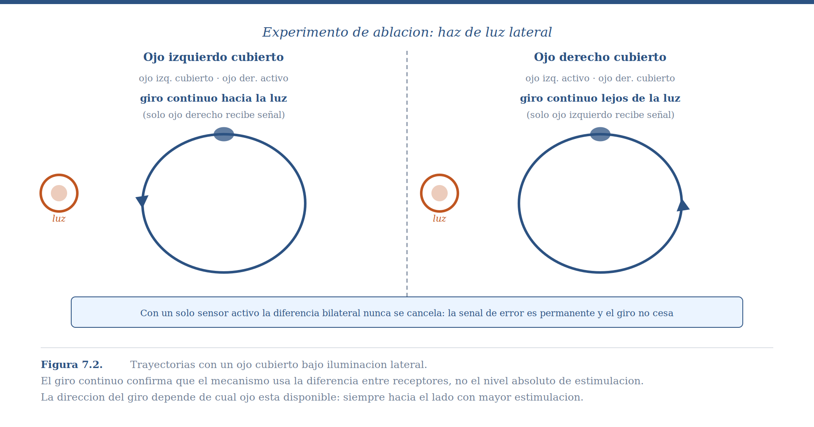
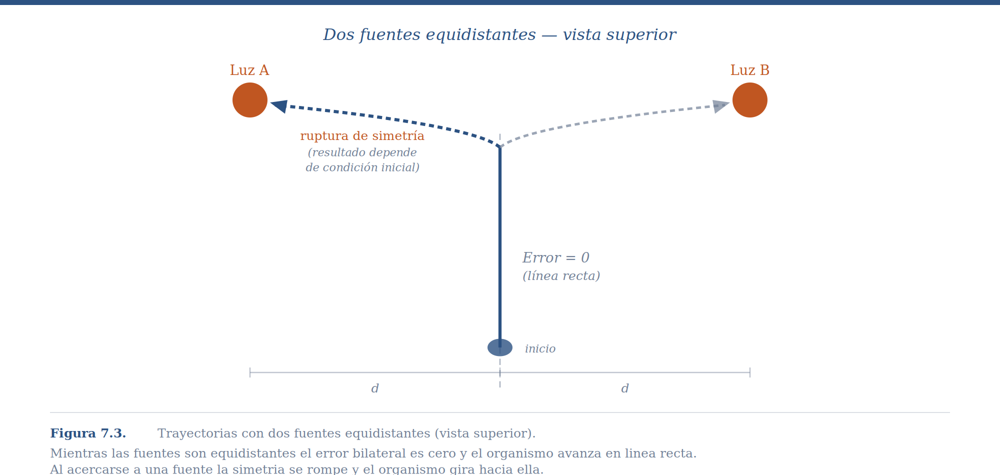
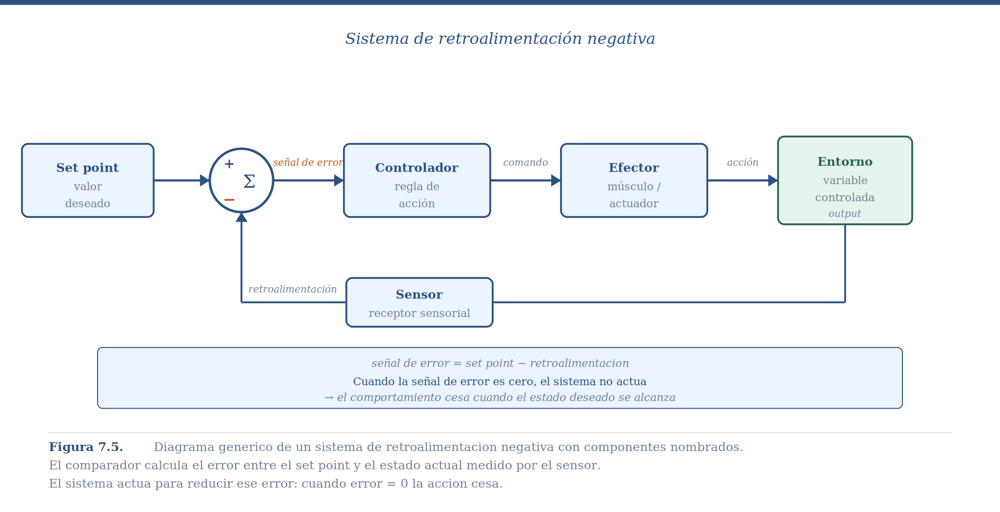
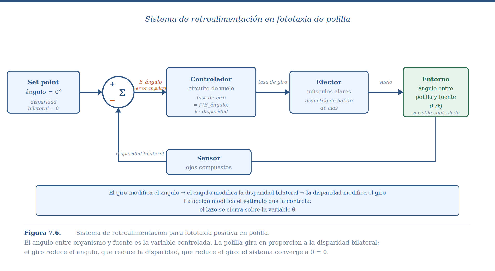

## Comparación Simultánea y el Límite de la Reactividad

En el capítulo anterior dejamos a la bacteria navegando con un solo sensor. Su estrategia era comparar *ahora* con *hace un momento* en el mismo lugar: si la concentración mejora, sigue; si empeora, busca otra dirección. Eso funciona, pero es lento y sinuoso. La bacteria no sabe hacia dónde está el nutriente —solo sabe si está mejorando o no.

La aparición de la simetría bilateral en los animales resolvió esa limitación de una forma elegante: en lugar de un sensor que se mueve para comparar el mundo en distintos tiempos, el organismo dispone de dos sensores separados que comparan el mundo en distintos lugares *al mismo tiempo*. Con este arreglo, la dirección de la fuente queda codificada directamente en la diferencia entre lo que detecta el lado izquierdo y lo que detecta el lado derecho, sin necesidad de moverse primero para saberlo.

Este capítulo introduce el mecanismo que hace posible esa comparación simultánea y lo generaliza: el **sistema de retroalimentación**. Veremos cómo está organizado, qué preguntas conviene hacerle, y —lo más importante— cuál es la limitación fundamental que comparte con el ascenso de colina y que abre la puerta al aprendizaje.

## El Problema: Orientarse en el Espacio

Imagina a una polilla nocturna. Hay una fuente de luz a una distancia desconocida. No tiene mapa, no tiene brújula. Solo tiene lo que sus dos ojos detectan en este momento: dos intensidades luminosas, una para cada lado de su cuerpo. ¿Cómo usa esa información mínima para orientar su cuerpo hacia la fuente?

Este problema —orientarse hacia o alejarse de una fuente puntual de estimulación— aparece en múltiples modalidades a lo largo del reino animal. La fototaxia de polillas y cucarachas, la quimiotaxia de insectos siguiendo plumas de feromonas, la fonotaxia de grillos hembra localizando machos que cantan, la termotaxia de serpientes detectando presas de sangre caliente: todos son el mismo problema computacional resuelto con el mismo principio básico. La diversidad está en el tipo de estímulo; el mecanismo subyacente es el mismo.

## El Mecanismo: Comparación Simultánea

La solución más simple posible al problema de orientación tiene dos componentes. Primero, comparar simultáneamente la estimulación que llega al receptor izquierdo con la que llega al derecho. Segundo, girar en la dirección del receptor que recibe más estimulación —en el caso de fototaxia positiva, hacia la luz; en el caso de fototaxia negativa, como la cucaracha, en dirección contraria.

Este mecanismo —conocido en biología como **tropotaxia**— es una instancia del principio más general que introduce este capítulo: el **sistema de retroalimentación**. La información direccional está disponible instantáneamente, sin costo de movimiento. No hay que explorar para saber hacia dónde girar.

Dos experimentos clásicos establecen que lo que controla el comportamiento es la *diferencia* entre sensores, no el nivel absoluto de estimulación en ninguno de ellos.

El primero cubre uno de los ojos compuestos de una polilla con pintura opaca. La predicción es directa: con solo un sensor funcional, la diferencia bilateral siempre favorece ese lado; la señal de corrección nunca se cancela porque no hay información desde el lado opuesto. El resultado es un giro continuo, sin orientación hacia ningún punto. Cuando se cubre el ojo izquierdo, la polilla gira continuamente a la izquierda; cuando se cubre el derecho, gira a la derecha. La cucaracha hace exactamente lo opuesto —porque huye de la luz— lo que confirma que el signo del giro depende del tipo de fototaxia, no de cuál ojo está disponible.

{#fig7_2_ojo_cubierto width=750 fig-align="center"}

::: {.callout-note collapse="true" appearance="minimal"}

**Descripción:Trayectorias con un ojo cubierto. Filas: oscuridad, luz arriba, haz de luz. Columnas: ojo izquierdo ciego vs. ojo derecho ciego. Con un solo ojo funcional, el organismo gira continuamente en lugar de orientarse. La dirección del giro depende de qué ojo está disponible y del tipo de taxia (positiva/negativa).
:::

El segundo experimento coloca dos fuentes de luz de igual intensidad a igual distancia del organismo. Si la conducta está controlada por la diferencia bilateral, la predicción es que el animal debería moverse en línea recta entre ambas fuentes —porque mientras estén equidistantes, los dos ojos reciben la misma estimulación, la diferencia es cero, y no hay señal de giro. Eso es exactamente lo que ocurre: el organismo avanza en línea recta hasta que la proximidad a una de las fuentes rompe la simetría, momento en que gira bruscamente. Pocas veces un experimento confirma tan limpiamente una predicción.

{#fig7_3_dos_fuentes width=750 fig-align="center"}

::: {.callout-note collapse="true" appearance="minimal"}

**Descripción**: Trayectorias de cochinilla con dos fuentes equidistantes. Las trayectorias reales muestran movimiento en línea recta entre las dos fuentes y el brusco cambio de dirección al acercarse a una de ellas. La línea recta ocurre porque la diferencia bilateral es cero cuando las fuentes son equidistantes.

:::
Vale la pena subrayar el contraste con la bacteria del capítulo anterior: descartamos la comparación simultánea en la Salmonela porque el organismo es demasiado pequeño para detectar diferencias de concentración entre sus dos extremos. En la polilla, el tamaño sí permite esa comparación —y la evidencia experimental muestra que exactamente eso es lo que ocurre.

## El Sistema de Retroalimentación

La fototaxia es un caso particular de un mecanismo general que aparece a lo largo de la biología y la ingeniería: el **sistema de retroalimentación**. Estamos acostumbrados a pensar en la relación organismo-entorno como unidireccional —el entorno produce un estímulo, el organismo produce una respuesta. Pero esa imagen es incompleta: la respuesta del organismo modifica el entorno, lo que modifica el estímulo que controla la respuesta.

La temperatura alta produce sudoración; la sudoración reduce la temperatura; la temperatura reducida disminuye la sudoración. El bebé recién nacido succiona; la succión extrae leche; la tasa de succión estimula la producción de leche de la madre. En todos estos casos la causalidad no va de A a B sino que forma un lazo cerrado donde A y B se codeterminan mutuamente.

Formalmente, el sistema está definido por dos ecuaciones simultáneas acopladas. La **función de control** (del organismo) describe cómo se transforma el estímulo en comportamiento:

$$C = G(X)$$

La **función de retroalimentación** (del entorno) describe cómo el comportamiento modifica el estímulo:

$$X = E(C)$$

En fototaxia: C es la tasa de giro, X es la disparidad bilateral entre los dos ojos. El giro cambia el ángulo entre el organismo y la fuente, lo que cambia la disparidad, lo que cambia el giro. El lazo se cierra.

En la implementación biológica concreta hay cuatro componentes reconocibles. El **sensor** mide el estado actual —los ojos compuestos que detectan intensidad luminosa en cada lado. El **comparador** calcula la discrepancia entre el estado actual y el estado deseado —el circuito neural que resta la activación de un ojo de la del otro, produciendo la *señal de error*. El **controlador** transforma esa señal de error en una acción —la regla que convierte la disparidad en una tasa de giro. El **efector** ejecuta la acción —los músculos de las alas que producen el giro— y al hacerlo modifica el ángulo, cerrando el lazo.

{#fig7_5_retroalimentacion with=750 fig-align="center"}

::: {.callout-note collapse="true" appearance="minimal"}

**Descrioción**: Diagrama de retroalimentación con componentes nombrados. Desired Output → Comparator → Error signal → Effectors (calefactor/AC) → Output, con Sensor + Feedback signal completando el lazo. El comparador integra la salida deseada con la señal de retroalimentación del sensor para producir la señal de error.

:::

Esto contrasta con los **sistemas abiertos**, donde el comportamiento responde al entorno pero no modifica la variable que lo controla. Un calefactor encendido permanentemente sin importar la temperatura es un sistema abierto. El golpe de lengua de una rana capturando una mosca también: una vez iniciado, el movimiento se ejecuta hasta completarse sin corrección durante su trayectoria. Y cubrir un ojo en el experimento de tropotaxia transforma al organismo en un sistema abierto: el giro nunca recibe señal de corrección, y el resultado es rotación indefinida.

Vale la pena detenerse un momento para notar que, en este capítulo igual que en el anterior, hemos aplicado sin nombrarlo el análisis de tres niveles del Capítulo 1. El nivel computacional es orientarse hacia una fuente de forma rápida y robusta. El nivel algorítmico es la comparación simultánea bilateral, el cálculo de una señal de error, y la función de control que transforma ese error en tasa de giro. El nivel de implementación —los circuitos neurales específicos, los fotorreceptores, los músculos— varía entre especies y no necesitamos especificarlo para entender cómo funciona el sistema. Una polilla, un robot de dos ruedas y un sistema de climatización doméstico comparten la misma arquitectura algorítmica aunque sus implementaciones físicas no tengan nada en común.

La **retroalimentación negativa** ocurre cuando el comportamiento tiende a *reducir* la señal de error —la acción contrarresta la desviación que la provocó. El nombre puede sonar paradójico, pero refleja que la acción tiene signo opuesto al error. Es el caso de la fototaxia y de toda regulación homeostática.

La **retroalimentación positiva** ocurre cuando el comportamiento *amplifica* la señal de error. La apertura de canales de sodio durante un potencial de acción es el ejemplo canónico: la entrada de iones positivos despolariza la membrana, lo que abre más canales, en una cascada que solo se detiene cuando todos los canales están abiertos. Es útil para producir transiciones rápidas y decisivas entre estados, pero no puede servir como mecanismo de orientación.

## Las Cuatro Preguntas

Ante cualquier sistema de retroalimentación, conviene hacerse las mismas cuatro preguntas en orden: ¿tiene el sistema un equilibrio? ¿Cuál es ese equilibrio? ¿Cómo llega el sistema al equilibrio —cuál es su dinámica? ¿Cómo responde ante una perturbación abrupta? Apliquémoslas al sistema de fototaxia.

Para hacerlo concreto, necesitamos la función de control. Sea ω la tasa de giro, S_izq la estimulación del sensor izquierdo, y S_der la del derecho:

$$\omega = k \cdot (S_{der} - S_{izq})$$

La diferencia entre paréntesis es la señal de error: codifica tanto la magnitud de la desviación como su dirección. Si S_der > S_izq, la fuente está a la derecha, el error es positivo, y ω es positivo (giro a la derecha). Si ambas son iguales, el error es cero y el organismo sigue recto.

El parámetro **k** es la *ganancia* del sistema: qué tan importante es para el organismo una diferencia dada entre sus sensores. Un k alto significa que diferencias pequeñas producen giros grandes; un k bajo requiere diferencias grandes para producir giros apreciables. Esta interpretación —la ganancia como peso de una señal de discrepancia— reaparecerá en capítulos posteriores cuando veamos cómo el aprendizaje modifica qué tanto le importa a un organismo la diferencia entre lo que predijo y lo que ocurrió. En fototaxia negativa, k < 0: ante más luz en el lado derecho, el organismo gira hacia la *izquierda*, alejándose. El signo de k define si el sistema busca o evita la fuente.

**¿Tiene equilibrio?** Sí. El equilibrio ocurre cuando ω = 0, es decir, cuando la señal de error es cero.

**¿Cuál es el equilibrio?** La señal de error es cero cuando S_der = S_izq, lo que ocurre cuando el organismo apunta directamente hacia la fuente (ángulo θ = 0°). Hay un segundo equilibrio matemático en θ = 180°, pero es inestable: cualquier perturbación mínima empuja al sistema lejos de ese punto. El equilibrio adaptativo es el único estable.

**¿Cuál es la dinámica?** La señal de error es mayor cuando el ángulo θ es grande y más pequeña cuando θ es pequeño. Esto significa que el giro correctivo es grande cuando más lo necesitas y se va volviendo cada vez más sutil conforme te acercas al equilibrio. La convergencia que se desacelera al acercarse al equilibrio produce el patrón de trayectoria observado en los experimentos: no una línea recta, sino una **espiral que se cierra progresivamente** hacia la fuente. Cuanto mayor el ángulo inicial, mayor la curvatura; cuanto más cercano al equilibrio, más recta la trayectoria.

{#fig7_6_mariposa width=750 fig-align="center"}

::: {.callout-note collapse="true" appearance="minimal"}

**Descripción**: Diagrama específico para la mariposa. Set point (45°) → Comparador (E_Angle) → Controller (Flying Decision-making circuit) → Actor (Wing) → Flying, con Sensor (Compound eyes) + señal de Angle cerrando el lazo. Los ángulos y nombres de señales corresponden a las variables del sistema real.

La distinción entre **transitorio** y **estado estacionario** es importante. El transitorio es el período de ajuste desde las condiciones iniciales hasta el equilibrio —la espiral de aproximación. El estado estacionario es el comportamiento una vez alcanzado el equilibrio. Cuando ocurre una perturbación (una ráfaga de viento que desvía a la polilla), el sistema entra en un nuevo transitorio que lo lleva de vuelta al estado estacionario.

**¿Cómo responde ante perturbación?** Una polilla con θ ≈ 0° recibe una ráfaga de viento que la desvía a θ = 30°. Sin retroalimentación, continuaría en esa dirección indefinidamente. Con retroalimentación: el nuevo ángulo genera nueva disparidad, nueva señal de error, nuevo giro correctivo, y la polilla vuelve al equilibrio. La perturbación es compensada sin ninguna "decisión" explícita, simplemente por la estructura del lazo. Una ventaja adicional: la robustez es independiente del valor exacto de k. Tanto un organismo joven con músculos débiles como uno adulto con músculos fuertes alcanzarán θ = 0°, solo que a velocidades distintas.

### ¿Qué tan buena es la función de control?

La función de control que describimos —girar a una tasa proporcional a la disparidad bilateral— funciona. La polilla llega a la fuente de luz, el organismo con un ojo cubierto gira indefinidamente, el sistema con demora oscila. Pero conviene preguntarse si esa función es la mejor posible.

Considera dos organismos con la misma arquitectura sensorial pero diferente ganancia *k*. El primero tiene *k* bajo: responde débilmente a cada unidad de disparidad, tarda más en corregir una desviación pero nunca sobrecompensa. El segundo tiene *k* alto: responde con fuerza a cada unidad de disparidad, corrige rápidamente pero puede pasarse de largo. En un ambiente tranquilo, sin viento, con la fuente de luz fija, el segundo organismo llega antes. En un ambiente con perturbaciones frecuentes —ráfagas de viento que desvían continuamente al organismo de su trayectoria— el organismo de *k* alto puede entrar en un ciclo de sobre-correcciones que lo hace menos eficiente que el de *k* bajo.

El valor óptimo de *k* no existe en abstracto: existe en relación a las características del entorno. En un entorno estable, alta ganancia es mejor. En un entorno turbulento, ganancia moderada produce mejor desempeño a largo plazo. La "solución" que vemos en cualquier especie particular es el resultado de que la selección natural ajustó *k* al entorno promedio que esa especie ha enfrentado a lo largo de su historia evolutiva. Una polilla que evolucionó en ambientes con poco viento tiene, probablemente, una ganancia más alta que una especie similar que evolucionó en zonas costeras con viento constante. No lo hemos medido, pero la predicción es directa.

Esto revela algo importante sobre qué significa "entender" un comportamiento. Si solo preguntamos cómo funciona el mecanismo —nivel algorítmico— la respuesta es la función de control y el valor de *k* que tiene esa especie. Pero si preguntamos por qué ese valor particular de *k* —por qué no más alto, por qué no más bajo— la respuesta requiere el nivel computacional: cuál es el problema adaptativo que ese organismo resuelve y en qué tipo de entorno lo resuelve. El valor de *k* es la respuesta al problema; el problema es lo que explica el valor de *k*.

La misma lógica aplica a la forma de la función de control. La función lineal ω = k·(S_der − S_izq) que usamos es la más simple posible. Podría imaginarse una función que no solo usa la disparidad actual sino la *tasa de cambio* de la disparidad —si la diferencia entre sensores está creciendo rápidamente, corrige más agresivamente que si está creciendo despacio, aunque en ambos casos el valor actual de la disparidad sea el mismo. Esa función sería más eficiente ante blancos móviles. Que organismos distintos tengan funciones de control distintas es esperable: la función es la solución y el entorno define el problema.

Lo que hace óptima a la solución más sofisticada no es solo tener la ganancia correcta, sino poder *cambiar adaptativamente qué tan importante es el error* dependiendo de la situación. Un organismo que en entornos tranquilos usa *k* alto para llegar rápido, y en entornos turbulentos reduce automáticamente su ganancia para no oscilar —ese organismo supera a cualquier competidor con ganancia fija, sin importar qué valor fijo tenga ese competidor. Esa capacidad de modificar la importancia del error basándose en la experiencia reciente con el entorno es, nuevamente, exactamente lo que los mecanismos de aprendizaje permiten. La diferencia entre un sistema de retroalimentación con *k* fijo y un sistema que aprende el valor de *k* adecuado no es de tipo sino de escala temporal: el primero es la solución filogenética al problema, el segundo es la solución ontogenética.

Cuando en el Bloque II veamos el parámetro α de los modelos de aprendizaje, reconoceremos en él la misma pregunta que hemos planteado aquí: ¿qué tan importante debería ser el error para este organismo, en este entorno, en este momento?

::: {.callout-tip}
## 🕹️ ¡Prueba el Simulador Interactivo!

Para explorar los conceptos de este capítulo en la práctica, abre el siguiente simulador:

[**Abrir Simulador sistemas de retroalimentación**](https://colab.research.google.com/github/arbouria/Libro-ACA-2026/blob/main/Simuladores/retroalimentacion.ipynb){target="_blank"}
:::

**Explora el primer simulador: fototaxias**

**Objetivo:** Descubrir cómo la ganancia k afecta la velocidad de convergencia sin cambiar el equilibrio, y por qué cubrir un ojo transforma el sistema de cerrado a abierto.

*Básico:* Con θ₀ = 75° y k = 1.0, observa la trayectoria. ¿Es una línea recta o una espiral? Antes de cambiar k, predice: si doblas k a 2.0, ¿el organismo llegará más rápido al mismo equilibrio, o llegará a un equilibrio diferente?

*Intermedio:* Activa la opción "cubrir ojo izquierdo". ¿Qué ocurre con la trayectoria? ¿Puedes explicarlo en términos de la señal de error?

*Avanzado:* Cambia el signo de k (fototaxia negativa). ¿Hacia dónde se mueve ahora el organismo? ¿Qué representa biológicamente este cambio de signo?

## Regulación y Servomecanismos

Hasta aquí el set point —el estado deseado— ha sido fijo: ángulo cero, fuente al frente. Hay una distinción útil entre dos tipos de sistemas que aparecen con frecuencia.

En los sistemas de **regulación**, el set point es interno y permanece relativamente fijo: la temperatura corporal de un mamífero (~37°C), la concentración de glucosa en sangre, el pH de los fluidos internos. El entorno cambia —hace calor, hace frío, comes mucho o poco— pero el organismo corrige continuamente para mantener su estado interno estable. Esto es lo que Cannon llamó homeostasis.

Los **servomecanismos** tienen un set point externo y variable: lo que el sistema persigue cambia de posición en el tiempo. La fototaxia se convierte en servomecanismo cuando la fuente de luz se mueve. Un misil teledirigido es el ejemplo tecnológico —no persigue un punto fijo, sino un avión que se desplaza. El seguimiento ocular es el ejemplo biológico cotidiano: cómo tus ojos rastrean un objeto en movimiento sin que tengas que pensarlo.

La diferencia importa por sus limitaciones. Un sistema de regulación puede fallar si la perturbación excede su capacidad correctiva. Un servomecanismo puede fallar si el objetivo se mueve más rápido de lo que el sistema puede seguir —hay un límite de velocidad de seguimiento, llamado ancho de banda, más allá del cual el sistema pierde el blanco.

::: {.callout-tip}
## 🕹️ ¡Sigue probando  el Simulador Interactivo!

[**Abrir Simulador sistemas de retroalimentación**](https://colab.research.google.com/github/arbouria/Libro-ACA-2026/blob/main/Simuladores/retroalimentacion.ipynb){target="_blank"}
:::

**Explora el segundo simulador:   Efecto de la Demora**

*Básico:* Con k = 1.0 y sin demora, confirma la convergencia suave. Añade una demora de 5 pasos. ¿Qué ocurre?

*Avanzado:* Encuentra el valor de delay a partir del cual el sistema comienza a oscilar para k = 1.0. Luego reduce k a la mitad. ¿El mismo delay ahora produce oscilaciones o no? ¿Por qué la ganancia y la demora interactúan?

## El Límite Fundamental: Esclavos del Presente

Los sistemas de retroalimentación son elegantes y poderosos, pero comparten con el ascenso de colina una limitación que no puede resolverse con más ganancia ni más sensores: son completamente **reactivos**. Para que actúen, primero tiene que haber un error. Siempre van un paso atrás.

El termostato no enciende antes de que la temperatura baje. Enciende porque ya bajó. La polilla no gira antes de desviarse de la fuente. Gira porque ya se desvió.

La regadera de agua caliente ilustra las consecuencias de esta reactividad cuando hay demoras. Si hay un desfase significativo entre el momento en que giras la perilla y el momento en que sientes el cambio de temperatura, tiendes a sobrecompensar: "¡demasiado fría!" [giras mucho hacia caliente] "¡ahora demasiado caliente!" [giras mucho hacia fría] y así sucesivamente, oscilando alrededor de la temperatura deseada sin llegar a ella. El problema no es la falta de retroalimentación —hay retroalimentación perfectamente funcional. El problema es que la retroalimentación llega tarde: para cuando la señal de corrección viaja de regreso, ya produjo un exceso en la dirección contraria.

En entornos reales, las demoras son ubicuas. El sistema nervioso tarda en procesar información sensorial. Los músculos tardan en responder. El entorno tarda en cambiar en respuesta al comportamiento. Cada demora puede desestabilizar un sistema de retroalimentación pura. La evolución ha desarrollado estrategias para minimizar estas demoras, pero ninguna las elimina por completo: la retroalimentación siempre reacciona después del hecho.

## El Conductor y las Gasolineras

Considera un problema cotidiano que lleva esta limitación a su punto más claro.

Un conductor viaja por carretera y necesita recargar gasolina en algún punto del trayecto. En principio podría resolver el problema con retroalimentación pura: cuando el tanque llegue a cero, detenerse y buscar gasolinera. El error dispara la respuesta. Problema: para cuando el error se materializa, ya es demasiado tarde. En carretera abierta, el tanque vacío puede dejarte varado entre gasolineras.

Una estrategia apenas mejor es fijar un umbral más alto: cargar cuando quede un cuarto de tanque. Es retroalimentación mejorada, pero sigue siendo reactiva: espera a que el estado del sistema alcance un nivel de alerta antes de actuar. En una ciudad con gasolineras cada dos kilómetros, esa estrategia funciona. En carretera del norte de México, donde pueden pasar cien kilómetros entre gasolineras, puede no ser suficiente.

La solución que adoptan los conductores experimentados es cualitativamente diferente: aprenden la *distribución espacial* de las gasolineras en su ruta habitual. Saben que en tal tramo hay gasolinera en el kilómetro 45, en el kilómetro 130, en el kilómetro 210. Con ese conocimiento, el conductor carga gasolina no cuando el tanque está bajo, sino *antes de un tramo largo sin estaciones*. El comportamiento ya no responde al estado actual del tanque; responde a una predicción sobre necesidades futuras basada en conocimiento aprendido del entorno.

La diferencia entre el conductor novato y el experimentado no es una diferencia en el hardware —ambos tienen los mismos instrumentos, el mismo tanque, los mismos pies. La diferencia es que el conductor experimentado aprendió relaciones en el mundo que le permiten predecir: "si no cargo aquí, más adelante habrá problemas." Ese aprendizaje —la adquisición de conocimiento sobre relaciones predictivas en el entorno— es precisamente lo que los sistemas de retroalimentación pura no pueden hacer.

A este tipo de control se le llama **control anticipatorio** o *feedforward*. La distinción respecto a la retroalimentación es precisa: en la retroalimentación, la señal que controla el comportamiento es el error actual; en el feedforward, es una predicción del error futuro derivada de un modelo aprendido del entorno. El conductor experimentado opera en modo feedforward respecto a la gasolina: carga antes de que aparezca el error, porque aprendió que cierta señal presente predice una necesidad futura.

El feedforward no reemplaza a la retroalimentación —la complementa. Si una gasolinera esperada está cerrada, el conductor reactiva inmediatamente la estrategia reactiva. Los sistemas biológicos más robustos combinan ambos lazos: la retroalimentación garantiza la corrección cuando algo sale mal; el feedforward evita que salga mal en primer lugar.

::: {.callout-tip}
## 🕹️ ¡Sigue probando  el Simulador Interactivo!

[**Abrir Simulador sistemas de retroalimentación**](https://colab.research.google.com/github/arbouria/Libro-ACA-2026/blob/main/Simuladores/retroalimentacion.ipynb){target="_blank"}
:::

**Explora el tercer simulador:   Reactivo vs. Anticipatorio**

*Básico:* Con la distribución por defecto de gasolineras [40, 90, 250, 280, 450 km], ¿cuál conductor llega al final de los 500 km? ¿En qué kilómetro se queda varado el reactivo?

*Avanzado:* Cambia las gasolineras a [20, 40, 60, 460, 480] —muchas al inicio, casi ninguna al final. ¿Cambia el resultado? ¿Puede el conductor reactivo tener éxito con algún umbral diferente al 15%? ¿Cuál es el umbral mínimo que garantiza llegar?

## El Puente Hacia el Aprendizaje

Este capítulo y el anterior han explorado mecanismos adaptativos que funcionan sin aprendizaje: el ascenso de colina y la retroalimentación. Ambos son herramientas poderosas para problemas relativamente estables y locales. Ambos comparten la misma limitación: responden al mundo tal como es *ahora*, no al mundo tal como *será*.

Para sobrevivir en un mundo donde eventos pasados predicen eventos futuros, un organismo necesita algo más: poder modificar su comportamiento basándose en experiencia acumulada. Aprender que cierto estímulo predice cierta consecuencia, y ajustar la conducta *antes* de que la consecuencia llegue. En términos del conductor: aprender que cierta señal en el entorno predice escasez de gasolineras adelante, y actuar en consecuencia.

Esto es el condicionamiento asociativo, y es el tema central del resto del libro. Los mecanismos que veremos —condicionamiento pavloviano, aprendizaje instrumental, modelos de reducción de error— son todos soluciones al mismo problema: ¿qué predice qué? ¿qué acción produce qué consecuencia? Cuando un organismo resuelve ese problema, ya no vive esclavizado al presente. Puede anticipar, prepararse, y actuar sobre el futuro antes de que llegue.

## Comparación: Los Dos Mecanismos Sin Historia

| | Ascenso de Colina (Cap. 4) | Retroalimentación (Cap. 5) |
|:---|:---|:---|
| Tipo de comparación | Sucesiva (ahora vs. antes) | Simultánea (derecha vs. izquierda) |
| Sensores requeridos | Uno solo | Bilaterales (dos) |
| Información direccional | No —solo tendencia local | Sí —dirección inmediata |
| Velocidad de convergencia | Lenta, sinuosa | Rápida, en espiral |
| Requiere memoria | Sí (valor previo) | No (comparación instantánea) |
| Robustez ante perturbaciones | Moderada | Alta |

Ambos mecanismos son adaptativos y complementarios. Muchos organismos los usan en diferentes contextos o en combinación. Lo que comparten —y lo que justifica estudiarlos juntos— es la limitación que abre la puerta al aprendizaje: son reactivos. No tienen historia, no tienen predicción, no tienen modelo del futuro.

## Ejercicios de Comprensión

**1.** Para cada comportamiento, decide si es (a) ascenso de colina, (b) taxia, (c) retroalimentación con set point interno, o (d) sistema abierto sin retroalimentación: un murciélago ajusta la dirección de vuelo basándose en diferencias de tiempo entre la llegada del eco a cada oído; una planta cierra sus hojas al detectar vibración; un humano mantiene su temperatura corporal en 37°C; un caracol navega hacia mayor humedad comparando su situación actual con la de hace un minuto.

**2.** Dibuja el diagrama de lazo de retroalimentación para la termorregulación en un mamífero. Identifica el sensor, el comparador, el controlador, el efector, y la función de retroalimentación. ¿Cuál es el set point? ¿Cuál es la señal de error cuando la temperatura ambiente baja bruscamente?

**3.** La función de control de una polilla es ω = k·(S_der − S_izq) con k = 2. En un momento dado, S_der = 8 y S_izq = 5. ¿Cuál es la tasa de giro? ¿En qué dirección está la fuente? ¿Qué ocurre en el siguiente instante si el giro fue efectivo y ahora S_der = 6.5 y S_izq = 6.5?

**4.** El experimento de cubrir un ojo transforma al organismo de un sistema cerrado a uno abierto. Explica por qué en términos de las dos ecuaciones del sistema (función de control y función de retroalimentación). ¿Cuál de las dos ecuaciones deja de funcionar correctamente?

**5.** Diseña el sistema de retroalimentación para un robot que debe seguir una línea negra en el piso usando dos sensores de luz en la parte frontal inferior. Especifica: (a) cuál es la señal de error, (b) cómo varía el signo de k según si el robot va hacia la línea o se aleja, (c) qué ocurre cuando el robot cruza la línea completamente y ambos sensores ven blanco.

**6.** El ejemplo del conductor y las gasolineras ilustra la diferencia entre reactivo y anticipatorio. Piensa en un ejemplo de tu propia vida donde aplicas una estrategia anticipatoria. ¿Qué señal usas como predictor? ¿Cuándo y cómo aprendiste que esa señal predice la necesidad futura? ¿Recuerdas haber fallado —usando la estrategia reactiva— antes de aprender la anticipatoria?

## Para Profundizar

**Fraenkel, G. S., & Gunn, D. L. (1961).** *The Orientation of Animals: Kineses, Taxes and Compass Reactions.* Dover. El tratado clásico. Los capítulos 2–4 cubren la evidencia experimental en taxias con más detalle del que fue posible aquí.

**Braitenberg, V. (1984).** *Vehicles: Experiments in Synthetic Psychology.* MIT Press. Una joya conceptual: comportamientos sorprendentemente complejos emergen de sistemas de retroalimentación simple. Breve y completamente accesible.

**Powers, W. T. (1973).** *Behavior: The Control of Perception.* Aldine. Un argumento radical: todo comportamiento animal es, fundamentalmente, control de percepción mediante retroalimentación. Controversial pero influyente.

**Ashby, W. R. (1956).** *An Introduction to Cybernetics.* Chapman & Hall. Los fundamentos matemáticos de los sistemas de retroalimentación, escritos con claridad excepcional. Los capítulos 1–3 son suficientes para los propósitos de este curso.
